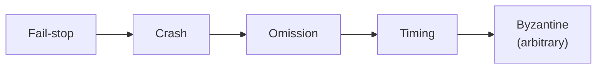
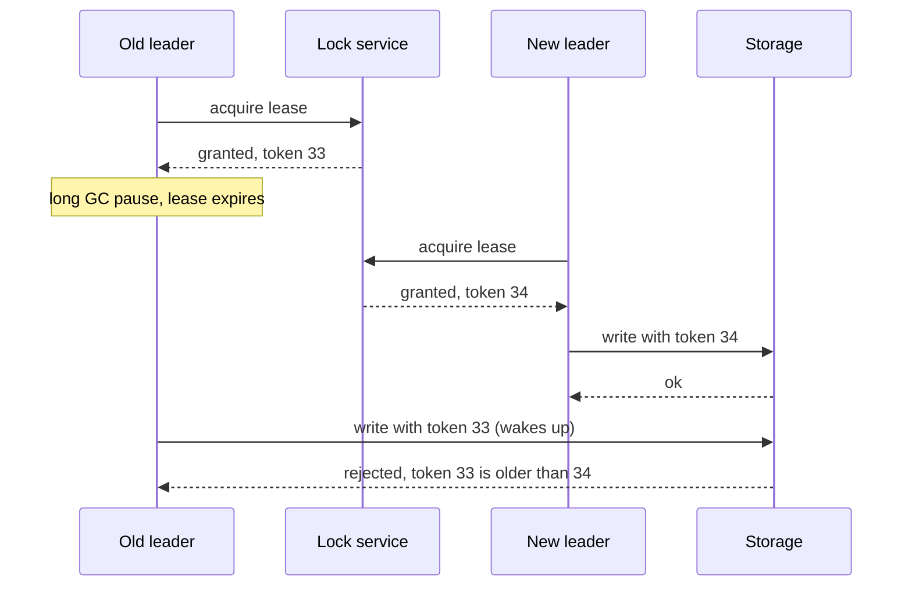
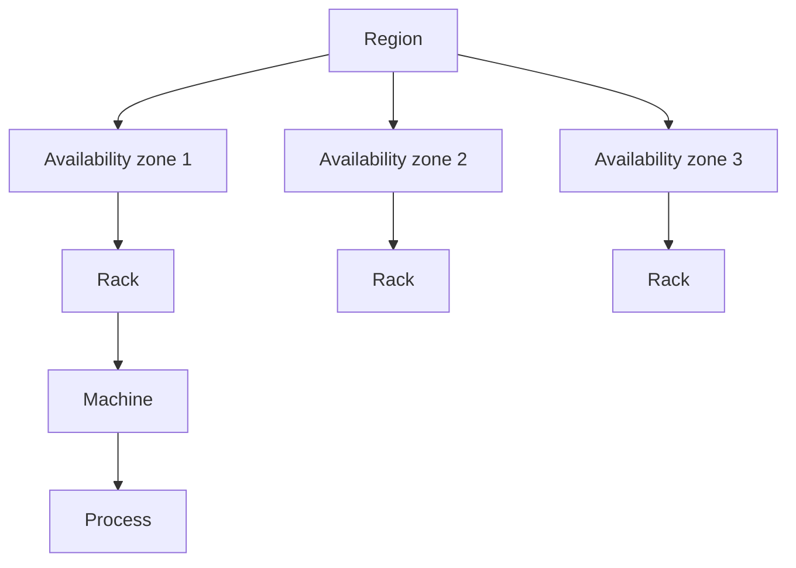

Every distributed system must tolerate failures, but "failure" can mean very different things. A server that cleanly stops is easy to handle compared with one that silently returns wrong answers. A **failure model** describes which kinds of misbehavior a system is designed to survive. Choosing the model determines which protocols you need and how expensive they are.

Models further to the right are harder to tolerate and include the ones to their left.

## Fail-stop

A node stops working **and other nodes can reliably detect that it has stopped**. This is the easiest model to handle: once a node is known to be dead, its work can be reassigned. Real systems rarely offer perfectly reliable detection, but some environments approximate it — for example, a cluster manager that forcibly shuts down unresponsive machines ("shoot the other node in the head", or STONITH) so that "unresponsive" becomes "definitely stopped".

## Crash failures

A node stops working, but other nodes **cannot be sure** whether it crashed or is merely slow. It never sends incorrect messages; it just goes silent. Most practical distributed databases and consensus protocols, such as Raft and Paxos, assume crash failures (often "crash-recovery", where a node may come back with its disk intact). Tolerating `f` crashed nodes typically requires `2f + 1` replicas so that a majority remains available.

| Replicas (N) | Majority needed | Crash failures tolerated |
| --- | --- | --- |
| 3 | 2 | 1 |
| 5 | 3 | 2 |
| 7 | 4 | 3 |

Adding a fourth replica to a group of three does not help: a majority of four is three, so it still tolerates only one failure while adding cost. That is why consensus groups almost always have an odd number of members.

## Omission failures

A node is running but **fails to send or receive some messages**. Buffers overflow, packets are dropped, a network link flaps. From the outside, omission failures look like crashes that come and go. Protocols handle them with acknowledgments, retries and sequence numbers so duplicates and gaps can be detected.

## Timing failures

A node responds, but **outside the expected time window** — too slowly, or with a clock that drifts. Long garbage-collection pauses are a classic example: a leader pauses for several seconds, others elect a new leader, then the old leader wakes up still believing it is in charge. Techniques such as **leases** and **fencing tokens** protect against these scenarios.

The storage service remembers the highest token it has seen and rejects writes carrying an older one. Even though the old leader wrongly believes it still holds the lease, it cannot corrupt data.

<Callout type="warning">
You cannot distinguish a slow node from a dead one using timeouts alone. Every failure detector makes a trade-off: short timeouts detect failures quickly but cause false alarms; long timeouts are accurate but slow to react.
</Callout>

## Byzantine failures

A node behaves **arbitrarily**: it may send conflicting or malicious messages, corrupt data or lie about its state. Tolerating `f` Byzantine nodes requires at least `3f + 1` nodes and more expensive protocols. Byzantine fault tolerance is essential in open systems where participants do not trust each other, such as public blockchains, and in some safety-critical systems such as aircraft controls. Most systems within a single organization assume non-Byzantine behavior and use checksums and authentication to catch corruption.

## Detecting failures

Since certainty is impossible, systems use **failure detectors** that suspect rather than know:

- **Heartbeats.** Each node periodically sends "I'm alive". Missing several in a row marks it suspected.
- **Adaptive (phi accrual) detectors.** Instead of a fixed timeout, they track the distribution of heartbeat arrival times and output a suspicion level, adapting to a network that is normally slow. Cassandra and Akka use this approach.
- **Gossip.** Nodes share their view of who is alive with random peers, so the cluster converges on membership without a central monitor.
- **Leases.** A node may act (for example, as leader) only while it holds an unexpired lease, so it stops acting on its own when it cannot renew.

## Gray failures

Some of the hardest failures are **gray failures**: a component is not dead but is subtly degraded. A disk that takes 2 seconds for some reads, a network card that drops 5% of packets, or a server that answers health checks but fails real requests. Health checks often miss them because the checks exercise a different code path. Detecting gray failures requires measuring what users experience — error rates and latency percentiles per instance — and ejecting outliers.

<Ponder question="A load balancer's health check calls /health, which returns 200 as long as the process is running. The database connection pool on one server is exhausted, so all real requests fail there. What happens, and how would you fix it?">
The load balancer keeps sending a share of traffic to the broken server because its health check passes — a gray failure. Fix it with **deep health checks** that exercise critical dependencies (carefully, so a shared dependency outage does not mark every server unhealthy at once), and with **outlier detection** that ejects instances whose real-request error rate is far above their peers'.
</Ponder>

## Failures in practice

Real failures are messy and often correlated:

- A bad deployment crashes every instance of a service at once.
- A network partition splits a data center so that both sides are healthy but cannot communicate.
- A disk slowly returns corrupted blocks.
- A dependency slows down, causing callers to exhaust their thread pools and fail in turn — a **cascading failure**.

Designing for failure means combining several techniques: replication across failure domains (machines, racks, zones and regions), health checks and timeouts, retries with backoff, checksums for data integrity, and gradual rollouts that limit the blast radius of bad changes.

Placing the three replicas of a consensus group in three different zones means a whole zone can fail — power, cooling or network — and a majority survives.

<KeyTakeaways>
- A failure model defines which misbehaviors a system must tolerate.
- Fail-stop and crash failures are the most commonly assumed; crash tolerance of `f` nodes needs `2f + 1` replicas, so groups use odd sizes.
- Omission and timing failures require acknowledgments, retries, leases and fencing tokens.
- Byzantine tolerance handles arbitrary or malicious behavior but needs `3f + 1` nodes and costly protocols.
- Failure detectors only suspect failures; heartbeats, adaptive detectors, gossip and leases are common tools.
- Gray failures and correlated failures are common in practice, so measure real traffic and replicate across independent failure domains.
</KeyTakeaways>
