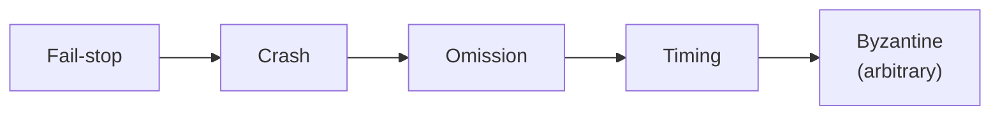

Every distributed system must tolerate failures, but “failure” can mean very different things. A server that cleanly stops is easy to handle compared with one that silently returns wrong answers. A **failure model** describes which kinds of misbehavior a system is designed to survive. Choosing the model determines which protocols you need and how expensive they are.

Models further to the right are harder to tolerate and include the ones to their left.

## Fail-stop

A node stops working **and other nodes can reliably detect that it has stopped**. This is the easiest model to handle: once a node is known to be dead, its work can be reassigned. Real systems rarely offer perfectly reliable detection, but some environments approximate it — for example, a cluster manager that forcibly shuts down unresponsive machines.

## Crash failures

A node stops working, but other nodes **cannot be sure** whether it crashed or is merely slow. It never sends incorrect messages; it just goes silent. Most practical distributed databases and consensus protocols, such as Raft and Paxos, assume crash failures. Tolerating `f` crashed nodes typically requires `2f + 1` replicas so that a majority remains available.

## Omission failures

A node is running but **fails to send or receive some messages**. Buffers overflow, packets are dropped, a network link flaps. From the outside, omission failures look like crashes that come and go. Protocols handle them with acknowledgments, retries and sequence numbers.

## Timing failures

A node responds, but **outside the expected time window** — too slowly, or with a clock that drifts. Long garbage-collection pauses are a classic example: a leader pauses for several seconds, others elect a new leader, then the old leader wakes up still believing it is in charge. Techniques such as **leases** and **fencing tokens** protect against these scenarios.

<Callout type="warning">
You cannot distinguish a slow node from a dead one using timeouts alone. Every failure detector makes a trade-off: short timeouts detect failures quickly but cause false alarms; long timeouts are accurate but slow to react.
</Callout>

## Byzantine failures

A node behaves **arbitrarily**: it may send conflicting or malicious messages, corrupt data or lie about its state. Tolerating `f` Byzantine nodes requires at least `3f + 1` nodes and more expensive protocols. Byzantine fault tolerance is essential in open systems where participants do not trust each other, such as public blockchains, and in some safety-critical systems. Most systems within a single organization assume non-Byzantine behavior and use checksums and authentication to catch corruption.

## Failures in practice

Real failures are messy and often correlated:

- A bad deployment crashes every instance of a service at once.
- A network partition splits a data center so that both sides are healthy but cannot communicate.
- A disk slowly returns corrupted blocks.
- A dependency slows down, causing callers to exhaust their thread pools and fail in turn — a **cascading failure**.

Designing for failure means combining several techniques: replication across failure domains (machines, racks, zones and regions), health checks and timeouts, retries with backoff, checksums for data integrity, and gradual rollouts that limit the blast radius of bad changes.

<KeyTakeaways>
- A failure model defines which misbehaviors a system must tolerate.
- Fail-stop and crash failures are the most commonly assumed; crash tolerance of `f` nodes needs `2f + 1` replicas.
- Omission and timing failures require acknowledgments, retries, leases and fencing.
- Byzantine tolerance handles arbitrary or malicious behavior but needs `3f + 1` nodes and costly protocols.
- Real failures are often correlated, so replicate across independent failure domains.
</KeyTakeaways>
