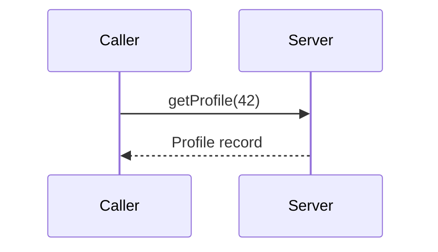
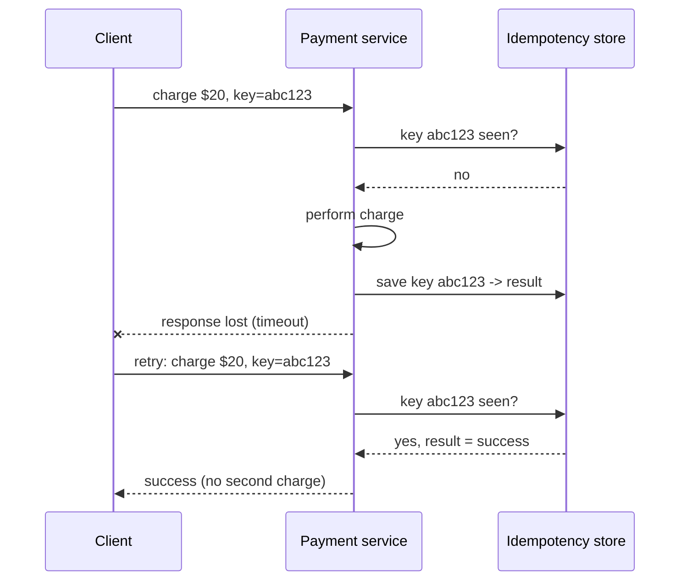

When one service needs something from another — a user profile, a payment authorization, a recommendation — it must send a request over the network and wait for a response. A **remote procedure call (RPC)** makes this look like calling a local function: `profile = userService.getProfile(userId)`. The RPC framework handles everything in between.

## How an RPC works

<Slides title="Anatomy of a remote procedure call">
<Slide caption="1. The caller invokes a local stub, which serializes the arguments into a message.">


</Slide>
<Slide caption="2. The RPC runtime sends the message over the network to the server.">


</Slide>
<Slide caption="3. The server stub deserializes the message and calls the real function.">


</Slide>
<Slide caption="4. The result travels back the same way and the caller receives it as a return value.">



</Slide>
</Slides>

The **stubs** are usually generated from an interface definition, such as a Protocol Buffers schema for gRPC or an OpenAPI document for REST. Generating them keeps client and server in agreement about message formats and lets both evolve safely through versioned schemas.

```protobuf
syntax = "proto3";

service UserService {
  rpc GetProfile (GetProfileRequest) returns (Profile);
}

message GetProfileRequest { int64 user_id = 1; }

message Profile {
  int64  user_id      = 1;
  string display_name = 2;
  string avatar_url   = 3;   // new fields get new numbers, so old clients keep working
}
```

Field numbers, not names, identify fields on the wire. Adding a field with a new number is backward compatible: old clients ignore it and new clients see a default when talking to old servers. This is how large organizations evolve thousands of services without deploying them all at once.

## Serialization formats

| Format | Encoding | Schema | Typical use |
| --- | --- | --- | --- |
| JSON | Text | Optional (JSON Schema, OpenAPI) | Public REST APIs, browsers |
| Protocol Buffers | Binary, compact | Required (`.proto`) | gRPC between internal services |
| Avro | Binary | Required, often stored in a schema registry | Event streams, data pipelines |
| Thrift | Binary | Required | Older internal RPC stacks |

Binary formats are typically several times smaller and faster to parse than JSON, which matters when a service handles hundreds of thousands of calls per second. JSON remains the default for public APIs because it is human-readable and universally supported.

## RPC styles in practice

| Style | Transport | Strengths | Weaknesses |
| --- | --- | --- | --- |
| REST | HTTP/1.1 or 2, usually JSON | Simple, cacheable, universal tooling | Chatty for complex reads; loose contracts |
| gRPC | HTTP/2, Protocol Buffers | Fast, strongly typed, streaming, deadlines | Needs a proxy for browsers; binary is harder to debug |
| GraphQL | HTTP, JSON | Clients fetch exactly the fields they need in one round trip | Complex server; caching and rate limiting are harder |

gRPC supports four call shapes: unary (one request, one response), server streaming (for example, a feed of price updates), client streaming (uploading telemetry) and bidirectional streaming (chat). HTTP/2 multiplexes many calls over one connection, avoiding the cost of a new connection per request.

## Why RPC is not a local call

The abstraction is convenient, but a remote call differs from a local one in important ways:

| Local call | Remote call |
| --- | --- |
| Takes nanoseconds | Takes milliseconds or more |
| Either returns or throws | May time out with **unknown outcome** |
| Shares memory with the caller | Arguments must be serialized |
| Caller and callee fail together | Either side can fail independently |

The most important difference is **partial failure**. If a request times out, the caller cannot tell whether the request was lost, the server crashed before acting, or the server acted but the response was lost.

## Designing robust RPCs

Because of partial failure, well-designed systems adopt a few habits.

**Timeouts and deadlines.** Every call needs a timeout, so a slow dependency cannot hang the caller forever. In a chain of calls, pass a **deadline** rather than a fresh timeout at each hop: if the user-facing request has 300 ms left, a downstream call should not wait 2 seconds.

**Retries with exponential backoff and jitter.** Transient failures are recovered by retrying, but naive retries synchronize clients into waves. A common rule is to wait a random time between zero and `min(cap, base × 2^attempt)` before each attempt — "full jitter" — and to limit retries with a budget, for example no more than 10% extra traffic.

**Idempotency.** An operation is idempotent if repeating it has the same effect as doing it once. `GET`, `PUT` of a full value and `DELETE` are naturally idempotent; "charge $20" is not. For non-idempotent actions, the client generates an **idempotency key** and sends it with every attempt.



**Circuit breakers.** A circuit breaker stops calling a dependency that is failing and fails fast instead, giving it time to recover. After a cool-down it lets a few trial requests through and closes again if they succeed.

**Service discovery and load balancing.** Callers need to find healthy instances. A service registry (or DNS, or a service mesh sidecar) tracks instances, and the client or a proxy spreads calls among them.

<Callout type="interview">
Whenever your design has one service calling another, briefly mention timeouts, retries and idempotency. It signals that you understand partial failure — one of the most important ideas in distributed systems.
</Callout>

<Ponder question="Service A calls B, which calls C, and each hop retries three times on failure. C is down. How many requests does C receive for one user request?">
Up to 4 × 4 = **16**: each of A's four attempts causes B to make four attempts to C. With more layers the amplification grows exponentially. The fix is to retry at only one layer (usually the outermost or the one closest to the failure), use retry budgets, and propagate deadlines so inner layers give up when the outer request has already timed out.
</Ponder>

## Synchronous versus asynchronous communication

RPC is typically **synchronous**: the caller waits. This is simple and appropriate when the caller needs the answer immediately. But a chain of synchronous calls multiplies latency and couples availability — if any service in the chain is down, the whole request fails. Five services each available 99.9% of the time give a chain availability of only about 99.5%.

For work that does not need an immediate answer, such as sending emails or transcoding videos, **asynchronous messaging** through a queue is often better. The caller enqueues a message and returns immediately; a worker processes it later. The queue absorbs bursts and lets the consumer be down temporarily without losing work. We explore queues in the building blocks part of the course.

<KeyTakeaways>
- RPC makes remote requests look like local function calls using generated stubs and serialization.
- Schemas with numbered fields, such as Protocol Buffers, let services evolve without coordinated deployments.
- REST, gRPC and GraphQL trade simplicity, performance and flexibility differently.
- Remote calls are slower and suffer partial failure: a timeout leaves the outcome unknown.
- Use deadlines, retries with backoff, jitter and budgets, idempotency keys and circuit breakers.
- Prefer asynchronous messaging for work that does not need an immediate response.
</KeyTakeaways>
