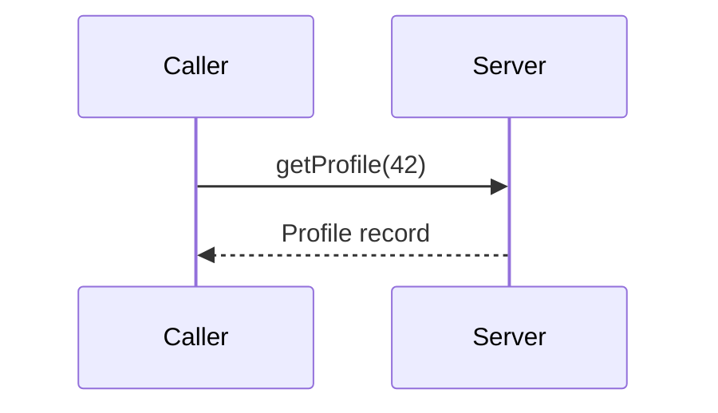

When one service needs something from another — a user profile, a payment authorization, a recommendation — it must send a request over the network and wait for a response. A **remote procedure call (RPC)** makes this look like calling a local function: `profile = userService.getProfile(userId)`. The RPC framework handles everything in between.

## How an RPC works

<Slides title="Anatomy of a remote procedure call">
<Slide caption="1. The caller invokes a local stub, which serializes the arguments into a message.">

</Slide>
<Slide caption="2. The RPC runtime sends the message over the network to the server.">

</Slide>
<Slide caption="3. The server stub deserializes the message and calls the real function.">

</Slide>
<Slide caption="4. The result travels back the same way and the caller receives it as a return value.">

</Slide>
</Slides>

The **stubs** are usually generated from an interface definition, such as a Protocol Buffers schema for gRPC or an OpenAPI document for REST. Generating them keeps client and server in agreement about message formats and lets both evolve safely through versioned schemas.

## Why RPC is not a local call

The abstraction is convenient, but a remote call differs from a local one in important ways:

| Local call | Remote call |
| --- | --- |
| Takes nanoseconds | Takes milliseconds or more |
| Either returns or throws | May time out with **unknown outcome** |
| Shares memory with the caller | Arguments must be serialized |
| Caller and callee fail together | Either side can fail independently |

The most important difference is **partial failure**. If a request times out, the caller cannot tell whether the request was lost, the server crashed before acting, or the server acted but the response was lost.

## Designing robust RPCs

Because of partial failure, well-designed systems adopt a few habits:

- **Timeouts** on every call, so a slow dependency cannot hang the caller forever.
- **Retries with exponential backoff and jitter**, so transient failures are recovered without overwhelming a struggling service.
- **Idempotency** — designing operations so that repeating them has the same effect as doing them once. For non-idempotent actions such as charging a card, clients send an **idempotency key** so the server can detect duplicates.
- **Circuit breakers**, which stop calling a dependency that is failing and fail fast instead, giving it time to recover.

<Callout type="interview">
Whenever your design has one service calling another, briefly mention timeouts, retries and idempotency. It signals that you understand partial failure — one of the most important ideas in distributed systems.
</Callout>

## Synchronous versus asynchronous communication

RPC is typically **synchronous**: the caller waits. This is simple and appropriate when the caller needs the answer immediately. But a chain of synchronous calls multiplies latency and couples availability — if any service in the chain is down, the whole request fails.

For work that does not need an immediate answer, such as sending emails or transcoding videos, **asynchronous messaging** through a queue is often better. The caller enqueues a message and returns immediately; a worker processes it later. We explore queues in the building blocks part of the course.

<KeyTakeaways>
- RPC makes remote requests look like local function calls using generated stubs and serialization.
- Remote calls are slower and suffer partial failure: a timeout leaves the outcome unknown.
- Use timeouts, retries with backoff and jitter, idempotency keys and circuit breakers.
- Prefer asynchronous messaging for work that does not need an immediate response.
</KeyTakeaways>
