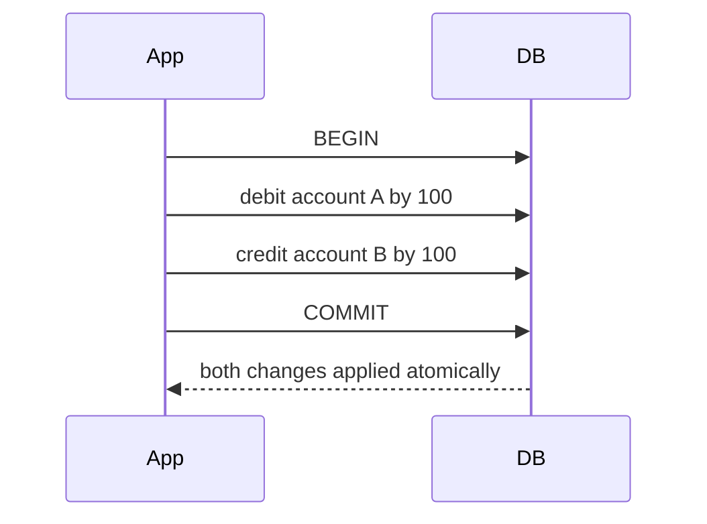
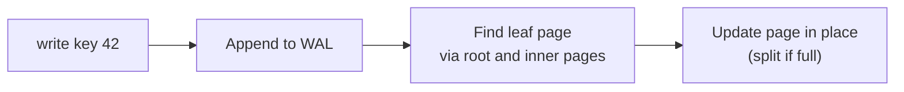
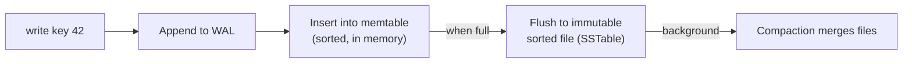

Almost every application needs to remember things: user accounts, orders, messages, settings. A **database** is an organized collection of data together with software — the database management system — that stores it durably, retrieves it efficiently and keeps it correct when many users read and write at the same time.

## Why not just use files?

A simple application could write data to files. That works until requirements grow:

- **Concurrent access.** Two users updating the same file at the same time can corrupt it.
- **Efficient queries.** Finding one user among millions by scanning a file is slow; databases use **indexes** to jump straight to the data.
- **Integrity.** Databases enforce rules such as "every order references an existing customer."
- **Durability and recovery.** Databases use write-ahead logs so that acknowledged writes survive crashes.
- **Security.** Fine-grained access control determines who can read or change which data.

## Core properties: ACID transactions

Many databases group operations into **transactions** with **ACID** guarantees:

- **Atomicity** — all operations in a transaction succeed, or none do. Transferring money never debits one account without crediting the other.
- **Consistency** — transactions move the database from one valid state to another, respecting constraints.
- **Isolation** — concurrent transactions do not interfere; each behaves as if it ran alone (to a degree set by the isolation level).
- **Durability** — once committed, data survives crashes and power loss.

Some distributed databases relax these guarantees in exchange for scalability and availability, offering a looser model sometimes summarized as **BASE**: basically available, soft state, eventually consistent.

## Isolation levels

Full isolation (serializability) is expensive, so databases offer weaker **isolation levels** that allow some anomalies in exchange for concurrency:

| Level | Prevents | Still allows | Typical default in |
| --- | --- | --- | --- |
| Read uncommitted | Almost nothing | Dirty reads of uncommitted data | Rarely used |
| Read committed | Dirty reads and writes | Non-repeatable reads, lost updates | Many relational databases |
| Repeatable read / snapshot | Non-repeatable reads | Write skew | Several popular databases |
| Serializable | All of the above | — | Opt-in; some distributed SQL databases |

A **lost update** is a classic example: two requests read a counter as 10, both add 1, and both write 11 — one increment disappears. Remedies include atomic operations (`UPDATE counters SET n = n + 1`), explicit row locks (`SELECT … FOR UPDATE`), or optimistic concurrency with a version column that makes the second write fail and retry.

**Write skew** is subtler: two doctors each check that at least one other doctor is on call, then both go off call. Each transaction was valid on its own snapshot, but together they break the rule. Only serializable isolation (or explicit locking of the rows being checked) prevents it.

## How a database stores data

Under the hood, storage engines use one of two broad families of data structures:

- **B-trees** keep data sorted in fixed-size pages and update pages in place. They offer fast reads and range queries and are used by most relational databases.
- **Log-structured merge trees (LSM trees)** buffer writes in memory, flush them to sorted immutable files, and merge those files in the background. They excel at high write throughput and are common in wide-column and key-value stores.

<TabGroup>
<Tab label="B-tree write">

A read follows the same path from the root to one leaf, usually 3–4 page reads even for billions of rows.

</Tab>
<Tab label="LSM write">

A read checks the memtable, then SSTables from newest to oldest, using Bloom filters to skip files that cannot contain the key.

</Tab>
</TabGroup>

Both rely on a **write-ahead log (WAL)**: every change is first appended to a sequential log on disk, so the database can recover to a consistent state after a crash by replaying the log.

| | B-tree | LSM tree |
| --- | --- | --- |
| Write pattern | Random in-place page updates | Sequential appends and merges |
| Write throughput | Good | Excellent |
| Point reads | Excellent, predictable | Good, may check several files |
| Space | Some fragmentation | Compaction reclaims space, temporarily needs extra |
| Typical systems | Most relational databases | Wide-column and key-value stores, embedded engines |

## Row stores and column stores

Transactional workloads (**OLTP**) read and write a few whole rows at a time — fetch an order, update a balance. Analytical workloads (**OLAP**) scan millions of rows but only a few columns — total revenue by country last quarter. **Row-oriented** storage suits the first; **column-oriented** storage, which stores each column's values together and compresses them heavily, suits the second. That is why companies typically copy data from their operational databases into a separate data warehouse for analytics.

## Scaling databases

A single database server eventually runs out of CPU, memory, disk or I/O capacity. The two fundamental scaling techniques, covered in the next lessons, are:

- **Replication** — keeping copies of the same data on several machines to increase read capacity and availability.
- **Partitioning (sharding)** — splitting data across machines so each holds only a subset, increasing write capacity and total storage.

Most large systems use both together. Before either, simpler steps often go a long way: adding the right indexes, caching hot reads, pooling connections so thousands of app servers do not open thousands of connections each, and moving to a larger machine.

<Ponder question="Two web servers process 'add $10 to the balance' for the same account at the same moment under read committed isolation. The code reads the balance, adds 10 in the application and writes it back. What can go wrong, and what are two fixes?">
A **lost update**: both read $100, both write $110, and one $10 disappears. Fixes: perform the increment atomically in the database (`UPDATE accounts SET balance = balance + 10 WHERE id = ?`), or use optimistic concurrency — read a version number and write with `WHERE version = ?`, retrying if no row was updated. Explicit `SELECT … FOR UPDATE` locking also works but reduces concurrency.
</Ponder>

<Callout type="interview">
Choosing a database is one of the most scrutinized decisions in a design interview. Base the choice on access patterns — lookups by key, range scans, joins, full-text search, graph traversals — and on consistency and scale requirements, not on popularity.
</Callout>

<KeyTakeaways>
- Databases provide durable storage, efficient queries, concurrency control, integrity and security.
- ACID transactions guarantee atomicity, consistency, isolation and durability; isolation levels trade anomalies such as lost updates and write skew for concurrency.
- Storage engines are typically B-tree based (read-optimized) or LSM-tree based (write-optimized), with a write-ahead log for recovery.
- Row stores suit transactional workloads; column stores suit analytics.
- Replication and partitioning are the two fundamental ways to scale a database, after indexing, caching and pooling.
- Choose databases based on access patterns and requirements.
</KeyTakeaways>
