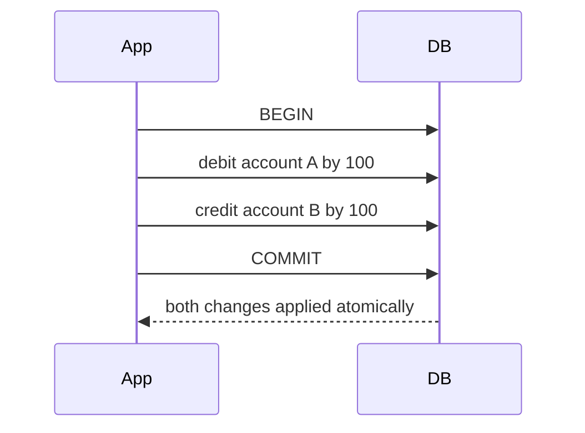

Almost every application needs to remember things: user accounts, orders, messages, settings. A **database** is an organized collection of data together with software — the database management system — that stores it durably, retrieves it efficiently and keeps it correct when many users read and write at the same time.

## Why not just use files?

A simple application could write data to files. That works until requirements grow:

- **Concurrent access.** Two users updating the same file at the same time can corrupt it.
- **Efficient queries.** Finding one user among millions by scanning a file is slow; databases use **indexes** to jump straight to the data.
- **Integrity.** Databases enforce rules such as “every order references an existing customer.”
- **Durability and recovery.** Databases use write-ahead logs so that acknowledged writes survive crashes.
- **Security.** Fine-grained access control determines who can read or change which data.

## Core properties: ACID transactions

Many databases group operations into **transactions** with **ACID** guarantees:

- **Atomicity** — all operations in a transaction succeed, or none do. Transferring money never debits one account without crediting the other.
- **Consistency** — transactions move the database from one valid state to another, respecting constraints.
- **Isolation** — concurrent transactions do not interfere; each behaves as if it ran alone (to a degree set by the isolation level).
- **Durability** — once committed, data survives crashes and power loss.

Some distributed databases relax these guarantees in exchange for scalability and availability, offering a looser model sometimes summarized as **BASE**: basically available, soft state, eventually consistent.

## How a database stores data

Under the hood, storage engines use one of two broad families of data structures:

- **B-trees** keep data sorted in fixed-size pages and update pages in place. They offer fast reads and range queries and are used by most relational databases.
- **Log-structured merge trees (LSM trees)** buffer writes in memory, flush them to sorted immutable files, and merge those files in the background. They excel at high write throughput and are common in wide-column and key-value stores.

Both rely on a **write-ahead log (WAL)**: every change is first appended to a sequential log on disk, so the database can recover to a consistent state after a crash.

## Scaling databases

A single database server eventually runs out of CPU, memory, disk or I/O capacity. The two fundamental scaling techniques, covered in the next lessons, are:

- **Replication** — keeping copies of the same data on several machines to increase read capacity and availability.
- **Partitioning (sharding)** — splitting data across machines so each holds only a subset, increasing write capacity and total storage.

Most large systems use both together.

<Callout type="interview">
Choosing a database is one of the most scrutinized decisions in a design interview. Base the choice on access patterns — lookups by key, range scans, joins, full-text search, graph traversals — and on consistency and scale requirements, not on popularity.
</Callout>

<KeyTakeaways>
- Databases provide durable storage, efficient queries, concurrency control, integrity and security.
- ACID transactions guarantee atomicity, consistency, isolation and durability.
- Storage engines are typically B-tree based (read-optimized) or LSM-tree based (write-optimized), with a write-ahead log for recovery.
- Replication and partitioning are the two fundamental ways to scale a database.
- Choose databases based on access patterns and requirements.
</KeyTakeaways>
