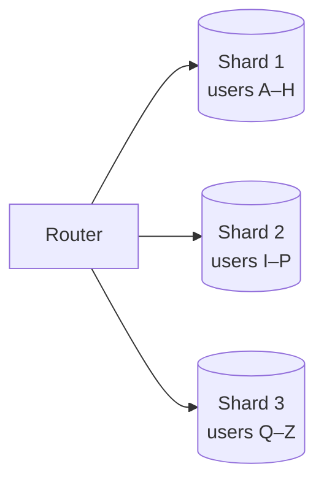
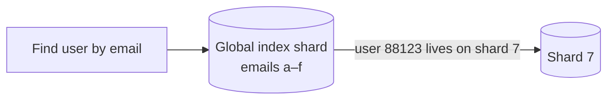
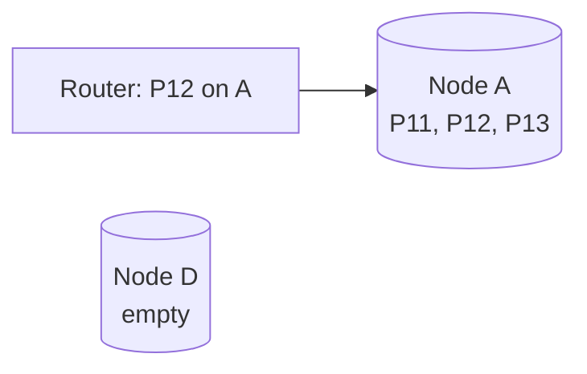
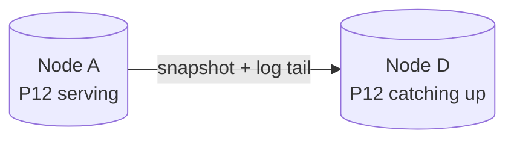
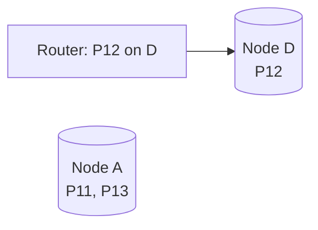

Replication copies all data to every replica, so it does not help when the data set is too large for one machine or when the write rate exceeds what one leader can handle. **Partitioning** — also called **sharding** — splits data into subsets, called partitions or shards, and places them on different machines. Each shard handles only its portion of reads and writes.

Partitioning is usually combined with replication: each shard is replicated for availability, so a cluster of 30 machines might hold 10 shards with three replicas each.

## Vertical versus horizontal partitioning

- **Vertical partitioning** splits by columns or by feature: user profiles in one database, orders in another, large blobs in a third. It is simple and often a first step.
- **Horizontal partitioning (sharding)** splits rows of the same table across machines, based on a **partition key**. This is what scales very large data sets.

## Partitioning strategies

### Range partitioning

Each shard owns a contiguous range of keys, such as user IDs 1–1,000,000, or dates in January. Range queries are efficient because adjacent keys live together. The risk is **hotspots**: if keys are timestamps, all current writes land on the newest shard. A common fix is a compound key such as `(sensor_id, timestamp)`, which spreads writes across sensors while keeping each sensor's readings in time order.

### Hash partitioning

A hash function maps each key to a shard, for example `shard = hash(key) mod N`. Hashing spreads keys evenly and avoids most hotspots, but range queries must query every shard. The simple `mod N` scheme has a big problem: changing `N` remaps almost every key. **Consistent hashing** solves this by placing shards and keys on a ring so that adding or removing a shard moves only a small fraction of keys.

### Directory-based partitioning

A lookup service records which shard holds each key or key range. This is flexible — data can be moved freely, and a very large tenant can get its own shard — but the directory must be highly available and fast, and it adds a lookup to each request (usually cached by clients).

| Strategy | Even load | Range queries | Adding shards | Extra component |
| --- | --- | --- | --- | --- |
| Range | Risk of hotspots | Efficient | Split ranges | Range map |
| Hash (mod N) | Good | Scatter to all shards | Moves almost everything | None |
| Consistent hash | Good | Scatter to all shards | Moves about 1/N of keys | Ring membership |
| Directory | Controllable | Depends on mapping | Move any key freely | Directory service |

## Choosing a partition key

The partition key determines how well load spreads and which queries are efficient:

- It should have **high cardinality** and spread load evenly.
- Most queries should be answerable within **one shard**. Partitioning messages by conversation ID keeps a conversation's history together.
- Beware of **celebrity keys**: one very popular user or product can overload its shard. Mitigations include splitting hot keys with a random suffix and caching them aggressively.

### Worked example: sharding an e-commerce database

An online store has users, orders and order items. The most frequent queries are "show this user's orders" and "show this order with its items".

- Partitioning **orders by order ID** spreads writes evenly, but "this user's orders" must query every shard.
- Partitioning **orders by user ID** keeps a user's orders and their items on one shard, so both common queries hit a single shard. Order items are stored with their order (same shard key).
- The remaining cross-shard query — "all orders containing product P" for merchants — is served from a separate index or analytics store.

The general lesson: choose the key that makes the **most frequent** queries single-shard, and serve the rest another way.

<Callout type="warning">
Cross-shard operations are expensive. Joins across shards, global secondary indexes and transactions spanning multiple shards all require extra coordination. Design your partition key so the most common operations stay within a single shard.
</Callout>

## Secondary indexes in a sharded database

Queries by something other than the partition key — "find users by email" when users are partitioned by ID — need a secondary index, and there are two ways to partition it:

| | Local index (per shard) | Global index (partitioned by the indexed term) |
| --- | --- | --- |
| Writes | Update only the local shard | May update a different shard than the data (often asynchronously) |
| Reads | **Scatter-gather**: ask every shard, merge results | Ask the one index shard that owns the term |
| Consistency | Always in sync with local data | Can lag behind the data |

Local indexes make writes cheap and reads expensive; global indexes make reads cheap and writes more complex.

## Handling hot keys

Even with good hashing, individual keys can be hot: a celebrity's profile, a viral post's like counter, a flash-sale product.

- **Cache** hot reads in front of the shard.
- **Split** the key: write to `post:991:0` … `post:991:15` chosen at random and sum on read. The sharded counters chapter uses this pattern.
- **Isolate** very large tenants on dedicated shards using a directory.

## Rebalancing

As data grows, shards must be split or moved. Good strategies include:

- Creating **many more logical partitions than nodes** (for example, 1,000 partitions over 10 nodes) and moving whole partitions between nodes when scaling. Keys never change partition; only partitions change nodes.
- **Dynamic splitting** of partitions that grow too large, as many range-partitioned stores do automatically.
- Rebalancing gradually and throttling data movement so it does not overwhelm the cluster.

<Slides title="Moving a partition to a new node">
<Slide caption="1. Partition P12 lives on node A. The rebalancer decides to move it to new node D.">

</Slide>
<Slide caption="2. D copies a snapshot of P12, then streams new writes from A's log until it has caught up.">

</Slide>
<Slide caption="3. Writes to P12 pause briefly, D applies the last entries, and the partition map flips. The router now sends P12 to D.">

</Slide>
</Slides>

## Request routing

Clients must find the right shard. Options include a **routing tier** that knows the partition map, **partition-aware clients**, or letting any node accept a request and forward it. The partition map is often stored in a coordination service such as ZooKeeper or etcd, which notifies routers when it changes.

## Cross-shard transactions

When a single operation must update several shards atomically — moving money between two users on different shards — the database needs a protocol such as **two-phase commit (2PC)**: a coordinator asks every shard to *prepare* (lock and promise), and only if all agree does it tell them to *commit*. 2PC is correct but slow and blocks if the coordinator fails mid-protocol. Many systems avoid it by choosing partition keys that keep transactions single-shard, or by using **sagas**: a sequence of local transactions with compensating actions if a later step fails.

<Ponder question="A team shards a social network's posts table by post ID. The home timeline needs 'the latest posts by the 300 accounts I follow'. What is the problem?">
Each followed account's posts are scattered across every shard, so building one timeline queries every shard (scatter-gather) and merges results — expensive at hundreds of thousands of timeline reads per second. Partitioning posts by **author ID** makes "latest posts by one author" a single-shard range scan, and the timeline itself is usually precomputed (fan-out on write) so reads do not touch the posts table at all.
</Ponder>

<KeyTakeaways>
- Partitioning splits data across machines to scale storage and write throughput, usually combined with replication.
- Range partitioning supports range queries but risks hotspots; hash partitioning spreads load but scatters ranges; directories add flexibility.
- Choose a partition key with high cardinality that keeps the most frequent queries within one shard.
- Local secondary indexes need scatter-gather reads; global indexes need cross-shard writes.
- Handle hot keys with caching, key splitting and dedicated shards.
- Use many logical partitions to simplify rebalancing, route requests via a partition map, and avoid cross-shard transactions where possible.
</KeyTakeaways>
