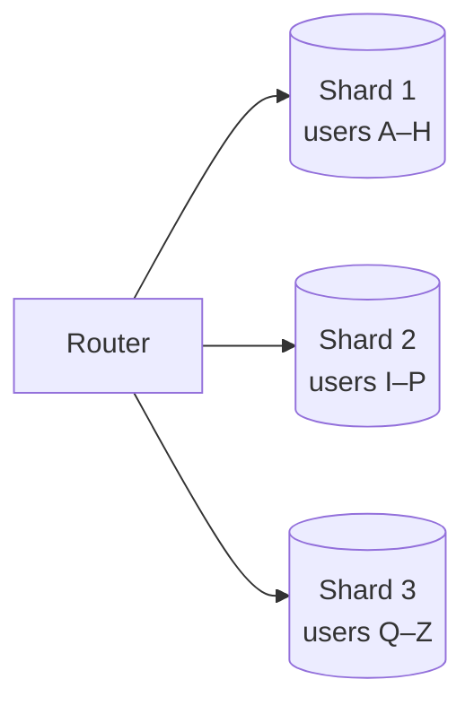

Replication copies all data to every replica, so it does not help when the data set is too large for one machine or when the write rate exceeds what one leader can handle. **Partitioning** — also called **sharding** — splits data into subsets, called partitions or shards, and places them on different machines. Each shard handles only its portion of reads and writes.

Partitioning is usually combined with replication: each shard is replicated for availability.

## Vertical versus horizontal partitioning

- **Vertical partitioning** splits by columns or by feature: user profiles in one database, orders in another, large blobs in a third. It is simple and often a first step.
- **Horizontal partitioning (sharding)** splits rows of the same table across machines, based on a **partition key**. This is what scales very large data sets.

## Partitioning strategies

### Range partitioning

Each shard owns a contiguous range of keys, such as user IDs 1–1,000,000, or dates in January. Range queries are efficient because adjacent keys live together. The risk is **hotspots**: if keys are timestamps, all current writes land on the newest shard.

### Hash partitioning

A hash function maps each key to a shard, for example `shard = hash(key) mod N`. Hashing spreads keys evenly and avoids most hotspots, but range queries must query every shard. The simple `mod N` scheme has a big problem: changing `N` remaps almost every key. **Consistent hashing** solves this by placing shards and keys on a ring so that adding or removing a shard moves only a small fraction of keys.

### Directory-based partitioning

A lookup service records which shard holds each key or key range. This is flexible — data can be moved freely — but the directory must be highly available and fast, and it adds a lookup to each request.

## Choosing a partition key

The partition key determines how well load spreads and which queries are efficient:

- It should have **high cardinality** and spread load evenly.
- Most queries should be answerable within **one shard**. Partitioning messages by conversation ID keeps a conversation's history together.
- Beware of **celebrity keys**: one very popular user or product can overload its shard. Mitigations include splitting hot keys with a random suffix and caching them aggressively.

<Callout type="warning">
Cross-shard operations are expensive. Joins across shards, global secondary indexes and transactions spanning multiple shards all require extra coordination. Design your partition key so the most common operations stay within a single shard.
</Callout>

## Rebalancing

As data grows, shards must be split or moved. Good strategies include:

- Creating **many more logical partitions than nodes** (for example, 1,000 partitions over 10 nodes) and moving whole partitions between nodes when scaling.
- **Dynamic splitting** of partitions that grow too large.
- Rebalancing gradually and throttling data movement so it does not overwhelm the cluster.

## Request routing

Clients must find the right shard. Options include a **routing tier** that knows the partition map, **partition-aware clients**, or letting any node accept a request and forward it. The partition map is often stored in a coordination service such as ZooKeeper or etcd.

<KeyTakeaways>
- Partitioning splits data across machines to scale storage and write throughput.
- Range partitioning supports range queries but risks hotspots; hash partitioning spreads load but scatters ranges.
- Consistent hashing minimizes data movement when shards are added or removed.
- Choose a partition key with high cardinality that keeps common queries within one shard.
- Use many logical partitions to simplify rebalancing, and route requests via a partition map.
</KeyTakeaways>
