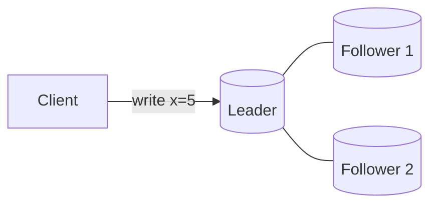
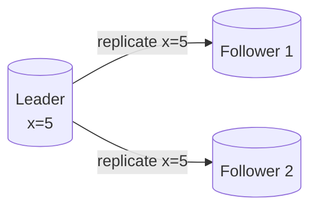
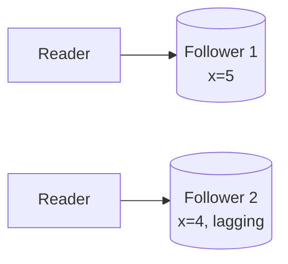

**Replication** means keeping copies of the same data on multiple machines, called **replicas**. It serves three purposes: **availability** (the system survives the loss of a machine), **read scalability** (reads can be spread across replicas) and **latency** (replicas can be placed close to users). The challenge is keeping replicas in sync as data changes.

## Single-leader replication

One replica is the **leader** (primary). All writes go to the leader, which records them and streams changes to **followers** (secondaries). Reads can be served by the leader or by followers.

<Slides title="Single-leader replication">
<Slide caption="1. A client sends a write to the leader, which applies it locally.">

</Slide>
<Slide caption="2. The leader streams the change to its followers through a replication log.">

</Slide>
<Slide caption="3. Reads can be served by any replica, though followers may lag slightly behind.">

</Slide>
</Slides>

### Synchronous versus asynchronous

- **Synchronous replication:** the leader waits for followers to confirm before acknowledging the write. Followers are always up to date, but a slow or failed follower blocks writes.
- **Asynchronous replication:** the leader acknowledges immediately and replicates in the background. Writes are fast, but followers lag, and if the leader fails, recent writes may be lost.
- **Semi-synchronous:** the leader waits for one follower (or a quorum) and replicates asynchronously to the rest — a common compromise.

### Replication lag

With asynchronous replication, followers may be seconds behind during heavy load. This causes anomalies such as a user not seeing their own update. Techniques such as reading your own writes from the leader, or tracking the replication position each client has seen, provide **read-your-writes** consistency.

### Failover

If the leader fails, a follower is promoted. Automated failover must detect the failure reliably, pick the most up-to-date follower and redirect writes — while preventing **split brain**, where two nodes act as leader simultaneously.

## Multi-leader replication

Several nodes accept writes, typically one per data center, and replicate to each other. This offers lower write latency across regions and tolerance of data-center outages, but introduces **write conflicts** when the same data is modified in two places concurrently. Conflicts must be resolved — by last-write-wins timestamps (which can lose data), by merging, or by application-specific logic.

## Leaderless replication

Any replica accepts reads and writes. A client writes to several replicas and reads from several, using **quorums**: with `n` replicas, writes wait for `w` acknowledgments and reads query `r` replicas. If `w + r > n`, every read overlaps at least one replica with the latest write. Replicas repair stale data through **read repair** and background **anti-entropy** processes. Leaderless designs are highly available and are covered in depth in the key-value store chapter.

| Approach | Writes | Conflicts | Typical use |
| --- | --- | --- | --- |
| Single-leader | One node | None | Most relational databases |
| Multi-leader | One per region | Must be resolved | Multi-region apps, offline clients |
| Leaderless | Any node (quorum) | Resolved by versions | Highly available key-value stores |

<KeyTakeaways>
- Replication improves availability, read scalability and latency by keeping copies on multiple machines.
- Single-leader replication is simple and conflict-free; synchronous mode trades latency for safety.
- Asynchronous replication causes lag, which requires techniques such as read-your-writes.
- Multi-leader replication supports multi-region writes but must resolve conflicts.
- Leaderless replication uses quorums (w + r > n) for high availability.
</KeyTakeaways>
