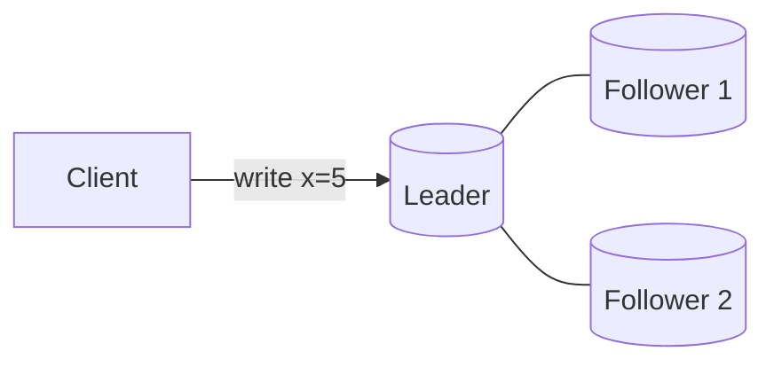
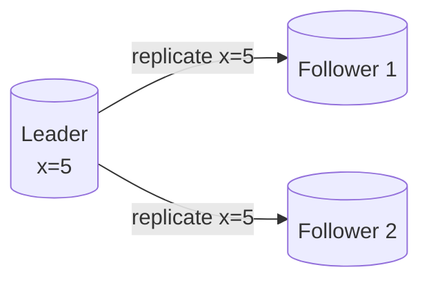
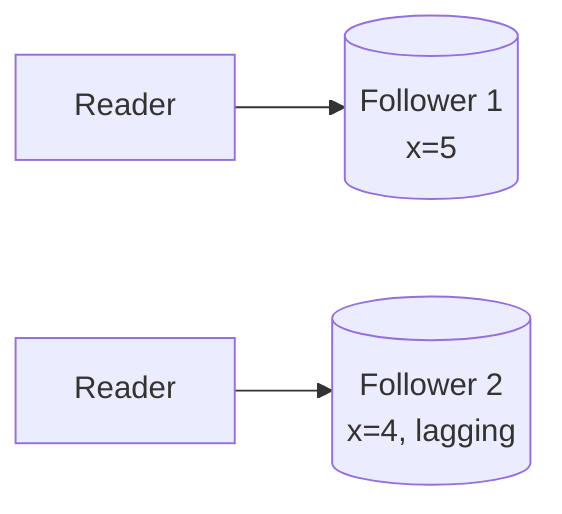
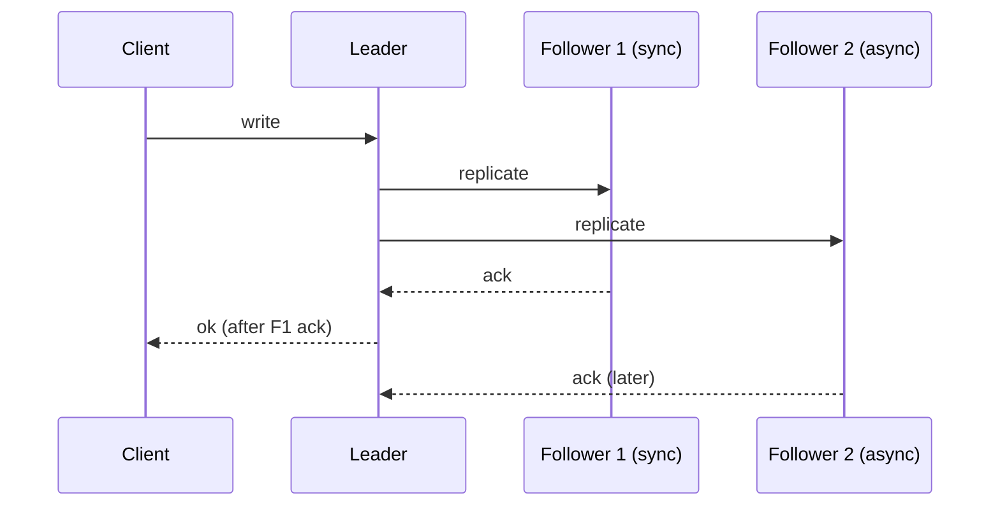
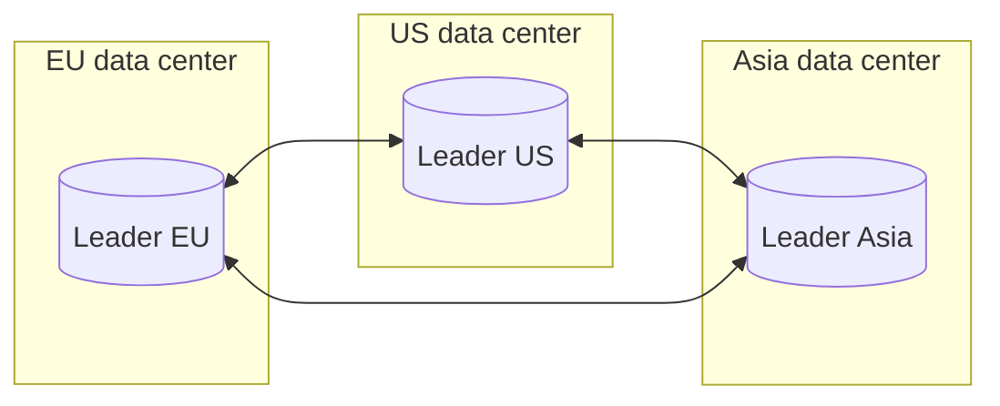

**Replication** means keeping copies of the same data on multiple machines, called **replicas**. It serves three purposes: **availability** (the system survives the loss of a machine), **read scalability** (reads can be spread across replicas) and **latency** (replicas can be placed close to users). The challenge is keeping replicas in sync as data changes.

## Single-leader replication

One replica is the **leader** (primary). All writes go to the leader, which records them and streams changes to **followers** (secondaries). Reads can be served by the leader or by followers.

<Slides title="Single-leader replication">
<Slide caption="1. A client sends a write to the leader, which applies it locally.">

</Slide>
<Slide caption="2. The leader streams the change to its followers through a replication log.">

</Slide>
<Slide caption="3. Reads can be served by any replica, though followers may lag slightly behind.">

</Slide>
</Slides>

### What exactly is replicated?

| Method | What is sent | Pros | Cons |
| --- | --- | --- | --- |
| Statement-based | The SQL statements themselves | Compact | Non-deterministic functions (`NOW()`, `RAND()`) diverge |
| Physical (WAL shipping) | Low-level disk page changes | Exact copy, simple | Tied to one storage format and version; hard to upgrade |
| Logical (row-based) | "Row with key K now has these values" | Version-independent; can feed other systems | Larger than statements for bulk updates |

Logical replication logs are also the foundation of **change data capture**, which streams changes to caches, search indexes and warehouses.

### Synchronous versus asynchronous

- **Synchronous replication:** the leader waits for followers to confirm before acknowledging the write. Followers are always up to date, but a slow or failed follower blocks writes.
- **Asynchronous replication:** the leader acknowledges immediately and replicates in the background. Writes are fast, but followers lag, and if the leader fails, recent writes may be lost.
- **Semi-synchronous:** the leader waits for one follower (or a quorum) and replicates asynchronously to the rest — a common compromise.

### Adding a new follower

A new replica cannot simply start streaming the log from now — it would be missing all earlier data. The standard procedure is: take a consistent **snapshot** of the leader, recording its exact log position; copy the snapshot to the new follower; then have it request all log entries after that position and catch up. The same process rebuilds a follower that has been down too long.

### Replication lag and its anomalies

With asynchronous replication, followers may be seconds behind during heavy load. Three anomalies are common:

| Anomaly | Example | Guarantee that prevents it |
| --- | --- | --- |
| Not seeing your own write | You edit your bio, refresh, and the old bio appears | Read-your-writes: read the user's own data from the leader, or from a follower that has caught up to the user's last write position |
| Time going backwards | A comment appears, then disappears on refresh because the second read hit a staler follower | Monotonic reads: pin each user to one follower |
| Effects before causes | You see an answer before the question it responds to | Consistent prefix reads: keep causally related writes in the same partition, or track dependencies |

### Failover

If the leader fails, a follower is promoted. Automated failover involves:

1. **Detecting** failure, usually by missed heartbeats over a timeout (too short causes needless failovers, too long prolongs outages).
2. **Choosing** a new leader — ideally the follower with the most recent data — often via a consensus-based election.
3. **Reconfiguring** clients and other followers to use the new leader, and **fencing** the old one so it cannot accept writes if it returns.

Failover is where many serious incidents occur: asynchronously replicated writes that never reached the new leader are lost, and if two nodes both believe they are leader (**split brain**), they may accept conflicting writes.

## Multi-leader replication

Several nodes accept writes, typically one per data center, and replicate to each other. This offers lower write latency across regions and tolerance of data-center outages, but introduces **write conflicts** when the same data is modified in two places concurrently.

Conflicts must be resolved:

- **Last write wins (LWW)** — keep the write with the highest timestamp. Simple, but silently discards the other write, and clock skew can pick the "wrong" winner.
- **Merge** — combine values, for example the union of two shopping-cart edits. **CRDTs** are data types designed so concurrent updates always merge deterministically.
- **Application logic** — store both versions and let the application or user resolve them, as some note-taking and calendar apps do.
- **Avoidance** — route all writes for a given record to the same "home" leader, so conflicts cannot occur for that record.

Offline-capable clients — a mobile app that works without a connection — are effectively multi-leader: each device is a leader that syncs later.

## Leaderless replication

Any replica accepts reads and writes. A client writes to several replicas and reads from several, using **quorums**: with `n` replicas, writes wait for `w` acknowledgments and reads query `r` replicas. If `w + r > n`, every read overlaps at least one replica with the latest write. Replicas repair stale data through **read repair** and background **anti-entropy** processes. Leaderless designs are highly available and are covered in depth in the key-value store chapter.

| Approach | Writes | Conflicts | Typical use |
| --- | --- | --- | --- |
| Single-leader | One node | None | Most relational databases |
| Multi-leader | One per region | Must be resolved | Multi-region apps, offline clients |
| Leaderless | Any node (quorum) | Resolved by versions | Highly available key-value stores |

<Ponder question="A read-heavy service adds ten asynchronous read replicas and sends all reads to them. Users start reporting that their changes 'don't save'. What is happening, and what is the cheapest fix?">
Their writes are saved on the leader, but their next read goes to a lagging replica, so they see the old value — a read-your-writes violation. The cheapest fix is to route a user's reads of *their own* recently changed data to the leader for a short window (say, 10 seconds after a write, tracked in their session), or to pass the write's log position and only read from replicas that have reached it.
</Ponder>

<KeyTakeaways>
- Replication improves availability, read scalability and latency by keeping copies on multiple machines.
- Single-leader replication is simple and conflict-free; logs may be statement-based, physical or logical.
- Synchronous replication trades latency for safety; asynchronous replication is fast but lags and can lose writes on failover.
- Replication lag causes read-your-writes, monotonic-read and consistent-prefix anomalies, each with known fixes.
- Failover requires detection, election and fencing to avoid lost writes and split brain.
- Multi-leader replication supports multi-region and offline writes but must resolve conflicts; leaderless replication uses quorums (w + r > n).
</KeyTakeaways>
