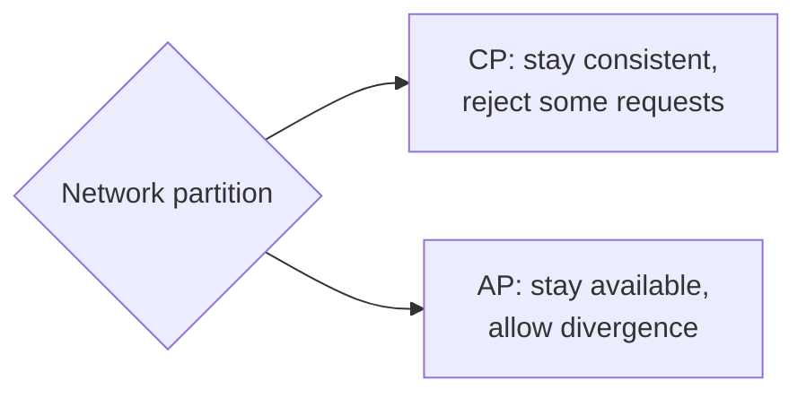

Every database design decision trades one desirable property for another. Knowing these trade-offs — and articulating them clearly — is what turns a list of technologies into a well-reasoned design.

## Consistency versus availability: the CAP theorem

The **CAP theorem** states that when a network **partition** occurs, a distributed data store must choose between **consistency** (every read sees the latest write) and **availability** (every request gets a non-error response). Since partitions cannot be ruled out in real networks, the practical choice is what to sacrifice during one:

- **CP systems** refuse some requests during a partition to avoid returning stale or conflicting data. Suitable for bank balances, locks and inventory.
- **AP systems** keep serving requests on both sides of the partition and reconcile afterwards. Suitable for shopping carts, social feeds and view counts.

## Latency versus consistency: PACELC

CAP only describes behavior during partitions. The **PACELC** extension adds: **E**lse, when the network is healthy, choose between **L**atency and **C**onsistency. Synchronously replicating every write across regions gives strong consistency but adds a cross-region round trip to each write. Many systems let you choose per operation.

## Normalization versus denormalization

- **Normalized** schemas store each fact once. Updates are simple and consistent, but reads require joins.
- **Denormalized** schemas duplicate data to make reads fast — for example, storing an author's name on every post. Reads become single lookups, but updates must touch every copy.

Read-heavy systems at scale usually denormalize the data behind their hottest read paths, often through precomputed views.

## Read optimization versus write optimization

- **Indexes** speed up reads but slow down writes, because each write updates every index.
- **B-tree** engines favor reads and range scans; **LSM** engines favor write throughput at the cost of background compaction and some read amplification.
- **Precomputed results** (materialized views, fan-out-on-write timelines) make reads cheap by doing more work on each write.

## Strong schema versus flexible schema

A strict schema catches errors early and documents the data model, but schema migrations on huge tables require planning. Flexible schemas allow rapid iteration, but move validation into application code and can let inconsistent data accumulate.

## SQL versus NoSQL at a glance

| Consideration | Relational (SQL) | Typical NoSQL |
| --- | --- | --- |
| Data model | Tables, fixed schema | Key-value, document, wide-column, graph |
| Transactions | Multi-row ACID | Often single-key or limited |
| Queries | Flexible, ad-hoc, joins | Designed around access patterns |
| Scaling writes | Harder; manual sharding | Built-in partitioning |
| Consistency | Strong by default | Often tunable or eventual |

<Callout type="interview">
A convincing database justification has three parts: the **access pattern** (“we read a user's recent messages by conversation, ordered by time”), the **requirement** (“very high write volume, eventual consistency is acceptable”), and the **choice** (“so a wide-column store partitioned by conversation ID and clustered by timestamp”).
</Callout>

<KeyTakeaways>
- CAP: during a partition, choose between consistency and availability.
- PACELC: even without partitions, choose between latency and consistency.
- Normalization simplifies updates; denormalization speeds reads.
- Indexes, storage engines and precomputation trade write cost for read speed.
- Justify database choices by access pattern, requirements and resulting trade-offs.
</KeyTakeaways>
