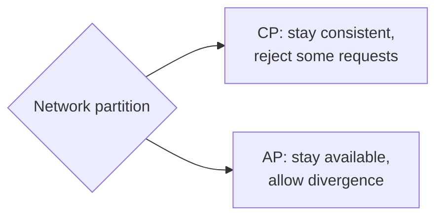

Every database design decision trades one desirable property for another. Knowing these trade-offs — and articulating them clearly — is what turns a list of technologies into a well-reasoned design.

## Consistency versus availability: the CAP theorem

The **CAP theorem** states that when a network **partition** occurs, a distributed data store must choose between **consistency** (every read sees the latest write) and **availability** (every request gets a non-error response). Since partitions cannot be ruled out in real networks, the practical choice is what to sacrifice during one:

- **CP systems** refuse some requests during a partition to avoid returning stale or conflicting data. Suitable for bank balances, locks and inventory.
- **AP systems** keep serving requests on both sides of the partition and reconcile afterwards. Suitable for shopping carts, social feeds and view counts.

### A concrete scenario

A key-value store has three replicas: two in data center A and one in data center B. The link between A and B fails. A client in B wants to update a user's email address.

- A **CP** store requires a majority (two of three replicas) for every write. B holds only one replica, so the write is rejected until the link recovers. Clients in A continue normally.
- An **AP** store accepts the write in B and later reconciles with A. If someone in A changed the same email meanwhile, the two versions conflict and must be merged or one discarded.

Neither is wrong; the right choice depends on what a rejected write costs compared with a conflicting one.

## Latency versus consistency: PACELC

CAP only describes behavior during partitions. The **PACELC** extension adds: **E**lse, when the network is healthy, choose between **L**atency and **C**onsistency. Synchronously replicating every write across regions gives strong consistency but adds a cross-region round trip to each write. Many systems let you choose per operation.

| Behavior | During partition (P) | Normal operation (E) | Examples of this style |
| --- | --- | --- | --- |
| PA/EL | Stay available | Favor low latency | Dynamo-style key-value stores with default settings |
| PC/EC | Stay consistent | Favor consistency | Consensus-based and distributed SQL databases |
| PA/EC | Stay available | Favor consistency | Some document stores with majority reads and writes |
| PC/EL | Stay consistent | Favor latency | Rare; some in-memory data grids |

Many modern systems are **tunable**: a leaderless store can behave more like PC/EC when you ask for quorum reads and writes, and more like PA/EL with single-replica operations.

## ACID versus BASE

| | ACID | BASE |
| --- | --- | --- |
| Philosophy | Correctness first | Availability first |
| Consistency | Strong, immediate | Eventual |
| Transactions | Multi-row, isolated | Often single-key, or none |
| Scaling | Harder across machines | Designed for horizontal scale |
| Developer burden | Lower — the database protects invariants | Higher — application handles conflicts and stale data |

## Normalization versus denormalization

- **Normalized** schemas store each fact once. Updates are simple and consistent, but reads require joins.
- **Denormalized** schemas duplicate data to make reads fast — for example, storing an author's name on every post. Reads become single lookups, but updates must touch every copy.

Read-heavy systems at scale usually denormalize the data behind their hottest read paths, often through precomputed views kept up to date by events or change data capture.

## Read optimization versus write optimization

- **Indexes** speed up reads but slow down writes, because each write updates every index. A table with eight indexes performs roughly nine writes for every insert.
- **B-tree** engines favor reads and range scans; **LSM** engines favor write throughput at the cost of background compaction and some read amplification.
- **Precomputed results** (materialized views, fan-out-on-write timelines) make reads cheap by doing more work on each write.

## Strong schema versus flexible schema

A strict schema catches errors early and documents the data model, but schema migrations on huge tables require planning. Flexible schemas allow rapid iteration, but move validation into application code and can let inconsistent data accumulate — the schema still exists, it is just implicit in the code that reads the data ("schema on read").

## Distributed transactions versus sagas

When a business operation spans several services or shards:

| | Two-phase commit | Saga |
| --- | --- | --- |
| Atomicity | All-or-nothing across participants | Each step commits locally; failures trigger compensating steps |
| Isolation | Locks held until commit | Intermediate states are visible |
| Availability | Blocks if the coordinator or a participant is down | Continues; compensation can run later |
| Typical use | Within one database product's shards | Across microservices: order, payment, shipping |

A saga for "place order" might reserve inventory, charge the card and create a shipment; if the charge fails, a compensating step releases the inventory.

## SQL versus NoSQL at a glance

| Consideration | Relational (SQL) | Typical NoSQL |
| --- | --- | --- |
| Data model | Tables, fixed schema | Key-value, document, wide-column, graph |
| Transactions | Multi-row ACID | Often single-key or limited |
| Queries | Flexible, ad-hoc, joins | Designed around access patterns |
| Scaling writes | Harder; manual sharding | Built-in partitioning |
| Consistency | Strong by default | Often tunable or eventual |

<Ponder question="For a flash sale with 1,000 units of a product and 100,000 buyers, would you choose a CP or AP approach for the inventory count, and why?">
**CP** for the inventory decrement. With an AP approach, both sides of a partition could sell the "last" units, overselling and forcing cancellations, which is worse for customers than a brief "try again" error. The rest of the page — product description, reviews, recommendations — can stay AP and be served from caches. Choosing per data type rather than per system is the key point.
</Ponder>

<Callout type="interview">
A convincing database justification has three parts: the **access pattern** ("we read a user's recent messages by conversation, ordered by time"), the **requirement** ("very high write volume, eventual consistency is acceptable"), and the **choice** ("so a wide-column store partitioned by conversation ID and clustered by timestamp").
</Callout>

<KeyTakeaways>
- CAP: during a partition, choose between consistency and availability — reject requests or allow divergence.
- PACELC: even without partitions, choose between latency and consistency; many systems are tunable per operation.
- ACID puts correctness in the database; BASE trades it for availability and scale, shifting work to the application.
- Normalization simplifies updates; denormalization speeds reads.
- Indexes, storage engines and precomputation trade write cost for read speed.
- Two-phase commit gives atomicity across participants but blocks; sagas stay available with compensating steps.
- Justify database choices by access pattern, requirements and resulting trade-offs.
</KeyTakeaways>
