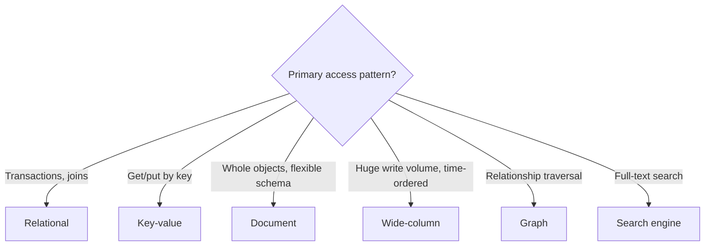

There is no single best database. Different data models make different access patterns easy or hard. This lesson surveys the main families and when to use each.

## Relational databases (SQL)

Relational databases store data in **tables** of rows and columns with a fixed **schema**. Relationships are expressed with foreign keys and combined at query time with **joins**. SQL provides a powerful, declarative query language.

**Strengths:** ACID transactions, strong consistency, flexible ad-hoc queries, mature tooling, enforced integrity constraints.
**Weaknesses:** horizontal scaling of writes requires manual sharding; schema changes on huge tables need care; object–relational impedance mismatch.
**Good for:** financial records, inventory, orders, user accounts — anything relational and correctness-critical.

## Key-value stores

Data is stored as **key → value** pairs, where the value is opaque to the database. Operations are simple: get, put, delete.

**Strengths:** extremely fast, easy to partition and replicate, massive scale.
**Weaknesses:** no queries by value, no joins.
**Good for:** sessions, caches, user preferences, shopping carts, feature flags.

## Document databases

Data is stored as self-contained **documents** (typically JSON-like) that can nest arrays and objects. Documents in a collection may have different fields.

**Strengths:** flexible schema, data locality (a whole object is loaded in one read), natural mapping to application objects.
**Weaknesses:** weaker support for joins and many-to-many relationships; data duplication across documents.
**Good for:** content management, product catalogs, user profiles.

## Wide-column stores

Rows are identified by a **partition key** and contain a flexible, potentially huge set of columns sorted by a **clustering key**. Data for one partition is stored together.

**Strengths:** very high write throughput, linear horizontal scaling, efficient range scans within a partition.
**Weaknesses:** queries must be designed around the partition key; limited ad-hoc querying.
**Good for:** time series, messaging history, activity logs, IoT data.

## Graph databases

Data is modeled as **nodes** and **edges** with properties. Queries traverse relationships efficiently.

**Good for:** social graphs, recommendation engines, fraud detection, knowledge graphs — where the relationships are the point.

## Other specialized stores

- **Search engines** with inverted indexes for full-text search and relevance ranking.
- **Time-series databases** optimized for timestamped metrics with downsampling and retention policies.
- **Vector databases** that index embeddings for similarity search, increasingly used in AI applications.
- **Blob or object stores** for large unstructured files.

## Polyglot persistence

Large systems often use several databases, each for what it does best: relational for orders, a key-value store for sessions, a search engine for product search and a blob store for images. This is called **polyglot persistence**. It optimizes each workload but increases operational complexity and requires keeping data synchronized, typically through change-data-capture pipelines or events.

<Callout type="tip">
“SQL versus NoSQL” is a false dichotomy. Modern relational databases support JSON columns and can scale far with replicas and sharding, while many NoSQL stores now offer transactions. Choose based on the specific access patterns and guarantees you need.
</Callout>

<KeyTakeaways>
- Relational databases offer transactions, joins and strong consistency; they suit correctness-critical relational data.
- Key-value stores are fast and scalable for simple key lookups.
- Document databases store flexible, self-contained objects.
- Wide-column stores handle enormous write volumes with queries designed around partition keys.
- Graph, search, time-series and vector databases serve specialized access patterns.
- Large systems commonly combine several stores (polyglot persistence).
</KeyTakeaways>
