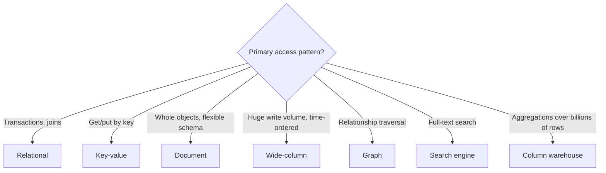
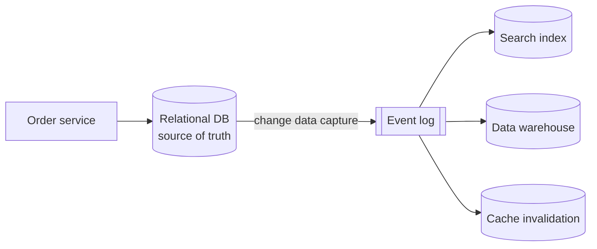

There is no single best database. Different data models make different access patterns easy or hard. This lesson surveys the main families, shows how the same data looks in each, and explains when to use which.

## Relational databases (SQL)

Relational databases store data in **tables** of rows and columns with a fixed **schema**. Relationships are expressed with foreign keys and combined at query time with **joins**. SQL provides a powerful, declarative query language, and the query planner decides how to execute it using available indexes.

```sql
CREATE TABLE users  (id BIGINT PRIMARY KEY, name TEXT, email TEXT UNIQUE);
CREATE TABLE orders (id BIGINT PRIMARY KEY, user_id BIGINT REFERENCES users(id),
                     total_cents INT, created_at TIMESTAMP);

-- Ten most recent orders with the customer's name
SELECT o.id, u.name, o.total_cents
FROM orders o JOIN users u ON u.id = o.user_id
ORDER BY o.created_at DESC LIMIT 10;
```

**Strengths:** ACID transactions, strong consistency, flexible ad-hoc queries, mature tooling, enforced integrity constraints.
**Weaknesses:** horizontal scaling of writes requires manual sharding; schema changes on huge tables need care; object–relational impedance mismatch.
**Good for:** financial records, inventory, orders, user accounts — anything relational and correctness-critical.

## Key-value stores

Data is stored as **key → value** pairs, where the value is opaque to the database. Operations are simple: get, put, delete, sometimes with a time to live.

```text
session:9f3a2c  ->  {"userId": 42, "cart": [17, 93], "expires": "..."}
flag:new-checkout -> "enabled-for-10-percent"
```

**Strengths:** extremely fast, easy to partition and replicate, massive scale.
**Weaknesses:** no queries by value, no joins.
**Good for:** sessions, caches, user preferences, shopping carts, feature flags.

## Document databases

Data is stored as self-contained **documents** (typically JSON-like) that can nest arrays and objects. Documents in a collection may have different fields, and most document stores can index fields inside documents.

```json
{
  "_id": "product-8812",
  "title": "Trail running shoe",
  "brand": "Acme",
  "variants": [
    { "size": 42, "color": "blue", "stock": 17 },
    { "size": 43, "color": "blue", "stock": 4 }
  ],
  "specs": { "weightGrams": 280, "drop": "6mm" }
}
```

**Strengths:** flexible schema, data locality (a whole object is loaded in one read), natural mapping to application objects.
**Weaknesses:** weaker support for joins and many-to-many relationships; data duplication across documents.
**Good for:** content management, product catalogs, user profiles.

## Wide-column stores

Rows are identified by a **partition key** and contain a flexible, potentially huge set of columns sorted by a **clustering key**. Data for one partition is stored together on the same nodes, sorted, so reading "the latest 50 items of partition X" is a single sequential read.

```text
Partition key: conversation_id = c-771
  clustering key (message_id, descending) | sender | body
  0193f...e2                               | alice  | "see you at 6"
  0193f...a9                               | bob    | "works for me"
  0193e...77                               | alice  | "dinner friday?"
```

**Strengths:** very high write throughput, linear horizontal scaling, efficient range scans within a partition.
**Weaknesses:** queries must be designed around the partition key; limited ad-hoc querying; data is often duplicated into one table per query.
**Good for:** time series, messaging history, activity logs, IoT data.

## Graph databases

Data is modeled as **nodes** and **edges** with properties. Queries traverse relationships efficiently, without the repeated joins a relational database would need for "friends of friends of friends".

```text
(alice:Person)-[:FOLLOWS]->(bob:Person)-[:LIKES]->(post:Post {id: 991})
MATCH (a:Person {name:'alice'})-[:FOLLOWS*2]->(fof) RETURN fof
```

**Good for:** social graphs, recommendation engines, fraud detection, knowledge graphs — where the relationships are the point.

## Distributed SQL (NewSQL)

A newer family keeps the relational model and SQL but partitions and replicates data automatically, using consensus per partition to provide serializable transactions across machines and even regions. It removes the need for manual sharding at the cost of higher write latency (a consensus round per write) and more complex operations. It suits workloads that have outgrown a single relational node but still need strong transactional guarantees, such as global financial or inventory systems.

## Other specialized stores

- **Search engines** with inverted indexes for full-text search and relevance ranking.
- **Time-series databases** optimized for timestamped metrics with downsampling and retention policies.
- **Column-oriented warehouses** for analytical queries over billions of rows.
- **In-memory stores** that keep the entire data set in RAM for microsecond access, with optional persistence.
- **Vector databases** that index embeddings for similarity search, increasingly used in AI applications.
- **Blob or object stores** for large unstructured files.



## Choosing a database: three examples

| Requirement | Choice | Reasoning |
| --- | --- | --- |
| Bank ledger: every transfer must balance, auditors run ad-hoc queries | Relational (or distributed SQL at global scale) | Multi-row ACID transactions and constraints; flexible queries |
| Chat history: 50,000 messages per second, read latest N per conversation | Wide-column | Write-optimized, partitions by conversation, sorted by time |
| E-commerce catalog: varied attributes per category, read whole product | Document, plus a search engine | Flexible schema and locality; full-text and faceted search in a separate index |

## Polyglot persistence

Large systems often use several databases, each for what it does best: relational for orders, a key-value store for sessions, a search engine for product search and a blob store for images. This is called **polyglot persistence**. It optimizes each workload but increases operational complexity and requires keeping data synchronized, typically through **change data capture (CDC)** — streaming the primary database's change log into the other stores — or through events.



<Ponder question="Why is change data capture usually safer than having the application write to the database and the search index directly?">
With dual writes, the application can crash between the two writes, or the writes can happen in different orders for concurrent requests, leaving the search index permanently out of sync. CDC derives every downstream update from the database's own committed log, in commit order, so the index eventually reflects exactly what the database holds, and a failed consumer can resume from its last position.
</Ponder>

<Callout type="tip">
"SQL versus NoSQL" is a false dichotomy. Modern relational databases support JSON columns and can scale far with replicas and sharding, while many NoSQL stores now offer transactions. Choose based on the specific access patterns and guarantees you need.
</Callout>

<KeyTakeaways>
- Relational databases offer transactions, joins and strong consistency; they suit correctness-critical relational data.
- Key-value stores are fast and scalable for simple key lookups; document stores keep flexible, self-contained objects together.
- Wide-column stores handle enormous write volumes with queries designed around partition and clustering keys.
- Distributed SQL keeps relational guarantees with automatic partitioning, at the cost of consensus latency.
- Graph, search, time-series, columnar, in-memory and vector databases serve specialized access patterns.
- Large systems combine several stores and keep them in sync with change data capture.
</KeyTakeaways>
