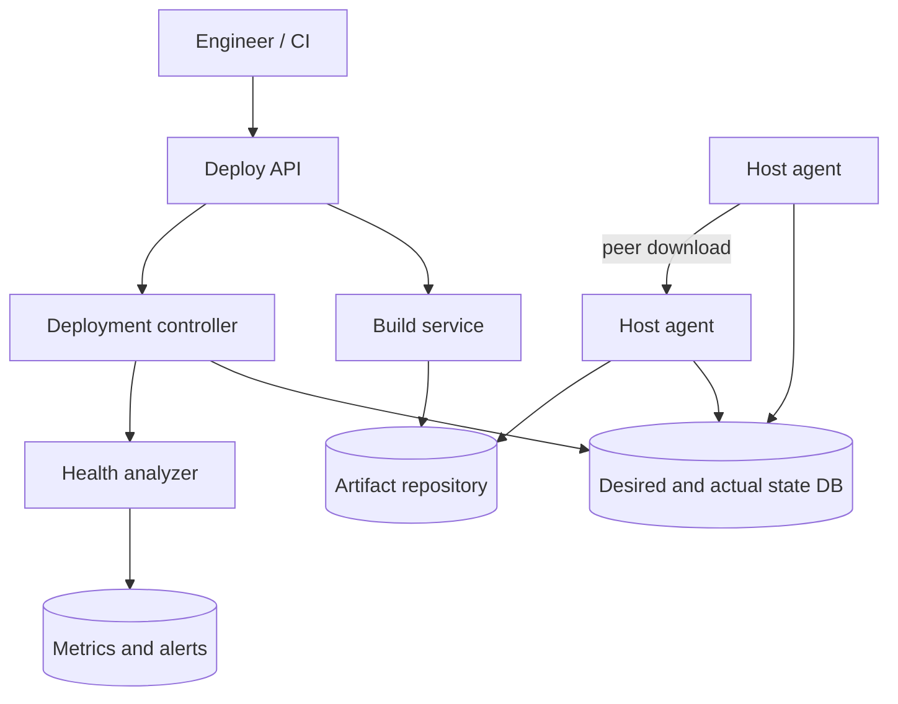
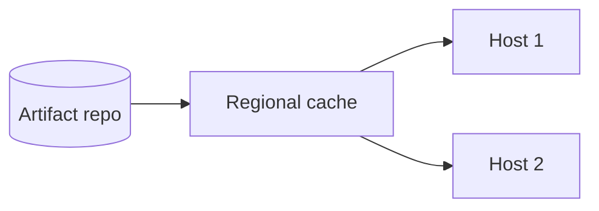
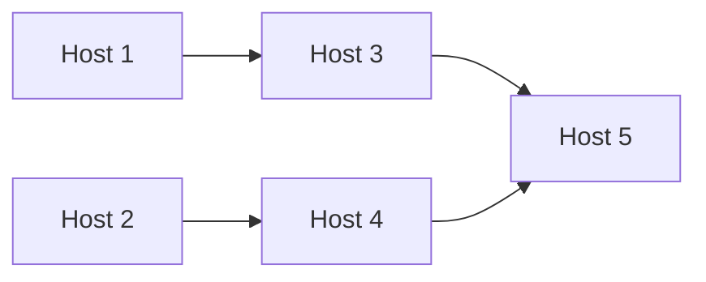
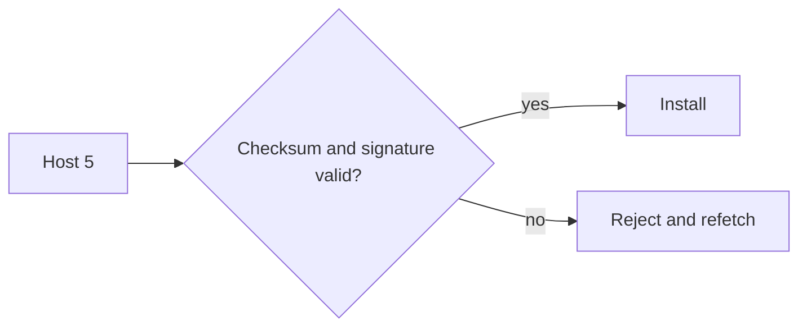

This lesson designs the deployment system: building artifacts, distributing them efficiently, driving hosts to a desired version and rolling out progressively with automatic rollback.

## Requirements recap

- **Functional:** build a commit into an artifact, deploy it to a service's hosts using a configurable rollout plan, monitor health, roll back automatically or on demand, and show the status of every deployment.
- **Non-functional:** deploy to tens of thousands of hosts within minutes to an hour, never lose track of which version runs where, be highly available and be secure (only authorized, signed artifacts run in production).

## Architecture

- **Build service** checks out the commit, builds in a hermetic, reproducible environment, runs tests and pushes a **signed, immutable artifact** identified by version and checksum.
- **Deploy API** accepts deployment requests, checks permissions and records them for audit.
- **Deployment controller** turns a request into a plan of waves and moves hosts from the old version to the new one, wave by wave.
- **State database** stores, for each host or service instance, the **desired version** and the **actual version** reported by the host.
- **Host agents** run on every machine, poll or subscribe for their desired state, download artifacts, verify signatures, install and restart the service, run local health checks and report the actual state.
- **Health analyzer** compares metrics of the new version against the old one and signals the controller to continue, pause or roll back.

## Desired-state reconciliation

Instead of pushing commands such as "install version 42 now," the controller writes **desired state**, and agents continuously **reconcile** actual state towards it. This design is robust: if a host is down during the deployment, its agent reconciles when it comes back; if a command message is lost, the next poll fixes it. Rollback is just setting the desired version back to the previous one.

## Distributing artifacts efficiently

Downloading a 500 MB artifact from a central repository to 50,000 hosts would be 25 TB of egress in a burst, saturating the repository. Instead:

<Slides title="Peer-assisted artifact distribution">
<Slide caption="1. A few hosts per rack or zone download from the repository or a regional cache.">

</Slide>
<Slide caption="2. Other hosts fetch pieces from peers that already have them, in the style of peer-to-peer file sharing.">

</Slide>
<Slide caption="3. Every host verifies the checksum and signature before installing.">

</Slide>
</Slides>

Artifacts can also be **pre-staged**: downloaded to all hosts before the rollout starts, so each wave only has to switch versions, which is quick. Container image layers help too, since hosts only fetch layers they do not already have.

## Progressive rollout and automatic rollback

A rollout plan for a global service might be: 1 canary host, then 1 percent of one zone, then one full zone, then one region, then the remaining regions in batches, with a **bake time** after each wave. Waves never span multiple regions at once, so a bad version cannot take down everything.

During bake time, the health analyzer compares the new version's error rate, latency, crash count and key business metrics with those of hosts still on the old version. If the new version is significantly worse, the controller **halts** and **rolls back** automatically. Engineers can also pause or roll back manually.

## Correctness details

- **Idempotent agents:** reinstalling the same version is harmless, so retries are safe.
- **Concurrency control:** only one active deployment per service at a time, enforced with a lock or version check in the state database, so two engineers cannot fight over the desired version.
- **Capacity safety:** waves never take down more than a set fraction of a service's instances at once, and instances drain connections before restarting.
- **Audit and security:** every deployment is recorded with author, commit and approvals; agents run only signed artifacts from the trusted repository.
- **Emergency path:** a fast rollback path skips normal bake times, and the deployment system itself runs in several regions with minimal dependencies.

## Deciding whether a wave is healthy

Comparing the new version with the old requires care: a slightly higher error rate could be noise. The health analyzer compares **canary** hosts running the new version with **baseline** hosts running the old version that receive similar traffic at the same time, so time-of-day effects cancel out.

| Metric | Baseline | Canary | Verdict |
| --- | --- | --- | --- |
| Error rate | 0.20% | 0.22% | Within noise — pass |
| p99 latency | 180 ms | 410 ms | Significant regression — fail |
| Crash loops | 0 | 0 | Pass |
| Orders per minute per host | 12.1 | 12.0 | Pass |

A statistical test (for example, comparing distributions rather than single values) decides whether differences are significant. One failed critical metric is enough to halt and roll back.

## Deploying schema and configuration changes

Code rollouts mix old and new versions for a while, so data changes must work with both:

- **Database schema changes** follow expand and contract: add the new column first (compatible with old code), deploy code that writes both, backfill, switch reads, then remove the old column in a later deployment.
- **Configuration changes** go through the same progressive waves and health checks as code — many major outages have been caused by a configuration push applied everywhere at once.
- **Feature flags** let new code ship dark and be enabled gradually by percentage, independently of deployment.

<Ponder question="A new version passes canary checks on 1% of hosts but causes a memory leak that crashes processes only after six hours. How could the rollout process catch this?">
Short bake times would miss it. Longer bake times for early waves (hours rather than minutes), monitoring trends such as memory growth rather than only current values, and keeping part of the fleet on the old version long enough to compare, all help. Automatic rollback triggered by crash-rate alerts limits the damage if it slips through; progressive waves ensure that when it does, only part of the fleet is affected.
</Ponder>

<KeyTakeaways>
- Builds produce signed, immutable artifacts; a controller turns deployments into waves.
- Hosts reconcile actual state to desired state, which makes rollouts and rollbacks robust to failures.
- Peer-assisted distribution, regional caches and pre-staging avoid overloading the artifact repository.
- Progressive waves with bake times and automatic comparison of new and old versions limit the blast radius.
- One deployment per service at a time, capacity limits, audit trails and an emergency rollback path keep deployments safe.
- Canary analysis compares new and old versions side by side with statistical tests.
- Schema and configuration changes need the same progressive, backward-compatible rollout as code.
</KeyTakeaways>
