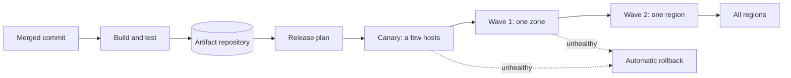

A code deployment system takes a change that an engineer has merged and delivers it safely to thousands of servers, often many times a day. At large companies, it builds artifacts for hundreds of services, rolls them out gradually across regions, watches health metrics and rolls back automatically when something goes wrong. It is internal infrastructure, but it is critical: a bad deployment is one of the most common causes of outages.

## Why deployment is a system design problem

Copying files to servers is easy. Doing it well at scale is not:

- **Scale.** A large organization might deploy thousands of times a day to hundreds of thousands of hosts in many regions.
- **Artifact size and distribution.** Build outputs, such as container images or binaries, can be hundreds of megabytes. Downloading one from a central store to 50,000 machines at once would overwhelm it.
- **Safety.** A bug deployed everywhere at once can take down the whole service. Rollouts must be gradual, observable and reversible.
- **Consistency.** At any moment, the system must know exactly which version is running where, and what the desired version is.
- **Reliability of the deployer itself.** If the deployment system is down, engineers cannot ship fixes during an incident, so it must be highly available and must not depend on the services it deploys.

## The pipeline

1. **Build:** compile the code, run tests and produce an immutable, versioned artifact.
2. **Store:** push the artifact to a repository and record its checksum.
3. **Plan:** decide the rollout strategy and waves for each service.
4. **Roll out:** deploy to a small canary set, then progressively larger waves, pausing between them to observe health.
5. **Verify or roll back:** compare metrics of new and old versions; halt and revert on regression.

## Deployment strategies

| Strategy | How it works | Trade-off |
| --- | --- | --- |
| Rolling | Replace instances a batch at a time | Simple; mixed versions run together during rollout |
| Blue-green | Stand up a full new environment, switch traffic at once | Fast switch and rollback; needs double capacity |
| Canary | Send a small share of traffic to the new version first | Limits blast radius; needs good metrics to judge |
| Feature flags | Ship code dark, enable features separately at runtime | Decouples deploy from release; flag debt accumulates |

Most mature systems combine them: code is deployed by canary and rolling waves, and risky features are enabled separately with feature flags.

## What the next lesson designs

We will design a deployment system with:

- a build service that produces immutable artifacts;
- efficient, peer-assisted artifact distribution to many hosts;
- a deployment controller that drives desired state per host;
- health-based progressive rollout with automatic rollback;
- an audit trail of who deployed what, when and where.

<Callout type="interview">
Deployment interviews reward operational thinking. Talk about blast radius, observability and rollback before you talk about file copying.
</Callout>

<KeyTakeaways>
- A deployment system builds, stores, distributes and rolls out artifacts to many servers safely.
- The hard parts are scale, efficient artifact distribution, safety, knowing what runs where and the deployer's own reliability.
- Rollouts are progressive: canary, then waves by zone and region, with health checks between them.
- Rolling, blue-green, canary and feature flags each trade simplicity, capacity and risk differently.
</KeyTakeaways>
