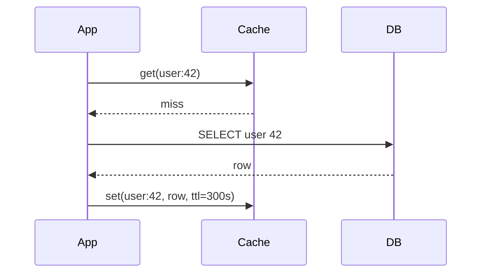

Before designing the distributed cache, we need the vocabulary of caching: how data gets into the cache, how writes are handled, what gets evicted and how stale data is avoided.

## Reading strategies

**Cache-aside (lazy loading)** is the most common pattern. The application checks the cache; on a miss, it reads from the database and populates the cache.



Only requested data is cached, and a cache failure degrades to database reads. The downsides are a slow first request and possible staleness.

**Read-through** caches sit between the application and the database and load missing data themselves. The application only talks to the cache, which needs to know how to query the database (usually through a loader function configured by the application).

| | Cache-aside | Read-through |
| --- | --- | --- |
| Who loads on a miss | Application | Cache |
| Application code | Handles miss logic | Simpler |
| Cache failure | Application falls back to the database | Reads fail unless there is a bypass |
| Flexibility | Any data source, any key format | Tied to the cache's loader |

**Refresh-ahead** proactively reloads entries that are popular and close to expiry, so hot keys never miss. It costs extra database reads for keys that might not be requested again.

## Writing strategies

- **Write-through** — writes go to the cache and the database synchronously. The cache is always fresh, but write latency increases and rarely read data may be cached.
- **Write-back (write-behind)** — writes go to the cache and are flushed to the database asynchronously. Writes are very fast, but data can be lost if the cache fails before flushing.
- **Write-around** — writes go directly to the database, and the cache entry is **invalidated** (deleted). The next read reloads it. This is the usual companion to cache-aside.

| Strategy | Write latency | Freshness | Risk |
| --- | --- | --- | --- |
| Write-through | Higher | Fresh | Caches cold data |
| Write-back | Lowest | Fresh in cache | Data loss on failure |
| Write-around + invalidate | Normal | Fresh after next read | Misses after writes |

Write-back is useful when many writes hit the same keys — for example, a view counter updated thousands of times a second can be accumulated in the cache and flushed to the database once a second.

## Eviction policies

When memory is full, something must go:

- **LRU (least recently used)** — evict the entry not accessed for the longest time. The default in most caches.
- **LFU (least frequently used)** — evict the entry with the fewest accesses; good for stable popularity.
- **FIFO** — evict the oldest entry; simple but ignores usage.
- **TTL-based** — entries expire after a fixed time regardless of use.
- **Random** — surprisingly competitive at large sizes and needs no bookkeeping; some caches approximate LRU by sampling a few random keys and evicting the least recently used among them.

LRU is typically implemented with a **hash map plus a doubly linked list**, giving O(1) lookups, insertions and evictions:

```python
class LRUCache:
    def __init__(self, capacity):
        self.capacity = capacity
        self.map = {}                      # key -> node
        self.head = Node(None, None)       # most recently used side
        self.tail = Node(None, None)       # least recently used side
        self.head.next, self.tail.prev = self.tail, self.head

    def get(self, key):
        node = self.map.get(key)
        if node is None:
            return None
        self._move_to_front(node)          # O(1): unlink and relink
        return node.value

    def set(self, key, value):
        if key in self.map:
            node = self.map[key]
            node.value = value
            self._move_to_front(node)
            return
        if len(self.map) == self.capacity:
            lru = self.tail.prev           # O(1): evict from the back
            self._unlink(lru)
            del self.map[lru.key]
        node = Node(key, value)
        self._insert_front(node)
        self.map[key] = node
```

## Invalidation and staleness

"There are only two hard things in computer science: cache invalidation and naming things." When the underlying data changes, cached copies become stale. Strategies include:

- **TTLs** bound staleness to a known maximum.
- **Explicit invalidation** — delete the cache entry when the data is written.
- **Event-driven invalidation** — a change-data-capture stream from the database triggers invalidations.
- **Versioned keys** — include a version number in the key so updates naturally use a new entry.

Add **jitter** to TTLs — for example, 300 seconds ± 10% — so that entries written at the same moment (say, after a cache restart) do not all expire at the same moment and hit the database together.

<Callout type="warning">
A subtle race in cache-aside: a reader misses and loads an old value from the database, a writer updates the database and deletes the cache entry, then the slow reader writes the old value into the cache. Short TTLs and techniques such as leases or delayed double-deletes limit the damage.
</Callout>

## Common failure patterns

- **Cache stampede** — a popular key expires and thousands of requests hit the database simultaneously. Mitigate with request coalescing, locks, or refreshing slightly before expiry.
- **Hot keys** — one key receives enormous traffic, overloading one cache node. Replicate hot keys or add a small local cache in each application server.
- **Cache penetration** — repeated requests for keys that do not exist bypass the cache every time. Cache negative results briefly or use a Bloom filter.
- **Cache avalanche** — many keys expire together, or the whole cache restarts, and the database receives the full load at once. TTL jitter, replication and gradual warm-up prevent it.

### Probabilistic early expiration

A neat stampede defense requires no locks. Each reader that gets a hit decides, with a probability that rises as expiry approaches, to refresh the entry early:

```text
refresh early if:  now − β × recompute_time × ln(random()) ≥ expiry
```

Because `ln(random())` is negative, the left side is `now` plus a random amount that is usually small and occasionally large. Far from expiry, almost no one refreshes; just before expiry, one reader is very likely to refresh while everyone else keeps using the cached value. Expensive-to-recompute values (larger `recompute_time`) start refreshing earlier.

<Ponder question="An attacker requests product IDs that do not exist, at 20,000 requests per second. Each misses the cache and queries the database. What are two defenses?">
Cache the **negative result**: store "product 98231 does not exist" with a short TTL, so repeated requests hit the cache. Or put a **Bloom filter** of all existing product IDs in front of the cache: if the filter says an ID definitely does not exist, return "not found" immediately without touching the cache or database. Rate limiting the client is a useful third layer.
</Ponder>

<KeyTakeaways>
- Cache-aside loads data on misses; read-through lets the cache load it; refresh-ahead reloads hot keys before they expire.
- Write-through keeps the cache fresh; write-back is fastest but risks loss; write-around invalidates entries.
- LRU is the most common eviction policy, implemented with a hash map and doubly linked list for O(1) operations.
- Bound staleness with TTLs (with jitter), explicit or event-driven invalidation, or versioned keys.
- Guard against stampedes (coalescing, probabilistic early refresh), hot keys, penetration and avalanches.
</KeyTakeaways>
