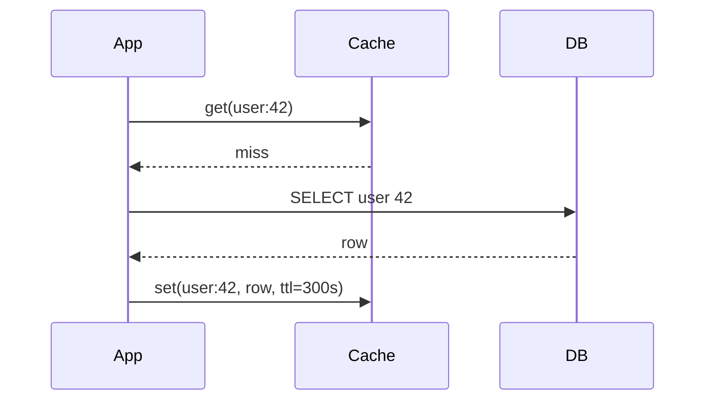

Before designing the distributed cache, we need the vocabulary of caching: how data gets into the cache, how writes are handled, what gets evicted and how stale data is avoided.

## Reading strategies

**Cache-aside (lazy loading)** is the most common pattern. The application checks the cache; on a miss, it reads from the database and populates the cache.

Only requested data is cached, and a cache failure degrades to database reads. The downsides are a slow first request and possible staleness.

**Read-through** caches sit between the application and the database and load missing data themselves. The application only talks to the cache.

## Writing strategies

- **Write-through** — writes go to the cache and the database synchronously. The cache is always fresh, but write latency increases and rarely read data may be cached.
- **Write-back (write-behind)** — writes go to the cache and are flushed to the database asynchronously. Writes are very fast, but data can be lost if the cache fails before flushing.
- **Write-around** — writes go directly to the database, and the cache entry is **invalidated** (deleted). The next read reloads it. This is the usual companion to cache-aside.

| Strategy | Write latency | Freshness | Risk |
| --- | --- | --- | --- |
| Write-through | Higher | Fresh | Caches cold data |
| Write-back | Lowest | Fresh in cache | Data loss on failure |
| Write-around + invalidate | Normal | Fresh after next read | Misses after writes |

## Eviction policies

When memory is full, something must go:

- **LRU (least recently used)** — evict the entry not accessed for the longest time. The default in most caches.
- **LFU (least frequently used)** — evict the entry with the fewest accesses; good for stable popularity.
- **FIFO** — evict the oldest entry; simple but ignores usage.
- **TTL-based** — entries expire after a fixed time regardless of use.

LRU is typically implemented with a **hash map plus a doubly linked list**, giving O(1) lookups, insertions and evictions.

## Invalidation and staleness

“There are only two hard things in computer science: cache invalidation and naming things.” When the underlying data changes, cached copies become stale. Strategies include:

- **TTLs** bound staleness to a known maximum.
- **Explicit invalidation** — delete the cache entry when the data is written.
- **Event-driven invalidation** — a change-data-capture stream from the database triggers invalidations.
- **Versioned keys** — include a version number in the key so updates naturally use a new entry.

<Callout type="warning">
A subtle race in cache-aside: a reader misses and loads an old value from the database, a writer updates the database and deletes the cache entry, then the slow reader writes the old value into the cache. Short TTLs and techniques such as leases or delayed double-deletes limit the damage.
</Callout>

## Common failure patterns

- **Cache stampede** — a popular key expires and thousands of requests hit the database simultaneously. Mitigate with request coalescing, locks, or refreshing slightly before expiry.
- **Hot keys** — one key receives enormous traffic, overloading one cache node. Replicate hot keys or add a small local cache in each application server.
- **Cache penetration** — repeated requests for keys that do not exist bypass the cache every time. Cache negative results briefly or use a Bloom filter.

<KeyTakeaways>
- Cache-aside loads data on misses; read-through lets the cache load it.
- Write-through keeps the cache fresh; write-back is fastest but risks loss; write-around invalidates entries.
- LRU is the most common eviction policy, implemented with a hash map and doubly linked list.
- Bound staleness with TTLs, explicit or event-driven invalidation, or versioned keys.
- Guard against stampedes, hot keys and penetration.
</KeyTakeaways>
