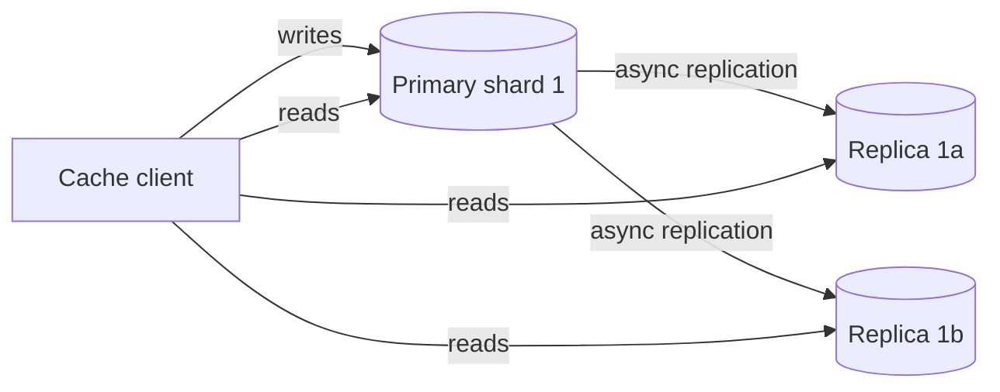
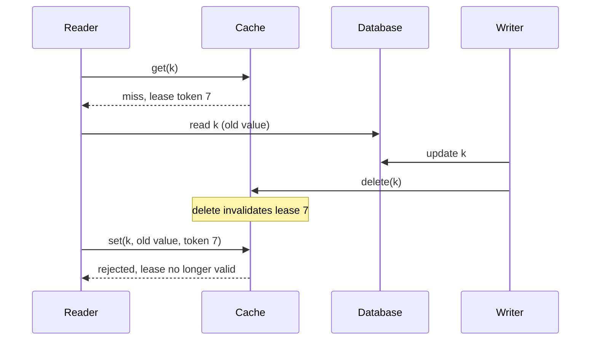
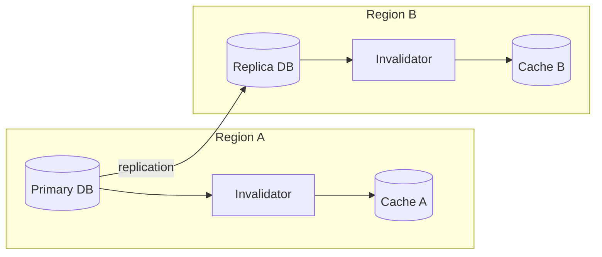

The high-level design works when every node is healthy and every key is equally popular. Real workloads are messier. This lesson addresses availability, hot keys and consistency in more depth.

## Replication for availability

If a cache node fails, all its keys miss until the ring adjusts and the new owners warm up — a sudden spike of database load. To avoid this, each shard can have **replicas**:

- Writes go to the **primary**, which replicates asynchronously to replicas.
- Reads can be spread across replicas, which also helps with hot keys.
- If the primary fails, the configuration service promotes a replica.

Because the cache is not the source of truth, **asynchronous** replication is acceptable: losing a few recent writes just causes misses.

### An alternative: a gutter pool

Replication doubles or triples memory cost. A cheaper approach for transient failures is a small **gutter pool** of spare cache servers. When a client cannot reach a node, it sends that node's requests to the gutter pool instead of the database, with short TTLs. The gutter pool absorbs the misses for a few minutes while the failed node recovers or is replaced, and because it is used only for failed nodes, it can be small — a few percent of the cluster.

| Approach | Extra memory | Hit ratio after a node failure | Complexity |
| --- | --- | --- | --- |
| No redundancy | None | Drops by 1/N until the new owner warms up | Low |
| Gutter pool | A few percent | Recovers quickly; entries short-lived | Low |
| Full replicas | 100–200% | Preserved | Higher: promotion, replication |

## Handling hot keys

Some keys are vastly more popular than others — a celebrity's profile, a viral post, a flash-sale product. One node can be overwhelmed even though the cluster is lightly loaded overall. Options include:

- **Read replicas** for the hot shard, so reads spread across several nodes.
- **Key splitting:** store copies under `key:1 … key:k` and have clients pick one at random.
- **Local near-caches:** a tiny in-process cache on each application server holds the hottest keys for a second or two, absorbing most requests before they reach the network.
- **Detection:** clients or nodes track request rates per key and automatically apply the above to keys exceeding a threshold.

A near-cache with a one-second TTL on 1,000 application servers turns 1,000,000 requests per second for one key into at most about 1,000 requests per second to the cache node — each server fetches the key once per second — at the cost of up to one second of extra staleness.

## Memory management

Caches store millions of small objects. Allocating and freeing memory for each one fragments the heap and wastes space. A common technique is **slab allocation**: memory is divided into slabs of fixed-size chunks (for example, 64 B, 128 B, 256 B…), and each item is stored in the smallest chunk that fits. This limits fragmentation at the cost of some unused space inside chunks. Each slab class can maintain its own LRU list.

A known pitfall: if the workload's value sizes change (say, profiles grow from 200 bytes to 900 bytes after a new field is added), memory stays assigned to the old slab classes, and the new class evicts aggressively while old classes sit mostly empty. Caches therefore **rebalance** slabs, moving memory from underused classes to busy ones.

## Consistency between cache and database

With cache-aside and write-around, the typical write path is:

1. Update the database.
2. **Delete** (not update) the cache entry.

Deleting is safer than updating because concurrent updates could otherwise write values into the cache in the wrong order. To shrink the remaining race windows:

- Keep **TTLs** as a safety net, so any stale entry eventually expires.
- Use **leases**: on a miss, the cache hands the reader a token; a later `set` succeeds only if no invalidation occurred since the token was issued.
- Drive invalidations from the database's **change log**, so every committed update invalidates the right keys, even if the writing application crashes.

### How leases stop stale sets

Leases also reduce stampedes: while a lease for a key is outstanding, the cache tells other readers to wait briefly and retry instead of each querying the database.

### Invalidation across regions

When the database replicates to several regions, each region usually has its own cache cluster. An update in one region must invalidate caches everywhere — but only *after* the replicated data has arrived in each region, or a reader there could refill the cache with the old value. The robust approach is for each region to **consume its local database's replication or change log** and invalidate its own cache as each change is applied locally.

## Protecting the backend

When the cache fails or a large portion goes cold, the database may receive traffic it cannot handle. Defensive measures include **request coalescing** (one database query per key at a time), **rate limiting** database fallbacks and **gradual warm-up** of new nodes — for example, filling a new cluster by copying entries from the old one, or routing a growing fraction of traffic to it over an hour.

<Callout type="interview">
If your design depends on a cache for performance, ask: "What happens to the database if the cache is empty?" A strong answer includes replication, warm-up and load protection, not just "the cache will refill."
</Callout>

<Ponder question="Why is 'update the cache with the new value' riskier than 'delete the cache entry' after a database write?">
Two concurrent writers can update the database in one order (A then B) but reach the cache in the other order (B then A), leaving A's older value in the cache indefinitely — until the TTL expires. Deleting is idempotent and order-insensitive: whichever delete arrives last still leaves the cache empty, and the next read loads the current value from the database.
</Ponder>

<KeyTakeaways>
- Asynchronous replicas keep hit ratios high through node failures; gutter pools are a cheaper alternative for transient failures.
- Hot keys are handled with replicas, key splitting, local near-caches and automatic detection.
- Slab allocation reduces fragmentation; slabs must be rebalanced as value sizes change.
- Update the database, then delete the cache entry; leases, TTLs and change-log invalidation limit staleness.
- In multi-region setups, invalidate each region's cache from its local change log.
- Protect the backend from cold caches with coalescing, rate limiting and gradual warm-up.
</KeyTakeaways>
