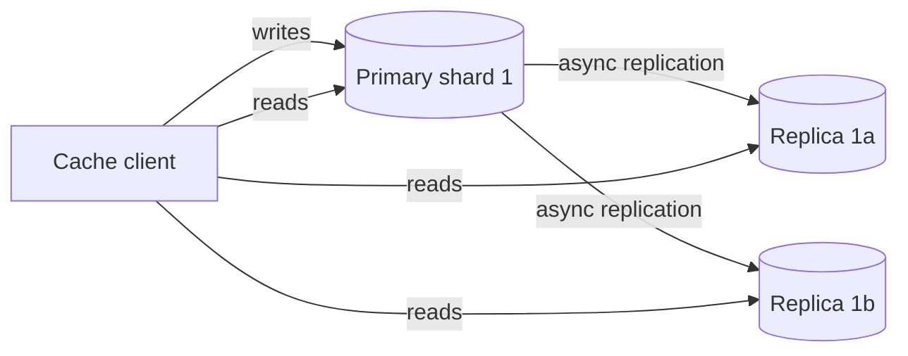

The high-level design works when every node is healthy and every key is equally popular. Real workloads are messier. This lesson addresses availability, hot keys and consistency in more depth.

## Replication for availability

If a cache node fails, all its keys miss until the ring adjusts and the new owners warm up — a sudden spike of database load. To avoid this, each shard can have **replicas**:

- Writes go to the **primary**, which replicates asynchronously to replicas.
- Reads can be spread across replicas, which also helps with hot keys.
- If the primary fails, the configuration service promotes a replica.

Because the cache is not the source of truth, **asynchronous** replication is acceptable: losing a few recent writes just causes misses.

## Handling hot keys

Some keys are vastly more popular than others — a celebrity's profile, a viral post, a flash-sale product. One node can be overwhelmed even though the cluster is lightly loaded overall. Options include:

- **Read replicas** for the hot shard, so reads spread across several nodes.
- **Key splitting:** store copies under `key#1 … key#k` and have clients pick one at random.
- **Local near-caches:** a tiny in-process cache on each application server holds the hottest keys for a second or two, absorbing most requests before they reach the network.
- **Detection:** clients or nodes track request rates per key and automatically apply the above to keys exceeding a threshold.

## Memory management

Caches store millions of small objects. Allocating and freeing memory for each one fragments the heap and wastes space. A common technique is **slab allocation**: memory is divided into slabs of fixed-size chunks (for example, 64 B, 128 B, 256 B…), and each item is stored in the smallest chunk that fits. This limits fragmentation at the cost of some unused space inside chunks. Each slab class can maintain its own LRU list.

## Consistency between cache and database

With cache-aside and write-around, the typical write path is:

1. Update the database.
2. **Delete** (not update) the cache entry.

Deleting is safer than updating because concurrent updates could otherwise write values into the cache in the wrong order. To shrink the remaining race windows:

- Keep **TTLs** as a safety net, so any stale entry eventually expires.
- Use **leases**: on a miss, the cache hands the reader a token; a later `set` succeeds only if no invalidation occurred since the token was issued.
- Drive invalidations from the database's **change log**, so every committed update invalidates the right keys, even if the writing application crashes.

## Protecting the backend

When the cache fails or a large portion goes cold, the database may receive traffic it cannot handle. Defensive measures include **request coalescing** (one database query per key at a time), **rate limiting** database fallbacks and **gradual warm-up** of new nodes.

<Callout type="interview">
If your design depends on a cache for performance, ask: “What happens to the database if the cache is empty?” A strong answer includes replication, warm-up and load protection, not just “the cache will refill.”
</Callout>

<KeyTakeaways>
- Asynchronous replicas keep hit ratios high through node failures; losing a few writes only causes misses.
- Hot keys are handled with replicas, key splitting, local near-caches and automatic detection.
- Slab allocation reduces memory fragmentation for many small objects.
- Update the database, then delete the cache entry; use TTLs, leases and change-log invalidation to limit staleness.
- Protect the backend from cold caches with coalescing, rate limiting and warm-up.
</KeyTakeaways>
