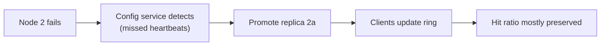

Let's evaluate the design against our requirements and discuss the remaining trade-offs.

## Performance

- **Sub-millisecond operations:** data lives in memory, hash-table lookups are O(1), and clients connect directly to the owning node.
- **Batching and pipelining** reduce round trips for multi-key requests.
- **Local near-caches** eliminate network hops entirely for the hottest keys.

The main performance risks are network saturation on hot nodes and large values. Keeping values small — typically under 100 KB — and compressing larger ones helps. A node serving 100,000 requests per second of 10 KB values sends about 1 GB/s, which saturates a 10 Gbps network card before the CPU is busy; values that large should be compressed, split or served from elsewhere.

## Scalability

- **Horizontal scaling:** add nodes to increase memory and throughput. Consistent hashing moves only a fraction of keys, so each expansion causes only a small, temporary dip in hit ratio.
- **Replicas** scale read throughput for popular shards.
- **Client-side routing** avoids a central bottleneck.

## Availability

- Node failures are detected by the configuration service, and clients update their routing.
- **Replicas** are promoted when a primary fails, preserving the hit ratio; a **gutter pool** covers transient failures cheaply.
- The **database remains available** as a fallback, protected by coalescing and rate limiting.

### Failure scenarios

| Scenario | Impact | Mitigation |
| --- | --- | --- |
| One node crashes | Its keys miss; database load rises by about 1/N of reads | Replica promotion or gutter pool; coalescing |
| Network partition between app servers and some nodes | Those keys miss from affected servers | Clients treat unreachable nodes as misses, with short timeouts |
| Whole cache cluster restarts | Every read misses — the database may collapse | Warm-up, rate-limited fallbacks, serving degraded responses |
| Hot key overloads a node | Latency spikes for every key on that node | Near-caches, key splitting, replicas |
| Bad deployment changes serialization | Old entries unreadable, mass misses | Versioned keys, gradual rollout |

## Consistency

The cache provides **eventual consistency** with the database, bounded by TTLs. Invalidation on writes makes staleness brief in practice. For data where staleness is unacceptable, the application reads from the database directly or uses stronger techniques such as leases or version checks.

## Affordability

Memory is the dominant cost. Techniques to control it:

- Cache only what benefits — measure hit ratios per key prefix and stop caching data that rarely hits.
- Choose TTLs deliberately; long TTLs on rarely read data waste memory.
- Use compact serialization formats and compression for large values.
- Size the cache from estimates of the **working set**, the data accessed within a typical period, rather than the whole data set.
- Consider **tiered caches** that keep the hottest data in RAM and a larger, colder tier on fast SSDs, which cost far less per gigabyte.

## Requirements summary

| Requirement | How the design meets it |
| --- | --- |
| High performance | In-memory hash tables, direct client routing, multi-get batching, near-caches |
| Scalability | Consistent hashing, horizontal node addition, read replicas |
| High availability | Replicas or gutter pool, configuration service, database fallback with protection |
| Consistency | Delete-on-write, leases, change-log invalidation, TTL safety net |
| Affordability | Working-set sizing, TTL tuning, compression, tiered storage |

## Trade-off summary

| Choice | Benefit | Cost |
| --- | --- | --- |
| Client-side routing | Lowest latency | Smarter clients, many connections |
| Async replication | Fast writes, high availability | Possible loss of recent cache writes |
| Long TTLs | Higher hit ratio | More staleness, more memory |
| Local near-cache | Absorbs hot keys | Extra staleness, per-server memory |

<Ponder question="An interviewer asks: 'Why not just make the database faster instead of adding a cache?' How would you answer?">
Sometimes that is right — add indexes, tune queries, add read replicas — and a cache adds complexity and staleness. But caches win when reads vastly outnumber writes and the same data is read repeatedly: memory lookups are orders of magnitude cheaper than query execution, a cache node serves hundreds of thousands of requests per second, and cached results can store expensive computed objects (joins, rendered fragments) that no index can make cheap. The decision should come from the read/write ratio, the latency target and the cost of database capacity.
</Ponder>

<KeyTakeaways>
- In-memory O(1) lookups, direct routing and batching deliver sub-millisecond performance; watch network limits with large values.
- Consistent hashing and replicas let the cache scale horizontally with minimal disruption.
- Replica promotion, gutter pools and database fallback with load protection provide availability; plan for whole-cluster restarts.
- The cache is eventually consistent with the database, bounded by TTLs and invalidation.
- Control cost by caching the working set, choosing TTLs deliberately, compressing values and tiering storage.
</KeyTakeaways>
