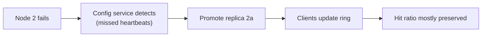

Let's evaluate the design against our requirements and discuss the remaining trade-offs.

## Performance

- **Sub-millisecond operations:** data lives in memory, hash-table lookups are O(1), and clients connect directly to the owning node.
- **Batching and pipelining** reduce round trips for multi-key requests.
- **Local near-caches** eliminate network hops entirely for the hottest keys.

The main performance risks are network saturation on hot nodes and large values. Keeping values small — typically under 100 KB — and compressing larger ones helps.

## Scalability

- **Horizontal scaling:** add nodes to increase memory and throughput. Consistent hashing moves only a fraction of keys, so each expansion causes only a small, temporary dip in hit ratio.
- **Replicas** scale read throughput for popular shards.
- **Client-side routing** avoids a central bottleneck.

## Availability

- Node failures are detected by the configuration service, and clients update their routing.
- **Replicas** are promoted when a primary fails, preserving the hit ratio.
- The **database remains available** as a fallback, protected by coalescing and rate limiting.

## Consistency

The cache provides **eventual consistency** with the database, bounded by TTLs. Invalidation on writes makes staleness brief in practice. For data where staleness is unacceptable, the application reads from the database directly or uses stronger techniques such as leases or version checks.

## Affordability

Memory is the dominant cost. Techniques to control it:

- Cache only what benefits — measure hit ratios per key prefix and stop caching data that rarely hits.
- Choose TTLs deliberately; long TTLs on rarely read data waste memory.
- Use compact serialization formats and compression for large values.
- Size the cache from estimates of the **working set**, the data accessed within a typical period, rather than the whole data set.

## Trade-off summary

| Choice | Benefit | Cost |
| --- | --- | --- |
| Client-side routing | Lowest latency | Smarter clients, many connections |
| Async replication | Fast writes, high availability | Possible loss of recent cache writes |
| Long TTLs | Higher hit ratio | More staleness, more memory |
| Local near-cache | Absorbs hot keys | Extra staleness, per-server memory |

<KeyTakeaways>
- In-memory O(1) lookups, direct routing and batching deliver sub-millisecond performance.
- Consistent hashing and replicas let the cache scale horizontally with minimal disruption.
- Replica promotion and database fallback with load protection provide availability.
- The cache is eventually consistent with the database, bounded by TTLs and invalidation.
- Control cost by caching the working set, choosing TTLs deliberately and compressing values.
</KeyTakeaways>
