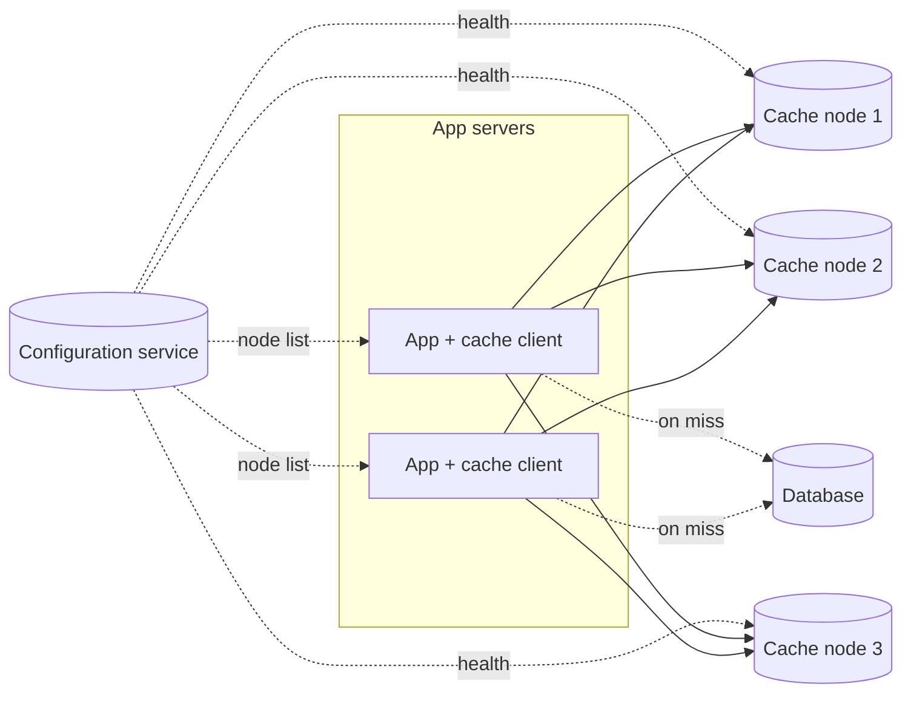

Let's sketch the architecture of our distributed cache: how keys are spread across nodes, how clients find the right node, and how the cluster is configured.

## Components

- **Cache clients** — libraries inside application servers. They hash each key to pick the right cache node and talk to it directly.
- **Cache nodes** — servers holding a portion of the key space in memory, each with a hash table and an eviction policy.
- **Configuration service** — tracks which cache nodes exist and are healthy, and notifies clients when membership changes.
- **Backing store** — the database that holds the source of truth.

## Distributing keys

Keys are spread across nodes with **consistent hashing**. A client hashes the key, finds its position on the ring and sends the request to the node that owns that position. Consistent hashing matters doubly for caches: when a node is added or removed, only about `1/N` of keys move — which means only `1/N` of the cache goes cold. With naive modulo hashing, nearly the entire cache would miss at once, potentially overwhelming the database.

## Why client-side routing?

Two options exist for finding the right node:

- **Client-side routing:** the client library knows the ring and connects directly to the owning node. One network hop, no extra infrastructure.
- **Proxy routing:** clients send requests to a proxy tier that routes them. Clients stay simple and connection counts to cache nodes stay manageable, at the cost of an extra hop.

For lowest latency we choose client-side routing, with the configuration service keeping every client's view of the ring up to date. Very large deployments sometimes add proxies to reduce the number of connections each cache node must handle.

## Inside a cache node

Each node runs:

- A **hash table** mapping keys to values.
- An **eviction policy**, such as LRU, implemented with a doubly linked list.
- **Expiration** handling: lazily on access (check the TTL when a key is read) plus a periodic background sweep.
- A simple **network protocol** with operations such as `get`, `set`, `delete` and batched `multi-get`.

## Request flow

1. The application calls `cache.get(key)`.
2. The client hashes the key, finds the owning node and sends the request.
3. On a hit, the value returns in well under a millisecond.
4. On a miss, the application reads from the database and calls `cache.set(key, value, ttl)`.

<Callout type="tip">
Batch requests with `multi-get`. Rendering one page might need 50 cached items; fetching them in a few parallel batched calls — one per node — is far faster than 50 sequential round trips.
</Callout>

<KeyTakeaways>
- Cache clients route keys to cache nodes using consistent hashing.
- Consistent hashing limits how much of the cache goes cold when nodes change.
- A configuration service tracks node membership and health for clients.
- Client-side routing minimizes latency; proxies reduce connection counts at the cost of a hop.
- Each node combines a hash table, eviction policy and TTL expiration.
</KeyTakeaways>
