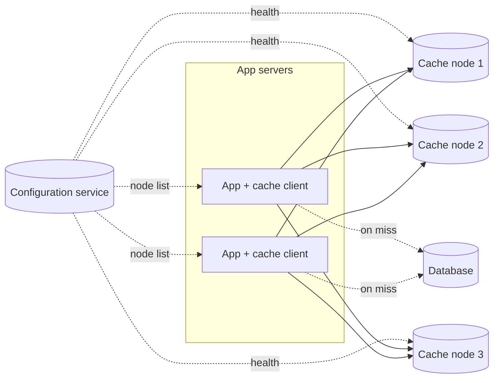
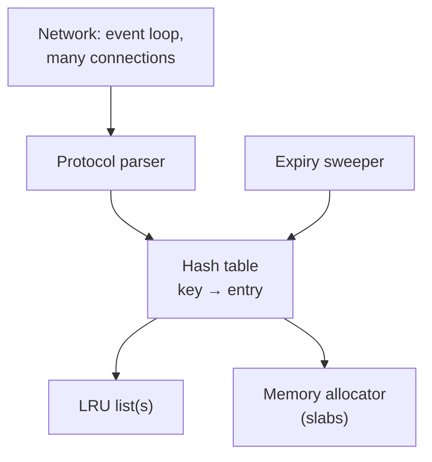
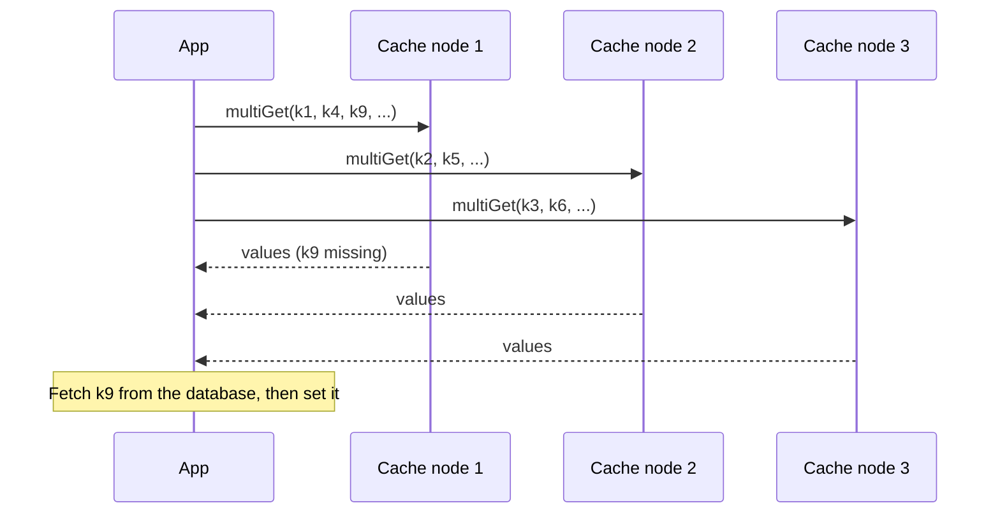

Let's sketch the architecture of our distributed cache: how keys are spread across nodes, how clients find the right node, and how the cluster is configured.

## Components



- **Cache clients** — libraries inside application servers. They hash each key to pick the right cache node and talk to it directly.
- **Cache nodes** — servers holding a portion of the key space in memory, each with a hash table and an eviction policy.
- **Configuration service** — tracks which cache nodes exist and are healthy, and notifies clients when membership changes. It is typically backed by a consensus-based store such as ZooKeeper or etcd so every client agrees on the same membership.
- **Backing store** — the database that holds the source of truth.

## Distributing keys

Keys are spread across nodes with **consistent hashing**. A client hashes the key, finds its position on the ring and sends the request to the node that owns that position. Consistent hashing matters doubly for caches: when a node is added or removed, only about `1/N` of keys move — which means only `1/N` of the cache goes cold. With naive modulo hashing, nearly the entire cache would miss at once, potentially overwhelming the database.

| Change to a 20-node cache | Keys that miss afterwards with `hash mod N` | With consistent hashing |
| --- | --- | --- |
| Add one node | ~95% | ~5% |
| Remove one failed node | ~95% | ~5% (only the failed node's keys) |

## Why client-side routing?

Two options exist for finding the right node:

- **Client-side routing:** the client library knows the ring and connects directly to the owning node. One network hop, no extra infrastructure.
- **Proxy routing:** clients send requests to a proxy tier that routes them. Clients stay simple and connection counts to cache nodes stay manageable, at the cost of an extra hop.

For lowest latency we choose client-side routing, with the configuration service keeping every client's view of the ring up to date. Very large deployments sometimes add proxies to reduce the number of connections each cache node must handle: 10,000 application servers each holding a connection to each of 500 cache nodes means 5 million connections, while a proxy tier can multiplex them onto far fewer.

## Inside a cache node

Each node runs:

- A **hash table** mapping keys to values.
- An **eviction policy**, such as LRU, implemented with a doubly linked list.
- **Expiration** handling: lazily on access (check the TTL when a key is read) plus a periodic background sweep that samples keys and removes expired ones.
- A simple **network protocol** with operations such as `get`, `set`, `delete` and batched `multi-get`.
- An **event loop** or small thread pool that handles many connections with non-blocking I/O, so one slow client cannot stall others.



## Request flow

1. The application calls `cache.get(key)`.
2. The client hashes the key, finds the owning node and sends the request.
3. On a hit, the value returns in well under a millisecond.
4. On a miss, the application reads from the database and calls `cache.set(key, value, ttl)`.

### Batching across nodes

A page that needs 50 profiles should not make 50 sequential calls. The client groups keys by owning node and sends one `multi-get` per node, in parallel:



The total latency is roughly that of the slowest node, not the sum of 50 round trips. As a request touches more nodes, however, the chance that at least one is slow rises — the same tail-latency effect seen with fan-out elsewhere — so very wide fan-outs benefit from hedged requests or replicas.

<Callout type="tip">
Batch requests with `multi-get`. Rendering one page might need 50 cached items; fetching them in a few parallel batched calls — one per node — is far faster than 50 sequential round trips.
</Callout>

## Designing keys

Good key design prevents collisions and makes invalidation easy:

```text
<service>:<entity>:<id>:v<schema version>
profile:user:42:v3
feed:user:42:page:1:v1
```

Including a **schema version** means a deployment that changes the serialized format simply starts using new keys; old entries expire naturally instead of being misread by new code. Keep keys short — they are stored with every entry — and never put unbounded user input in them without hashing it.

<Ponder question="Why is it risky for each application server to discover cache nodes on its own, for example by probing them, rather than using a shared configuration service?">
Different servers could end up with different views of which nodes are alive, and therefore different rings. The same key would then map to different nodes from different servers: one server writes an updated value to node A while another reads a stale copy from node B, and invalidations miss the copy that is actually being read. A shared, consistent membership view keeps every client routing each key to the same node.
</Ponder>

<KeyTakeaways>
- Cache clients route keys to cache nodes using consistent hashing, so node changes cool only about 1/N of the cache.
- A configuration service backed by consensus gives all clients the same view of membership and health.
- Client-side routing minimizes latency; proxies reduce connection counts at the cost of a hop.
- Each node combines an event-driven network layer, a hash table, eviction policy, allocator and TTL expiration.
- Batch multi-gets per node in parallel, and version keys so format changes never misread old entries.
</KeyTakeaways>
