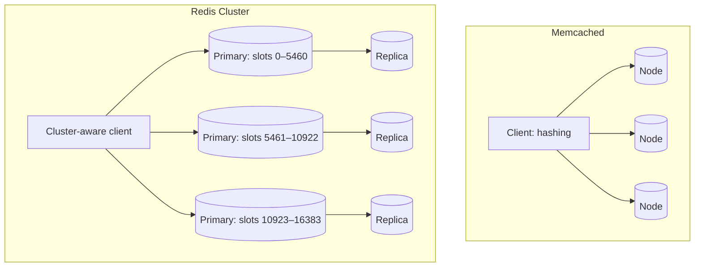

Two open-source systems dominate distributed caching: **Memcached** and **Redis**. Both are in-memory key-value stores, but they differ in data model, features and operational characteristics. Knowing the differences helps you pick the right one — and explain your choice in an interview.

## Memcached

Memcached is intentionally simple: a multi-threaded, in-memory hash table of opaque byte strings.

- **Data model:** strings only, with keys up to 250 bytes and values up to 1 MB by default.
- **Operations:** get, set, delete, increment, compare-and-set, multi-get.
- **Architecture:** each server is independent. Distribution happens entirely in the **client**, typically with consistent hashing. Servers know nothing about each other.
- **Memory:** slab allocation with per-slab LRU eviction.
- **Threading:** multi-threaded, scaling well across CPU cores on a single machine.
- **Persistence and replication:** none built in. Memcached is purely a cache.

Its simplicity is a strength at very large scale: some of the largest social networks have run Memcached fleets holding many terabytes, adding their own layers for routing, replication across regions and invalidation.

## Redis

Redis is a data-structure server: values can be rich types, and many operations run on the server.

- **Data model:** strings, hashes, lists, sets, sorted sets, bitmaps, HyperLogLogs, streams and geospatial indexes.
- **Operations:** hundreds of commands, atomic operations on data structures, transactions and server-side Lua scripts.
- **Architecture:** a primary–replica model with automatic failover (via a sentinel process), and a **cluster mode** that shards data across 16,384 hash slots.
- **Persistence:** optional snapshots and append-only files, so data can survive restarts.
- **Threading:** command execution is largely single-threaded per instance (with I/O threads), which makes operations atomic and simple; scale by running more instances or shards.
- **Pub/sub and streams:** can double as a lightweight message broker.



### Data structures in action

Redis data structures turn common design components into a few commands:

```text
# Leaderboard: sorted set, O(log n) updates and rank queries
ZINCRBY game:leaderboard 50 "player:881"
ZREVRANGE game:leaderboard 0 9 WITHSCORES        # top 10
ZREVRANK game:leaderboard "player:881"           # my rank

# Fixed-window rate limit: atomic counter with expiry
INCR ratelimit:user:42:202609271405
EXPIRE ratelimit:user:42:202609271405 60

# Unique visitors per day in ~12 KB regardless of count: HyperLogLog
PFADD visitors:2026-09-27 "user:42" "user:77"
PFCOUNT visitors:2026-09-27

# Nearby drivers: geospatial index
GEOADD drivers 77.5946 12.9716 "driver:19"
GEOSEARCH drivers FROMLONLAT 77.59 12.97 BYRADIUS 2 km ASC COUNT 10
```

Each of these runs atomically on the server, so concurrent clients cannot corrupt the data — no read-modify-write races in application code.

### Persistence options

| Mode | How it works | Data at risk on crash | Cost |
| --- | --- | --- | --- |
| None | Pure cache | Everything | Lowest |
| Snapshots (RDB) | Periodic fork and dump of the whole data set | Changes since the last snapshot | Fork can pause large instances briefly |
| Append-only file (AOF) | Log every write; fsync every second or every write | About one second (or nothing with fsync always) | More disk I/O; periodic rewrite to compact the log |

Even with persistence, Redis replication is asynchronous, so a failover can lose recently acknowledged writes. Treat Redis as a cache or as a store for data you can afford to lose a little of, unless you add stronger guarantees.

### Redis Cluster in brief

Each key maps to one of 16,384 **hash slots** (`CRC16(key) mod 16384`), and slots are assigned to primaries. Clients cache the slot map and send commands straight to the owner; if a slot has moved, the node replies with a redirect and the client updates its map. Multi-key operations work only when all keys share a slot, which applications arrange with **hash tags**: in `{user:42}:profile` and `{user:42}:settings`, only the part in braces is hashed, so both keys land together.

## Comparison

| Aspect | Memcached | Redis |
| --- | --- | --- |
| Data types | Strings | Rich structures |
| Server-side logic | Minimal | Atomic ops, scripts, transactions |
| Replication and failover | None built in | Built in |
| Persistence | None | Optional |
| Threading | Multi-threaded | Mostly single-threaded per instance |
| Clustering | Client-side hashing | Hash slots with redirects |
| Best for | Simple, huge-scale caching | Caching plus data-structure use cases |

## When to choose which

**Choose Memcached** when you need a simple, very large look-aside cache of serialized objects, want to use many cores per machine efficiently and are happy to handle distribution in clients.

**Choose Redis** when you benefit from data structures — leaderboards with sorted sets, rate-limiting counters with atomic increments and expiry, session stores, queues, geospatial lookups — or when you need replication and failover built in.

| Use case | Better fit | Why |
| --- | --- | --- |
| Caching rendered HTML fragments and database rows | Memcached or Redis | Plain get/set; Memcached uses cores efficiently |
| Game leaderboard | Redis | Sorted sets give rank and range queries |
| API rate limiting | Redis | Atomic increments with expiry, or Lua scripts |
| Session store that should survive restarts | Redis | Replication and optional persistence |
| Nearby-driver lookups | Redis | Geospatial commands |

<Callout type="interview">
In interviews, "Redis" is often used as shorthand for "a distributed in-memory cache." That is fine, but be ready to justify it: for example, "we'll use Redis sorted sets for the leaderboard because they give O(log n) rank updates and range queries."
</Callout>

<Ponder question="A team uses Redis as the only store for user account balances because it is fast. What could go wrong?">
Redis replication is asynchronous and persistence is at best per-second by default, so a crash or failover can lose recently acknowledged balance changes — silently. Memory limits with an eviction policy could even evict keys. Balances need a durable, strongly consistent database as the source of truth; Redis can cache balances for display or hold short-lived holds, with the database deciding.
</Ponder>

<KeyTakeaways>
- Memcached is a simple, multi-threaded cache of strings with client-side distribution and no persistence.
- Redis offers rich data structures, server-side atomic operations, replication, clustering with hash slots and optional persistence.
- Redis data structures implement leaderboards, rate limiters, unique counts and geospatial search in a few commands.
- Redis persistence and replication still allow some data loss, so it is not a substitute for a durable database.
- Memcached suits simple large-scale caching; Redis suits caching plus data-structure workloads. Justify the choice with the features you use.
</KeyTakeaways>
