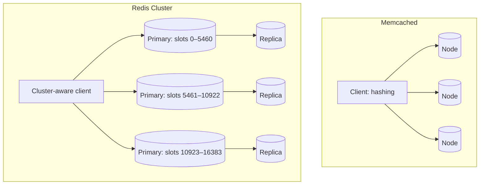

Two open-source systems dominate distributed caching: **Memcached** and **Redis**. Both are in-memory key-value stores, but they differ in data model, features and operational characteristics. Knowing the differences helps you pick the right one — and explain your choice in an interview.

## Memcached

Memcached is intentionally simple: a multi-threaded, in-memory hash table of opaque byte strings.

- **Data model:** strings only, with keys up to 250 bytes and values up to 1 MB by default.
- **Operations:** get, set, delete, increment, compare-and-set, multi-get.
- **Architecture:** each server is independent. Distribution happens entirely in the **client**, typically with consistent hashing. Servers know nothing about each other.
- **Memory:** slab allocation with per-slab LRU eviction.
- **Threading:** multi-threaded, scaling well across CPU cores on a single machine.
- **Persistence and replication:** none built in. Memcached is purely a cache.

## Redis

Redis is a data-structure server: values can be rich types, and many operations run on the server.

- **Data model:** strings, hashes, lists, sets, sorted sets, bitmaps, HyperLogLogs, streams and geospatial indexes.
- **Operations:** hundreds of commands, atomic operations on data structures, transactions and server-side Lua scripts.
- **Architecture:** a primary–replica model with automatic failover (via a sentinel process), and a **cluster mode** that shards data across 16,384 hash slots.
- **Persistence:** optional snapshots and append-only files, so data can survive restarts.
- **Threading:** command execution is largely single-threaded per instance (with I/O threads), which makes operations atomic and simple; scale by running more instances or shards.
- **Pub/sub and streams:** can double as a lightweight message broker.

## Comparison

| Aspect | Memcached | Redis |
| --- | --- | --- |
| Data types | Strings | Rich structures |
| Server-side logic | Minimal | Atomic ops, scripts, transactions |
| Replication and failover | None built in | Built in |
| Persistence | None | Optional |
| Threading | Multi-threaded | Mostly single-threaded per instance |
| Best for | Simple, huge-scale caching | Caching plus data-structure use cases |

## When to choose which

**Choose Memcached** when you need a simple, very large look-aside cache of serialized objects, want to use many cores per machine efficiently and are happy to handle distribution in clients.

**Choose Redis** when you benefit from data structures — leaderboards with sorted sets, rate-limiting counters with atomic increments and expiry, session stores, queues, geospatial lookups — or when you need replication and failover built in.

<Callout type="interview">
In interviews, “Redis” is often used as shorthand for “a distributed in-memory cache.” That is fine, but be ready to justify it: for example, “we'll use Redis sorted sets for the leaderboard because they give O(log n) rank updates and range queries.”
</Callout>

<KeyTakeaways>
- Memcached is a simple, multi-threaded cache of strings with client-side distribution and no persistence.
- Redis offers rich data structures, server-side atomic operations, replication, clustering and optional persistence.
- Memcached suits simple large-scale caching; Redis suits caching plus data-structure workloads.
- Justify the choice with the specific features your design uses.
</KeyTakeaways>
