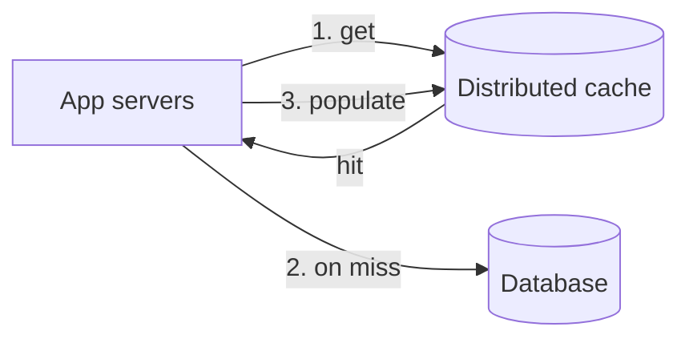

A **cache** stores copies of frequently accessed data in fast storage — usually memory — so future requests can be served without repeating expensive work such as a database query, a remote call or a complex computation. A **distributed cache** spreads that cache across many machines so it can hold far more data and serve far more requests than any single server.

## Why caching matters

Recall the latency numbers: reading from memory takes about 100 nanoseconds, while a database query over the network might take several milliseconds or more. For read-heavy systems, a cache in front of the database can:

- **Reduce latency** by serving hot data from memory.
- **Reduce load** on databases and downstream services, often by an order of magnitude.
- **Absorb spikes** that would otherwise overwhelm the database.
- **Reduce cost**, since memory reads are cheaper than database capacity at scale.



### How much does the hit ratio matter?

The average latency of a cached read is:

```text
effective latency = hit ratio × cache latency + (1 − hit ratio) × (cache latency + database latency)
```

With a 0.5 ms cache and a 10 ms database:

| Hit ratio | Effective latency | Database queries per 100,000 reads |
| --- | --- | --- |
| 0% (no cache) | 10 ms | 100,000 |
| 80% | 2.5 ms | 20,000 |
| 95% | 1 ms | 5,000 |
| 99% | 0.6 ms | 1,000 |

Going from 95% to 99% looks like a small change, but it cuts database load **fivefold**. That is why so much of cache design is about protecting the hit ratio — through failures, deployments and changes in cluster size.

## Why distributed?

A cache on each application server is fast but limited:

- Its size is bounded by one machine's memory.
- Each server caches its own copy, wasting memory on duplicates and reducing hit ratios.
- Data becomes inconsistent across servers when it changes.

A distributed cache pools memory across a cluster. Each key lives on a specific cache node, so the cluster's total memory is usable and every application server sees the same cached value. Many systems use both: a tiny local cache for the very hottest keys and a large distributed cache behind it.

## Requirements

### Functional

- `insert(key, value)` — store data in the cache.
- `retrieve(key)` — return cached data, or indicate a miss.
- Support **expiration** (TTL) and **eviction** when memory is full.

### Non-functional

- **High performance** — sub-millisecond reads and writes.
- **Scalability** — grow capacity and throughput by adding nodes.
- **High availability** — survive node failures without a large drop in hit ratio.
- **Consistency** — cached data should not stay stale for longer than the application tolerates.
- **Affordability** — memory is expensive, so use it efficiently.

## API

```text
set(key, value, ttlSeconds)      -> ok
get(key)                         -> value | miss
multiGet([key1, key2, ...])      -> { key: value | miss }
delete(key)                      -> ok
incr(key, delta)                 -> newValue        // atomic counters
compareAndSet(key, value, token) -> ok | conflict   // optimistic updates
```

## Sizing the cache

Suppose a social app serves 500,000 profile reads per second, each profile about 1 KB, and 200 million distinct profiles exist. We do not need to cache all of them — only the **working set** that is read repeatedly within a typical TTL window.

```text
Working set: suppose 20% of profiles are read at least once an hour → 40 million
Memory:      40M × 1 KB (plus ~30% overhead for keys, pointers)   ≈ 52 GB
Per node:    ~64 GB usable memory                                 → 1 node for capacity
Throughput:  500,000 req/s ÷ ~100,000 req/s per node              → 5 nodes for throughput
With replicas and headroom                                        → ~10–12 nodes
```

In this example, throughput, not memory, determines the cluster size — a common outcome for small values. For large values, such as rendered page fragments, memory usually dominates instead.

<Callout type="note">
A cache is not the source of truth. Losing cached data should cost performance, not correctness — the database can always rebuild it. This lets caches favor speed and availability over durability.
</Callout>

## Where caches appear

| Layer | Example | Typical contents |
| --- | --- | --- |
| Client | Browser or app cache | Static assets, API responses |
| Edge | CDN | Images, video, public pages |
| Reverse proxy | Gateway cache | Whole HTTP responses |
| Application (local) | In-process map | A few thousand of the hottest objects |
| Distributed cache | Memcached, Redis clusters | Database rows, computed objects, sessions |
| Database | Buffer pool | Recently used disk pages |

This chapter focuses on the distributed cache that sits between application servers and data stores, the one most frequently drawn in design interviews.

<Ponder question="A team's cache hit ratio drops from 98% to 90% after a routine deployment. Database CPU rises from 30% to 100%. Why such a big effect from an 8-point drop?">
Database load is proportional to the **miss** ratio, not the hit ratio. Misses went from 2% to 10% of reads — a fivefold increase in database queries. A database sized for the 2% case cannot handle it. This is why deployments that restart cache clients or change key formats (for example, a new serialization version) must be rolled out gradually, and why databases behind caches need headroom or load protection.
</Ponder>

<KeyTakeaways>
- Caches serve frequently accessed data from fast storage, reducing latency and backend load.
- Database load follows the miss ratio, so small changes in hit ratio have large effects.
- A distributed cache pools memory across nodes, increasing capacity and hit ratio while giving all servers a shared view.
- Requirements include sub-millisecond performance, scalability, availability, bounded staleness and cost efficiency.
- Size a cache from the working set and the request rate; either memory or throughput can drive the node count.
- Caches are not the source of truth; losing cached data should cost performance, not correctness.
</KeyTakeaways>
