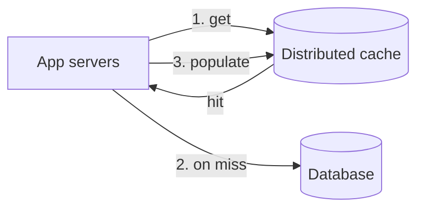

A **cache** stores copies of frequently accessed data in fast storage — usually memory — so future requests can be served without repeating expensive work such as a database query, a remote call or a complex computation. A **distributed cache** spreads that cache across many machines so it can hold far more data and serve far more requests than any single server.

## Why caching matters

Recall the latency numbers: reading from memory takes about 100 nanoseconds, while a database query over the network might take several milliseconds or more. For read-heavy systems, a cache in front of the database can:

- **Reduce latency** by serving hot data from memory.
- **Reduce load** on databases and downstream services, often by an order of magnitude.
- **Absorb spikes** that would otherwise overwhelm the database.
- **Reduce cost**, since memory reads are cheaper than database capacity at scale.

## Why distributed?

A cache on each application server is fast but limited:

- Its size is bounded by one machine's memory.
- Each server caches its own copy, wasting memory on duplicates and reducing hit ratios.
- Data becomes inconsistent across servers when it changes.

A distributed cache pools memory across a cluster. Each key lives on a specific cache node, so the cluster's total memory is usable and every application server sees the same cached value.

## Requirements

### Functional

- `insert(key, value)` — store data in the cache.
- `retrieve(key)` — return cached data, or indicate a miss.
- Support **expiration** (TTL) and **eviction** when memory is full.

### Non-functional

- **High performance** — sub-millisecond reads and writes.
- **Scalability** — grow capacity and throughput by adding nodes.
- **High availability** — survive node failures without a large drop in hit ratio.
- **Consistency** — cached data should not stay stale for longer than the application tolerates.
- **Affordability** — memory is expensive, so use it efficiently.

<Callout type="note">
A cache is not the source of truth. Losing cached data should cost performance, not correctness — the database can always rebuild it. This lets caches favor speed and availability over durability.
</Callout>

## Where caches appear

Caching happens at many layers: browser caches, CDNs, reverse proxies, application-level caches, distributed caches and database buffer pools. This chapter focuses on the distributed cache that sits between application servers and data stores, the one most frequently drawn in design interviews.

<KeyTakeaways>
- Caches serve frequently accessed data from fast storage, reducing latency and backend load.
- A distributed cache pools memory across nodes, increasing capacity and hit ratio while giving all servers a shared view.
- Requirements include sub-millisecond performance, scalability, availability, bounded staleness and cost efficiency.
- Caches are not the source of truth; losing cached data should cost performance, not correctness.
</KeyTakeaways>
