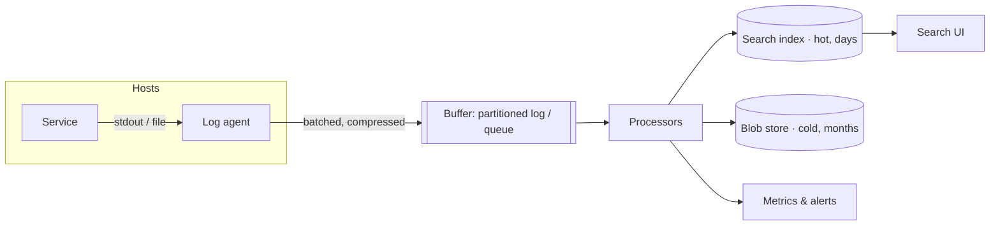

Let's design a pipeline that collects logs from thousands of services, makes them searchable within seconds and retains them cheaply.

## Architecture

### Log agents

A lightweight **agent** runs on every host (or as a sidecar in each pod). Applications simply write to standard output or local files; the agent tails them, adds metadata (host, service, region, container), batches and compresses entries and forwards them. Using an agent keeps applications decoupled from the logging backend and avoids slowing them down: if the backend is slow, the agent buffers to local disk.

### Buffer

Log volume is bursty — an incident can multiply error logs tenfold in seconds. A durable, partitioned **buffer** (a pub-sub log or queue) absorbs spikes and decouples agents from processing. If the index cluster slows down, logs accumulate in the buffer instead of being dropped.

### Processors

Stream processors consume from the buffer and:

- **Parse** unstructured lines into fields.
- **Enrich** entries, for example adding team ownership from a service catalog.
- **Redact** sensitive patterns that slipped through.
- **Route** logs by type and policy: errors to the index and alerting; high-volume debug logs only to cold storage.
- **Derive metrics**, such as error counts per service, to feed monitoring.

### Storage tiers

- **Hot tier:** a search index (inverted index plus columnar fields) holding recent logs — typically 3–14 days — for fast search.
- **Cold tier:** compressed log files in a blob store, organized by service and time, retained for months or years. They can be queried with batch tools or rehydrated into the index when needed.

Indexes are commonly organized **by time**, for example one index per day. Queries usually target recent time ranges, and old indexes are dropped wholesale when they expire — far cheaper than deleting individual entries.

## Write path

1. The service writes a structured log line to stdout.
2. The agent reads it, attaches metadata and adds it to a batch.
3. Every second (or when the batch is full), the agent sends the batch to the buffer and receives an acknowledgment.
4. Processors consume, transform and write to the hot index and cold storage.
5. The entry becomes searchable within seconds.

## Search path

Users query by time range, fields and free text. The query service routes the query to the relevant time-based indexes, fans out across their shards and merges results sorted by time. For wide time ranges beyond hot retention, it queries the cold tier with a slower batch engine.

<Callout type="interview">
When a design includes logging, the key points are: agents that buffer locally, a durable queue to absorb bursts, processing for parsing and redaction, a hot searchable tier with short retention, and a cheap cold tier for long retention.
</Callout>

<KeyTakeaways>
- Host agents tail logs, add metadata, batch, compress and buffer locally when the backend is slow.
- A durable partitioned buffer absorbs bursts and decouples collection from processing.
- Processors parse, enrich, redact, route and derive metrics.
- Recent logs live in a time-partitioned search index; older logs live compressed in a blob store.
- Time-based indexes make retention cheap: whole indexes are dropped when they expire.
</KeyTakeaways>
