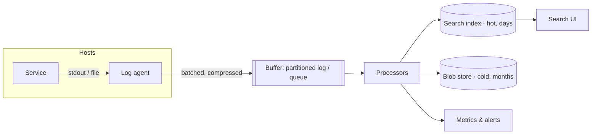
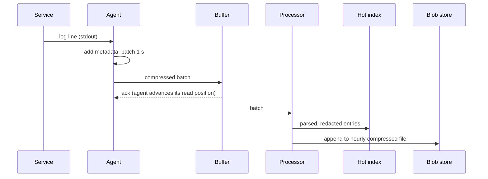

Let's design a pipeline that collects logs from thousands of services, makes them searchable within seconds and retains them cheaply.

## Architecture



### Log agents

A lightweight **agent** runs on every host (or as a sidecar in each pod). Applications simply write to standard output or local files; the agent tails them, adds metadata (host, service, region, container), batches and compresses entries and forwards them. Using an agent keeps applications decoupled from the logging backend and avoids slowing them down: if the backend is slow, the agent buffers to local disk.

The agent must be careful with resources:

- It tracks a **read position** per file, so after a restart it resumes where it stopped rather than resending or skipping lines.
- It caps its **disk buffer** (say, 5 GB) and, if the buffer fills during a long outage, drops the lowest-priority logs first (debug before errors).
- It caps **CPU and memory** so it never competes with the service it observes.

### Buffer

Log volume is bursty — an incident can multiply error logs tenfold in seconds. A durable, partitioned **buffer** (a pub-sub log or queue) absorbs spikes and decouples agents from processing. If the index cluster slows down, logs accumulate in the buffer instead of being dropped. Partitioning the buffer by service spreads load and lets processors scale horizontally.

### Processors

Stream processors consume from the buffer and:

- **Parse** unstructured lines into fields.
- **Enrich** entries, for example adding team ownership from a service catalog.
- **Redact** sensitive patterns that slipped through.
- **Route** logs by type and policy: errors to the index and alerting; high-volume debug logs only to cold storage.
- **Derive metrics**, such as error counts per service, to feed monitoring.

### Storage tiers

- **Hot tier:** a search index (inverted index plus columnar fields) holding recent logs — typically 3–14 days — for fast search.
- **Cold tier:** compressed log files in a blob store, organized by service and time, retained for months or years. They can be queried with batch tools or rehydrated into the index when needed.

Indexes are commonly organized **by time**, for example one index per day. Queries usually target recent time ranges, and old indexes are dropped wholesale when they expire — far cheaper than deleting individual entries.

## Full-text index or label index?

There are two broad ways to make logs searchable:

| | Full-text indexing | Label indexing with compressed chunks |
| --- | --- | --- |
| What is indexed | Every word in every line, plus fields | Only a few labels (service, host, level) |
| Storage cost | High — the index can be as large as the logs | Low — logs stored as compressed chunks in a blob store |
| Query speed for arbitrary text | Fast | Slower: chunks matching the labels are scanned (in parallel) |
| Best for | Frequent ad-hoc text search | Very high volume where most queries filter by service and time first |

Label-indexed designs have become popular for cost reasons: a query such as "errors from checkout in the last hour containing 'timeout'" first narrows by labels and time to a few gigabytes of chunks, then scans them with many workers in parallel. Many organizations combine both: full-text indexing for a short hot window, label indexing for longer retention.

## Write path

1. The service writes a structured log line to stdout.
2. The agent reads it, attaches metadata and adds it to a batch.
3. Every second (or when the batch is full), the agent sends the batch to the buffer and receives an acknowledgment.
4. Processors consume, transform and write to the hot index and cold storage.
5. The entry becomes searchable within seconds.



The agent advances its read position only after the buffer acknowledges a batch, so a crash anywhere upstream causes a resend (at-least-once) rather than a loss. Processors can deduplicate using a per-line ID made from the host, file and offset.

## Search path

Users query by time range, fields and free text. The query service routes the query to the relevant time-based indexes, fans out across their shards and merges results sorted by time. For wide time ranges beyond hot retention, it queries the cold tier with a slower batch engine.

```text
service:checkout AND level:ERROR AND "timeout" | last 1h | count by host
```

**Live tail** is served differently: the query service subscribes to the buffer (or the processors' output) with a filter and streams matching lines to the user's browser as they arrive, without touching the index.

## Alerting on logs

Processors evaluate simple rules on the stream — for example, "more than 100 `payment_failed` events in 5 minutes" — and emit counts as metrics. The monitoring system's alerting then handles thresholds, deduplication and paging. Converting log patterns into metrics keeps alerting cheap and consistent, instead of running expensive searches every minute.

## Evaluation

| Requirement | How the design meets it |
| --- | --- |
| Low overhead | Services write to stdout; agents batch, compress and cap their resources |
| Scalability | Partitioned buffer, horizontally scaled processors, sharded time-based indexes |
| Durability | Agent disk buffers, acknowledged batches, replicated buffer, cold copies in a blob store |
| Search latency | Hot index for recent logs, searchable within seconds |
| Burst handling | Buffer absorbs spikes; processors catch up afterwards |
| Security | Redaction at source and in processors, role-based access, encryption |
| Cost | Sampling, routing debug logs to cold storage, short hot retention, label indexing |

<Callout type="interview">
When a design includes logging, the key points are: agents that buffer locally, a durable queue to absorb bursts, processing for parsing and redaction, a hot searchable tier with short retention, and a cheap cold tier for long retention.
</Callout>

<Ponder question="During a major outage, error logs jump from 100,000 to 2 million lines per second, and the hot index can only ingest 500,000. What happens in this design, and what would you prioritize?">
The buffer absorbs the difference, so nothing is lost, but indexing falls behind and the newest logs become searchable with growing delay — just when engineers need them. Prioritize: route errors and warnings to the index ahead of info and debug logs, sample repetitive identical errors (keeping counts as metrics), scale processors and index ingest if possible, and let lower-priority logs go only to cold storage until the backlog clears.
</Ponder>

<KeyTakeaways>
- Host agents tail logs, add metadata, batch, compress, track read positions and buffer locally within strict resource limits.
- A durable partitioned buffer absorbs bursts and decouples collection from processing; acknowledgments give at-least-once delivery.
- Processors parse, enrich, redact, route and derive metrics for alerting.
- Recent logs live in a time-partitioned search index; older logs live compressed in a blob store; label indexing trades query speed for much lower cost.
- Time-based indexes make retention cheap, and live tail streams from the buffer rather than the index.
</KeyTakeaways>
