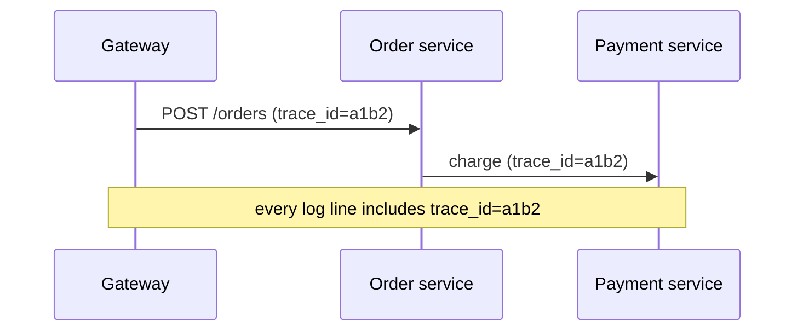

Before designing the pipeline, let's look at what good log data looks like and the practices that make it useful at scale.

## Structured logging

Free-form text logs such as `Payment failed for user 42 after 3 retries` are easy to write and hard to query. **Structured logs** record events as key-value data, usually JSON:

```json
{
  "timestamp": "2026-03-14T09:26:53.589Z",
  "level": "ERROR",
  "service": "payment",
  "host": "payment-7f9c",
  "trace_id": "a1b2c3d4",
  "user_id": 42,
  "event": "payment_failed",
  "retries": 3,
  "error": "card_declined"
}
```

Structured fields can be indexed and filtered precisely (`service = payment AND event = payment_failed`), aggregated into metrics, and parsed without fragile regular expressions.

| | Unstructured text | Structured JSON |
| --- | --- | --- |
| Writing | Easy, any format | Needs a logging library and field conventions |
| Filtering by a value | Regular expressions, fragile | Exact field match |
| Aggregation (count by error type) | Parse text first | Direct |
| Format changes | Silently break parsers | Fields can be added safely |

Organizations benefit from a **shared schema** — common field names such as `service`, `trace_id`, `user_id` and `duration_ms` — so that one query works across every team's logs.

## Log levels

Levels indicate severity and let systems control volume:

| Level | Use |
| --- | --- |
| DEBUG | Detailed diagnostic information, usually disabled in production |
| INFO | Normal significant events: request served, job completed |
| WARN | Unexpected but handled situations |
| ERROR | Failures affecting a request or operation |
| FATAL | The process cannot continue |

Production systems typically log INFO and above, with the ability to enable DEBUG dynamically for a specific service or request when investigating — for example, a request header that turns on debug logging for that one request as it travels through every service.

## Correlation with trace IDs

A single user action touches many services. Assigning each request a **trace ID** (or correlation ID) at the edge and propagating it in headers to every downstream call lets you retrieve all logs for that request with one query.



Logging libraries attach the current trace ID automatically from request context, so developers do not have to remember to include it.

## Controlling volume and cost

Logs are often the largest source of observability cost. Common techniques:

- **Sampling** high-volume, low-value logs (for example, keep 1% of successful health-check logs but 100% of errors).
- **Rate limiting** per service so a bug that logs in a tight loop cannot flood the pipeline.
- **Tiered retention** — keep recent logs in fast, searchable storage for days; move older logs to cheap archive storage for months or years.
- **Aggregating** repetitive events into metrics instead of logging each one.

### Sample by request, not by line

Sampling individual lines at random breaks correlation: you might keep the gateway's log for a request but drop the payment service's. Instead, decide once per request — for example, keep all logs for requests whose trace ID hashes into a 5% bucket — and always keep every log for requests that end in an error. Every service applies the same rule to the same trace ID, so sampled requests remain complete end to end.

| Log type | Typical policy |
| --- | --- |
| Errors and warnings | Keep 100% |
| Request logs for successful calls | Keep a 1–10% sample by trace ID |
| Health checks and polling | Keep under 1%, or convert to metrics |
| Debug logs | Off, enabled per service or per request when needed |
| Audit events | Keep 100%, separate pipeline |

## Privacy and security

Logs frequently leak sensitive data: passwords, tokens, personal information. Good practices include redacting sensitive fields at the source, restricting access by role, encrypting logs at rest and in transit, and enforcing retention limits required by regulations. Data-protection rules may also require deleting a user's personal data on request — much easier if logs reference users by an internal ID rather than by name or email, and if retention is short.

<Callout type="warning">
Never log secrets or full payment details. Once written, sensitive data spreads to indexes, backups and archives, and is very hard to purge completely.
</Callout>

<Ponder question="A service logs the full HTTP request body for every call 'to help debugging'. What problems will this cause?">
Volume and cost explode (bodies can be kilobytes each, at thousands of requests per second), and bodies routinely contain passwords, tokens, card numbers and personal data that then spread into indexes, archives and backups, violating security and privacy rules. Log a small, structured summary instead — endpoint, sizes, status, duration, IDs — and capture full payloads only with explicit, temporary, access-controlled debugging, with redaction.
</Ponder>

<KeyTakeaways>
- Structured (JSON) logs with a shared schema are far easier to index, filter and aggregate than free text.
- Log levels control severity and volume; DEBUG can be enabled selectively per service or request.
- Propagated trace IDs, attached automatically, correlate logs for a single request across services.
- Sampling (by request, not by line), rate limiting, tiered retention and aggregation control log volume and cost.
- Redact sensitive data at the source, restrict access to logs and keep retention short.
</KeyTakeaways>
