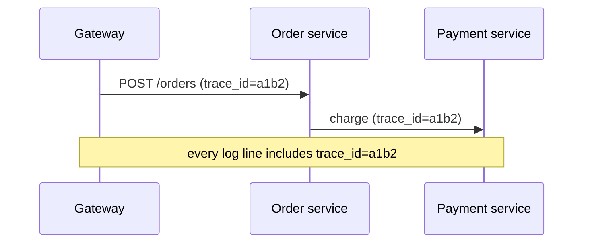

Before designing the pipeline, let's look at what good log data looks like and the practices that make it useful at scale.

## Structured logging

Free-form text logs such as `Payment failed for user 42 after 3 retries` are easy to write and hard to query. **Structured logs** record events as key-value data, usually JSON:

```json
{
  "timestamp": "2026-03-14T09:26:53.589Z",
  "level": "ERROR",
  "service": "payment",
  "host": "payment-7f9c",
  "trace_id": "a1b2c3d4",
  "user_id": 42,
  "event": "payment_failed",
  "retries": 3,
  "error": "card_declined"
}
```

Structured fields can be indexed and filtered precisely (`service = payment AND event = payment_failed`), aggregated into metrics, and parsed without fragile regular expressions.

## Log levels

Levels indicate severity and let systems control volume:

| Level | Use |
| --- | --- |
| DEBUG | Detailed diagnostic information, usually disabled in production |
| INFO | Normal significant events: request served, job completed |
| WARN | Unexpected but handled situations |
| ERROR | Failures affecting a request or operation |
| FATAL | The process cannot continue |

Production systems typically log INFO and above, with the ability to enable DEBUG dynamically for a specific service or request when investigating.

## Correlation with trace IDs

A single user action touches many services. Assigning each request a **trace ID** (or correlation ID) at the edge and propagating it in headers to every downstream call lets you retrieve all logs for that request with one query.



## Controlling volume and cost

Logs are often the largest source of observability cost. Common techniques:

- **Sampling** high-volume, low-value logs (for example, keep 1% of successful health-check logs but 100% of errors).
- **Rate limiting** per service so a bug that logs in a tight loop cannot flood the pipeline.
- **Tiered retention** — keep recent logs in fast, searchable storage for days; move older logs to cheap archive storage for months or years.
- **Aggregating** repetitive events into metrics instead of logging each one.

## Privacy and security

Logs frequently leak sensitive data: passwords, tokens, personal information. Good practices include redacting sensitive fields at the source, restricting access by role, encrypting logs at rest and in transit, and enforcing retention limits required by regulations.

<Callout type="warning">
Never log secrets or full payment details. Once written, sensitive data spreads to indexes, backups and archives, and is very hard to purge completely.
</Callout>

<KeyTakeaways>
- Structured (JSON) logs are far easier to index, filter and aggregate than free text.
- Log levels control severity and volume; DEBUG can be enabled selectively.
- Propagated trace IDs correlate logs for a single request across services.
- Sampling, rate limiting, tiered retention and aggregation control log volume and cost.
- Redact sensitive data at the source and restrict access to logs.
</KeyTakeaways>
