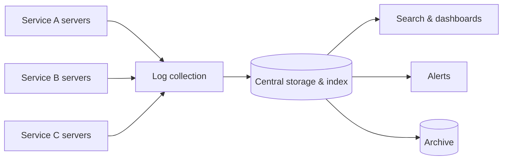

A user reports that their payment failed. The request passed through a load balancer, an API gateway, an order service, a payment service, a fraud-detection service and a database — each running on dozens of servers. To find out what happened, an engineer needs the logs from every step of that one request, gathered from all those machines and searchable in seconds. A **distributed logging** system makes this possible.

## Why logs matter

Logs are timestamped records of events: a request received, a query executed, an error thrown. They are indispensable for:

- **Debugging** — reconstructing what happened in a specific request.
- **Incident response** — spotting error spikes and their causes.
- **Security and auditing** — recording who did what and when.
- **Analytics** — deriving usage patterns and business metrics.

## Why logging is hard at scale

On one server, logs are files you can read with basic tools. In a large system:

- Logs are **scattered** across thousands of short-lived servers and containers; when a container is destroyed, its local logs disappear.
- **Volume** is enormous — terabytes per day for a large fleet.
- Engineers need to **search and correlate** across services quickly, often during an outage.
- Logs can contain **sensitive data** that must be protected or removed.

## Requirements

### Functional

- **Write** log entries from any service.
- **Search** logs by time range, service, severity, request ID and free text.
- **Retain** logs for a configurable period and **archive** older logs cheaply.
- **Alert** on log patterns such as error spikes.

### Non-functional

- **Low overhead** — logging must not slow down services.
- **Scalability** — ingest millions of log lines per second.
- **Availability and durability** — logs should not be lost, especially during incidents when they matter most.
- **Search latency** — recent logs searchable within seconds.
- **Security** — access control and redaction of sensitive fields.

## Logs, metrics and traces together

Logging complements the monitoring system from earlier chapters. Metrics tell you **that** something is wrong — the error rate for checkout jumped — while logs tell you **why**: the exact error messages and parameters of failing requests. Traces connect the two by showing which service in a call chain was slow or failing. A good observability setup lets engineers jump from a metric spike to the relevant traces and then to the matching log lines in a few clicks.

<KeyTakeaways>
- Distributed logging centralizes logs from many services so requests can be debugged end to end.
- Challenges include scattered and ephemeral sources, huge volume, fast search and sensitive data.
- Requirements cover writing, searching, retention, archiving and alerting with low overhead, scalability and durability.
</KeyTakeaways>
