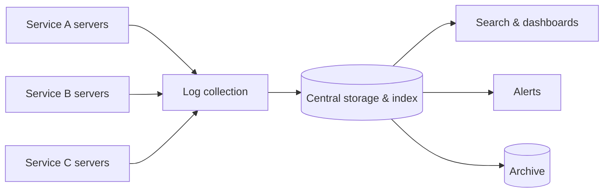

A user reports that their payment failed. The request passed through a load balancer, an API gateway, an order service, a payment service, a fraud-detection service and a database — each running on dozens of servers. To find out what happened, an engineer needs the logs from every step of that one request, gathered from all those machines and searchable in seconds. A **distributed logging** system makes this possible.

## Why logs matter

Logs are timestamped records of events: a request received, a query executed, an error thrown. They are indispensable for:

- **Debugging** — reconstructing what happened in a specific request.
- **Incident response** — spotting error spikes and their causes.
- **Security and auditing** — recording who did what and when.
- **Analytics** — deriving usage patterns and business metrics.

## Why logging is hard at scale

On one server, logs are files you can read with basic tools. In a large system:

- Logs are **scattered** across thousands of short-lived servers and containers; when a container is destroyed, its local logs disappear.
- **Volume** is enormous — terabytes per day for a large fleet.
- Engineers need to **search and correlate** across services quickly, often during an outage.
- Logs can contain **sensitive data** that must be protected or removed.



## Estimating volume

Assume 10,000 hosts running services that each emit 200 log lines per second, with an average of 500 bytes per structured line:

```text
Lines:        10,000 × 200          = 2,000,000 lines/s
Raw bytes:    2M × 500 B            = 1 GB/s ≈ 86 TB/day
Compressed:   ~10:1 for text logs   ≈ 8.6 TB/day stored
Hot index:    7 days, with index overhead (~1.5×) and 2 replicas ≈ 260 TB
Cold archive: 1 year compressed     ≈ 3 PB
```

During an incident, error logs can spike tenfold in seconds — exactly when engineers need the logging system most. The design must absorb bursts without dropping data or slowing the services that produce it.

## Requirements

### Functional

- **Write** log entries from any service.
- **Search** logs by time range, service, severity, request ID and free text.
- **Retain** logs for a configurable period and **archive** older logs cheaply.
- **Alert** on log patterns such as error spikes.
- **Live tail** — stream matching log lines in real time while debugging.

### Non-functional

- **Low overhead** — logging must not slow down services.
- **Scalability** — ingest millions of log lines per second.
- **Availability and durability** — logs should not be lost, especially during incidents when they matter most.
- **Search latency** — recent logs searchable within seconds.
- **Security** — access control and redaction of sensitive fields.
- **Cost efficiency** — logs are often the largest observability expense, so storage must be tiered.

## Logs, metrics and traces together

Logging complements the monitoring system from earlier chapters. Metrics tell you **that** something is wrong — the error rate for checkout jumped — while logs tell you **why**: the exact error messages and parameters of failing requests. Traces connect the two by showing which service in a call chain was slow or failing. A good observability setup lets engineers jump from a metric spike to the relevant traces and then to the matching log lines in a few clicks.


## Audit logs are different

Some logs are records the business must keep: who changed a user's permissions, who accessed a patient record, who approved a payment. **Audit logs** have stricter requirements than debugging logs — they must be complete (no sampling), tamper-evident, retained for years and access-controlled. Many systems send them through a separate pipeline with stronger durability guarantees and write-once storage.

<Ponder question="Why not simply have every service write its logs directly into the central search cluster?">
It couples every service to the health of the logging backend: if the cluster slows down during an incident (exactly when log volume spikes), services block on log writes or drop logs. Thousands of services opening connections to the cluster also makes it hard to control load. Local agents with disk buffers and a durable queue in between absorb bursts, protect services from backend slowness, and let the backend ingest at its own pace.
</Ponder>

<KeyTakeaways>
- Distributed logging centralizes logs from many services so requests can be debugged end to end.
- Challenges include scattered and ephemeral sources, huge volume (terabytes per day), fast search and sensitive data.
- Requirements cover writing, searching, live tail, retention, archiving and alerting with low overhead, scalability, durability and cost control.
- Metrics, traces and logs work together: detect, locate, then explain.
- Audit logs need completeness, tamper evidence and long retention, often through a separate pipeline.
</KeyTakeaways>
