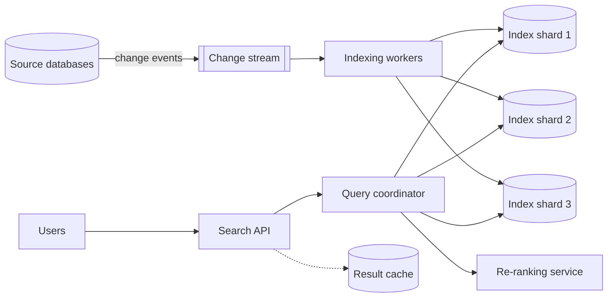
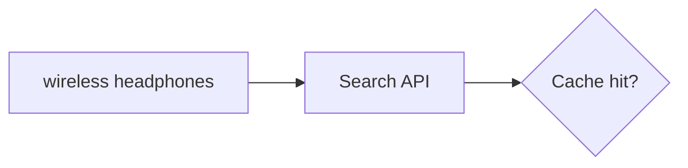
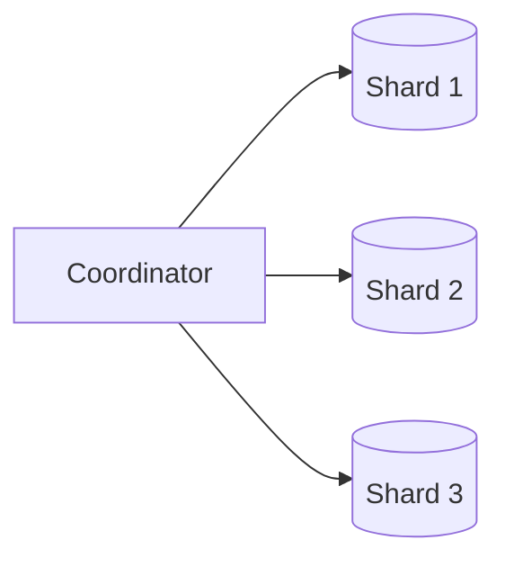
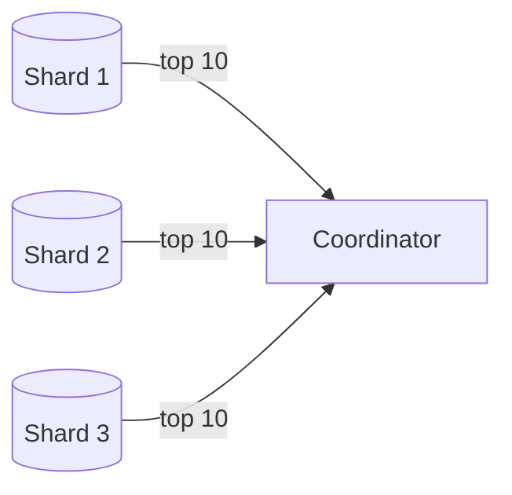
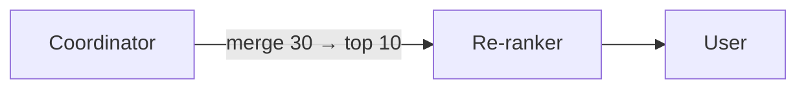

A distributed search system has two main pipelines: the **indexing pipeline**, which turns source data into index segments, and the **query pipeline**, which answers searches. Let's design both.

## Architecture

## Indexing pipeline

1. **Change capture.** When a document is created, updated or deleted in the source database, an event is published to a change stream (via change data capture or application events).
2. **Indexing workers** consume events, fetch any additional data needed (for example, the uploader's name), run text analysis and build index entries.
3. Each document is routed to its **index shard** (for example, by hashing the document ID).
4. Shards add the entries to an in-memory buffer and periodically **refresh**, creating new searchable segments, and **merge** segments in the background.

Using a durable change stream decouples indexing from the source system: if indexers fall behind or crash, events wait in the stream, and the index can be rebuilt from scratch by replaying events or bulk-exporting the source data.

## Query pipeline

<Slides title="Answering a search query">
<Slide caption="1. The API parses the query, applies text analysis and checks the result cache.">

</Slide>
<Slide caption="2. On a miss, the coordinator fans the query out to every shard (scatter).">

</Slide>
<Slide caption="3. Each shard searches its local index and returns its top K results with scores.">

</Slide>
<Slide caption="4. The coordinator merges the results (gather), optionally re-ranks the best candidates, and returns a page.">

</Slide>
</Slides>

This **scatter-gather** pattern is the standard way to query a document-partitioned index. Because every shard is queried, the slowest shard determines overall latency — so tail latency on each shard matters a great deal.

## Two-phase ranking

Ranking billions of documents with an expensive model is impossible within 100 ms. Systems use two phases:

- **Retrieval and cheap scoring** on each shard (for example, BM25 plus simple signals) selects a few hundred candidates.
- **Re-ranking** of those candidates with a richer, often machine-learned model that considers personalization and freshness.

## Pagination

Deep pagination (“page 500”) is expensive with scatter-gather, because each shard must return `page × size` results for the coordinator to merge. Systems limit how deep users can page, or use **search-after cursors** that continue from the last result's sort values.

## Caching

Query popularity is highly skewed; many users search for the same trending terms. A **result cache** keyed by normalized query and filters serves popular searches without touching the shards. Short TTLs keep results fresh.

<KeyTakeaways>
- The indexing pipeline consumes change events, analyzes text and writes to index shards, which refresh and merge segments.
- A durable change stream decouples indexing from sources and enables rebuilding the index.
- Queries use scatter-gather: fan out to all shards, gather top results, merge and re-rank.
- Two-phase ranking applies cheap scoring broadly and expensive models to a few candidates.
- Result caching and limits on deep pagination keep queries fast.
</KeyTakeaways>
