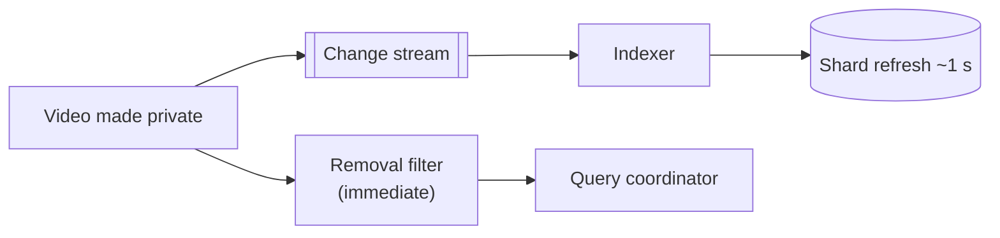

Let's evaluate our distributed search design against the requirements.

## Latency

- The inverted index turns keyword matching into postings-list lookups and merges.
- Hot index data is kept in memory; compressed postings maximize what fits.
- Scatter-gather queries run in parallel; **hedged requests** and **partial results** keep p99 latency bounded.
- **Result caching** serves popular queries without touching shards.
- Two-phase ranking restricts expensive models to a few hundred candidates.

### A latency budget for one query

| Step | Budget |
| --- | --- |
| API, parsing and query analysis | 5 ms |
| Result cache lookup (miss) | 1 ms |
| Scatter to shards, per-shard top-k search (parallel, p99) | 60 ms |
| Gather and merge | 5 ms |
| Fetch phase for 20 results | 15 ms |
| Re-ranking 500 candidates | 30 ms |
| Response serialization and network | 20 ms |
| **Total** | **~136 ms, within the 200 ms p99 target** |

## Scalability

- **More documents:** add shards (or reindex into more shards) and spread them over more nodes.
- **More queries:** add replicas per shard.
- **More indexing volume:** add indexing workers consuming the change stream in parallel.

Because indexing and serving are separated, each dimension scales independently.

## Availability

- Every shard has multiple replicas across availability zones.
- The coordinator skips failed replicas and, if an entire shard is unavailable, can return partial results with a flag rather than failing.
- The change stream buffers updates while indexers or shards recover, so no updates are lost.

| Failure | Effect | Handling |
| --- | --- | --- |
| One searcher replica fails | Fewer replicas for its shards | Coordinator routes to other replicas; a replacement downloads segments |
| Every replica of one shard fails | That shard's documents missing | Partial results with a flag; alert |
| Indexers fall behind | Freshness degrades | Change stream buffers; autoscale indexers |
| Coordinator overloaded | Latency rises | Stateless coordinators scale out; result cache absorbs popular queries |
| Bad ranking deployment | Relevance drops | A/B metrics catch it; roll back the model |

## Freshness

- Change data capture delivers updates to indexers within seconds.
- Shards refresh every second or so, making new segments searchable.
- **Deletions and privacy changes** are prioritized: a document made private must disappear immediately, so the query path can also check a small, fast "recently removed" filter until the index catches up.

## Consistency

The index is **eventually consistent** with the source databases. For search, a short lag is acceptable — users rarely notice that a video uploaded five seconds ago is not yet searchable — as long as deletions and permission changes are handled with priority. Versioned updates ensure that, once events stop, every document converges to its latest source version.

## Requirements summary

| Requirement | How the design meets it |
| --- | --- |
| Low latency | In-memory compressed postings, parallel scatter-gather, early termination, hedging, caching |
| Scalability | Shards for data, replicas for queries, parallel indexers |
| Availability | Replicas across zones, partial results, buffered change stream |
| Freshness | Change data capture, one-second refreshes, removal filter |
| Relevance | BM25 retrieval plus machine-learned re-ranking, evaluated with metrics and A/B tests |

## Trade-offs

| Decision | Benefit | Cost |
| --- | --- | --- |
| Document partitioning | Simple indexing, balanced load | Scatter-gather on every query |
| Near-real-time refresh | Freshness | More small segments to merge |
| Partial results on timeout | Availability, low latency | Occasionally incomplete results |
| Result caching | Low latency for popular queries | Slightly stale results |

<Ponder question="The team proposes skipping the change stream and having the application write to the database and the search index in the same request. What are the risks?">
Dual writes can diverge: the database write succeeds and the index write fails (or vice versa), or two concurrent requests apply their index writes in the opposite order to their database writes, leaving stale data permanently. It also couples request latency and availability to the search cluster. A change stream derived from the database's committed log keeps the index eventually consistent, preserves order per document, and lets indexing lag without affecting user requests.
</Ponder>

<KeyTakeaways>
- In-memory compressed indexes, parallel scatter-gather, early termination, hedging and caching deliver low latency within a clear budget.
- Shards, replicas and indexing workers scale data, queries and updates independently.
- Replicas across zones, partial results and a buffered change stream keep search available.
- Change data capture and frequent refreshes provide freshness; deletions are prioritized with a removal filter.
- The index is eventually consistent with its sources, which is acceptable for search, and must not be fed by dual writes.
</KeyTakeaways>
