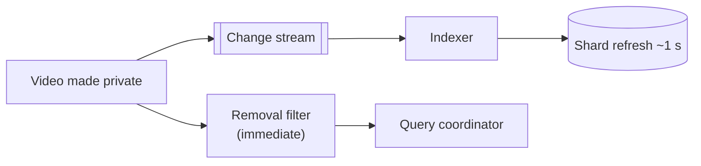

Let's evaluate our distributed search design against the requirements.

## Latency

- The inverted index turns keyword matching into postings-list lookups and merges.
- Hot index data is kept in memory; compressed postings maximize what fits.
- Scatter-gather queries run in parallel; **hedged requests** and **partial results** keep p99 latency bounded.
- **Result caching** serves popular queries without touching shards.
- Two-phase ranking restricts expensive models to a few hundred candidates.

## Scalability

- **More documents:** add shards (or reindex into more shards) and spread them over more nodes.
- **More queries:** add replicas per shard.
- **More indexing volume:** add indexing workers consuming the change stream in parallel.

Because indexing and serving are separated, each dimension scales independently.

## Availability

- Every shard has multiple replicas across availability zones.
- The coordinator skips failed replicas and, if an entire shard is unavailable, can return partial results with a flag rather than failing.
- The change stream buffers updates while indexers or shards recover, so no updates are lost.

## Freshness

- Change data capture delivers updates to indexers within seconds.
- Shards refresh every second or so, making new segments searchable.
- **Deletions and privacy changes** are prioritized: a document made private must disappear immediately, so the query path can also check a small, fast “recently removed” filter until the index catches up.

## Consistency

The index is **eventually consistent** with the source databases. For search, a short lag is acceptable — users rarely notice that a video uploaded five seconds ago is not yet searchable — as long as deletions and permission changes are handled with priority.

## Trade-offs

| Decision | Benefit | Cost |
| --- | --- | --- |
| Document partitioning | Simple indexing, balanced load | Scatter-gather on every query |
| Near-real-time refresh | Freshness | More small segments to merge |
| Partial results on timeout | Availability, low latency | Occasionally incomplete results |
| Result caching | Low latency for popular queries | Slightly stale results |

<KeyTakeaways>
- In-memory compressed indexes, parallel scatter-gather, hedging and caching deliver low latency.
- Shards, replicas and indexing workers scale data, queries and updates independently.
- Replicas across zones and partial results keep search available.
- Change data capture and frequent refreshes provide freshness; deletions are prioritized.
- The index is eventually consistent with its sources, which is acceptable for search.
</KeyTakeaways>
