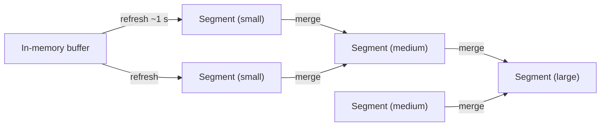

The heart of every search engine is the **inverted index**: a mapping from each term to the list of documents that contain it. It turns "which documents contain this word?" from a full scan into a fast lookup.

## Forward versus inverted index

A **forward index** maps documents to their terms — the natural way data is stored. An **inverted index** flips the mapping.

| Document | Text |
| --- | --- |
| D1 | wireless noise cancelling headphones |
| D2 | wired headphones with microphone |
| D3 | wireless charging pad |

| Term | Postings list |
| --- | --- |
| wireless | D1, D3 |
| headphones | D1, D2 |
| wired | D2 |
| charging | D3 |
| noise | D1 |

A query for `wireless headphones` looks up both postings lists and **intersects** them: `{D1, D3} ∩ {D1, D2} = {D1}`. Because postings lists are sorted by document ID, intersection is a fast linear merge. An OR query takes the **union** instead, and ranking then decides the order.

## Building the index: text analysis

Before indexing, text passes through an **analysis pipeline** so that queries match documents regardless of superficial differences:

<Slides title="Text analysis pipeline">
<Slide caption="1. Tokenization splits text into terms.">


</Slide>
<Slide caption="2. Normalization lowercases terms and removes punctuation and accents.">


</Slide>
<Slide caption="3. Stemming reduces words to a common root; stop words may be removed.">


</Slide>
</Slides>

The **same analysis** must be applied to queries, so a search for "cancelled headphone" also matches. Other steps include synonym expansion ("earbuds" ↔ "headphones") and language-specific processing — languages such as Chinese and Japanese do not separate words with spaces and need dictionary-based tokenizers.

## What postings contain

Postings lists can store more than document IDs:

- **Term frequency** — how many times the term appears in the document, used for ranking.
- **Positions** — where in the document the term appears, enabling phrase queries ("noise cancelling") and proximity scoring.
- **Field information** — whether the term appears in the title or body, since title matches are usually more relevant.

```text
noise      -> D1: positions [2]          D7: positions [4, 19]
cancelling -> D1: positions [3]          D7: positions [11]
Phrase "noise cancelling": D1 matches (3 = 2 + 1); D7 does not (no position 5 or 20)
```

### Compressing postings

Postings lists for common terms can contain hundreds of millions of IDs, so they are heavily **compressed** so that more of the index fits in memory:

```text
Document IDs:  1000, 1003, 1010, 1011, 1400
Gaps:          1000,    3,    7,    1,  389     (store differences, not IDs)
Variable-byte: small gaps fit in 1 byte instead of 4 or 8
```

Because gaps between sorted IDs are usually small, this shrinks postings several-fold, and decoding is fast enough that compressed lists are often *faster* to process than uncompressed ones, since less data moves through memory.

## Ranking basics

A classic relevance score combines:

- **Term frequency (TF):** documents mentioning a term more often are more relevant, with diminishing returns.
- **Inverse document frequency (IDF):** rare terms ("anechoic") are more informative than common ones ("the").
- **Length normalization:** a match in a short title counts more than one in a long transcript.

The widely used **BM25** function formalizes this. For each query term `t` in document `d`:

```text
score(t, d) = IDF(t) × tf × (k1 + 1) / (tf + k1 × (1 − b + b × |d| / avgdl))
IDF(t)      = ln(1 + (N − n_t + 0.5) / (n_t + 0.5))
```

where `tf` is the term's frequency in `d`, `|d|` the document length, `avgdl` the average length, `N` the number of documents, `n_t` the number containing `t`, and `k1 ≈ 1.2`, `b ≈ 0.75` are tuning constants. The document's score is the sum over query terms.

**Worked intuition.** In a collection of 1 million documents, "headphones" appears in 10,000 and "anechoic" in 50. IDF gives roughly 4.6 for "headphones" and 9.9 for "anechoic", so a document matching the rare word gets about twice the boost of one matching the common word, even with the same term frequency.

Production systems then combine text relevance with signals like popularity, freshness and personalization, often using machine-learned ranking models on the top candidates.

## Updating the index

Inverted indexes are expensive to modify in place, so systems write new documents into small **immutable segments** and periodically **merge** segments in the background. Deletions are recorded as tombstones and physically removed during merges. New segments are made searchable every second or so, which provides near-real-time freshness.



An update to a document is a delete of the old version plus an insert of the new one. Queries search all current segments and skip tombstoned documents. Merging keeps the number of segments small, because each extra segment adds work to every query.

<Ponder question="Why do search engines refresh segments about once a second instead of making each new document searchable immediately?">
Making a document searchable requires building an immutable segment and opening it for readers. Doing that per document would create millions of tiny segments, each adding overhead to every query and to merging. Batching a second's worth of documents into one segment keeps segment counts and merge costs manageable while still giving near-real-time freshness that users perceive as instant.
</Ponder>

<KeyTakeaways>
- An inverted index maps each term to a sorted postings list of documents containing it; queries intersect or union the lists.
- Text analysis — tokenization, normalization, stemming, synonyms — must be applied identically to documents and queries.
- Postings store frequencies, positions (for phrase queries) and fields, compressed with gap encoding to fit in memory.
- BM25 combines term frequency, inverse document frequency and length normalization; production ranking adds quality signals.
- Updates use immutable segments refreshed about every second and merged in the background, with tombstones for deletions.
</KeyTakeaways>
