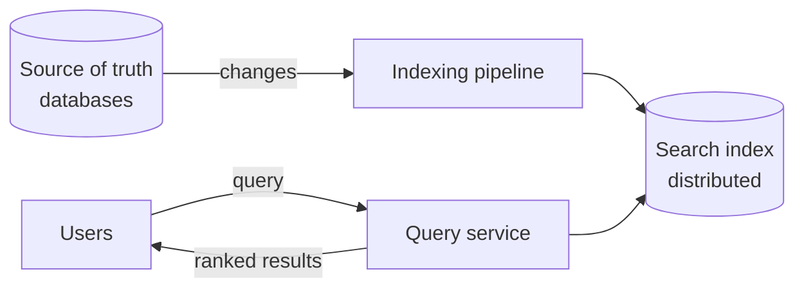

Users expect to type a few words and instantly find the right product, video, document or message among billions. Databases are great at looking up a record by its key, but queries like “find all documents containing the words *wireless* and *headphones*, ranked by relevance” require a different structure and architecture. A **distributed search system** indexes large volumes of text and answers such queries in milliseconds.

## Why a database is not enough

A naive approach scans every document for the query words:

```text
SELECT * FROM products WHERE description LIKE '%wireless%' AND description LIKE '%headphones%'
```

This reads every row for every query — acceptable for thousands of rows, hopeless for billions. It also offers no notion of **relevance**: a product that mentions “wireless” once in a footnote ranks the same as one titled “Wireless Headphones.”

Search systems solve both problems with an **inverted index** and **ranking** algorithms, and they scale by distributing the index across many machines.

## Where search appears

- E-commerce product search.
- Searching posts, videos or people on social platforms.
- Searching messages and documents in productivity tools.
- Log and observability search.
- Autocomplete and typeahead (covered in its own chapter).

## Requirements

### Functional

- **Index** documents as they are created or updated.
- **Search** with keyword queries, returning results ranked by relevance.
- **Filter and sort** by attributes such as price, date or category.
- **Paginate** through results.

### Non-functional

- **Low latency** — results in well under a few hundred milliseconds, ideally under 100 ms.
- **Scalability** — billions of documents and thousands of queries per second.
- **Availability** — search should keep working when nodes fail.
- **Freshness** — new or updated documents should become searchable quickly, typically within seconds to minutes.



## Chapter roadmap

1. **Requirements** in more depth, with capacity estimates.
2. **Indexing** — how inverted indexes work.
3. **Design** — the indexing and query pipelines.
4. **Scaling** — partitioning and replicating the index.
5. **Evaluation** — how the design meets its goals.

<Callout type="note">
The search index is usually **not** the source of truth. Data lives in databases and is copied into the search index, which is optimized for queries. If the index is lost, it can be rebuilt.
</Callout>

<KeyTakeaways>
- Scanning documents for keywords does not scale and cannot rank by relevance.
- Search systems use inverted indexes and ranking, distributed across many machines.
- Requirements: indexing, relevance-ranked search, filtering, pagination, low latency, scale, availability and freshness.
- The search index is derived from the source of truth and can be rebuilt.
</KeyTakeaways>
