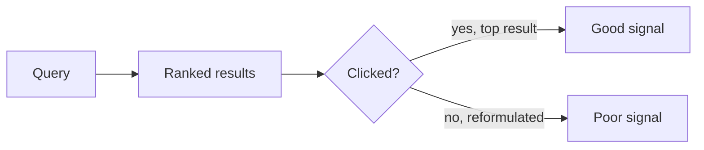

Let's make the requirements concrete for a large search system — for example, searching videos by title, description and transcript on a video platform.

## Functional requirements

- **Index documents:** each video's text fields and attributes (upload date, view count, duration, language) are indexed when uploaded or edited.
- **Keyword search:** users search with one or more terms; results contain documents matching the terms.
- **Relevance ranking:** results are ordered by how well they match, combined with quality signals such as popularity.
- **Filtering and sorting:** by upload date, duration, language and so on.
- **Pagination:** users fetch results in pages.
- **Deletion:** removed or private videos disappear from results promptly.

## Non-functional requirements

- **Latency:** p99 under 200 ms end to end.
- **Throughput:** thousands to tens of thousands of queries per second at peak.
- **Scale:** billions of documents, growing continuously.
- **Availability:** degraded results are better than no results.
- **Freshness:** new videos searchable within about a minute; deletions reflected even faster.

## Capacity estimates

Assume:

- 2 billion documents, with 2 KB of searchable text each on average.
- 200 million searches per day; peak is 3× average.

```text
Raw text: 2 × 10^9 × 2 KB = 4 TB
Inverted index: roughly 30–100% of raw text size → ~2–4 TB
With 3 replicas: ~6–12 TB of index storage

Queries: 2 × 10^8 / 10^5 s ≈ 2,000 QPS average → ~6,000 QPS at peak
Indexing: e.g. 5 million new or updated documents per day ≈ 60 per second
```

The workload is **read-heavy** at query time but has continuous writes from indexing. The index is too large for one machine's memory and must be **partitioned**, and query volume requires **replication**.

## Out of scope

To keep the design focused, we exclude spelling correction, query autocompletion (covered in the typeahead chapter), image and voice search, and personalized ranking beyond simple signals. We also assume documents are text-heavy and that each document is owned by a single source-of-truth database, which simplifies the indexing pipeline.

## Measuring quality

Search quality is harder to measure than latency. Common signals include:

- **Click-through rate** on top results.
- **Time to first click** and whether users reformulate their query.
- **Offline evaluation** with human-labeled query-result pairs and metrics such as precision and recall.



<Callout type="tip">
In interviews, focus on the infrastructure — indexing pipeline, index partitioning, query fan-out — unless asked about ranking. Mentioning that ranking combines text relevance with quality signals is usually sufficient.
</Callout>

<KeyTakeaways>
- Functional needs include indexing, keyword search, ranking, filtering, pagination and deletions.
- Non-functional targets: p99 latency under ~200 ms, thousands of QPS, billions of documents, high availability and freshness within about a minute.
- Index size and query volume require partitioning and replication.
- Search quality is measured with user behavior signals and offline relevance evaluation.
</KeyTakeaways>
