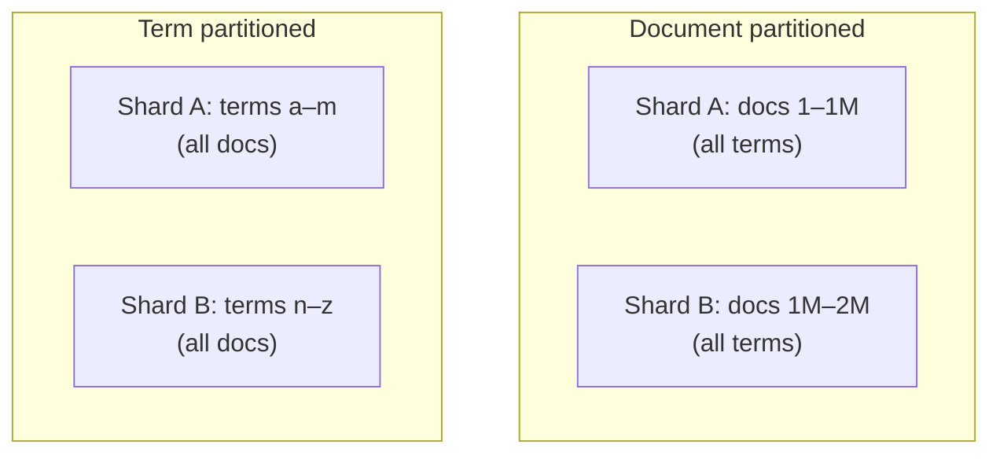
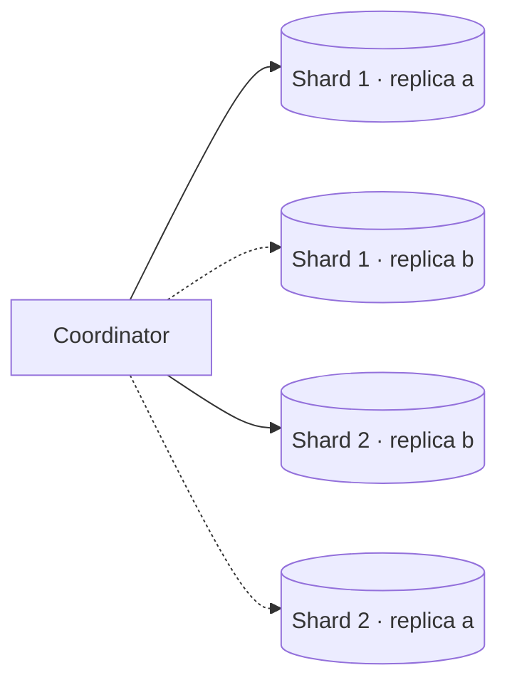
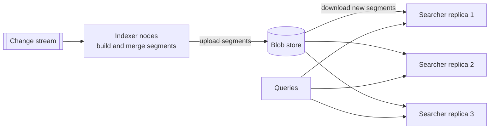
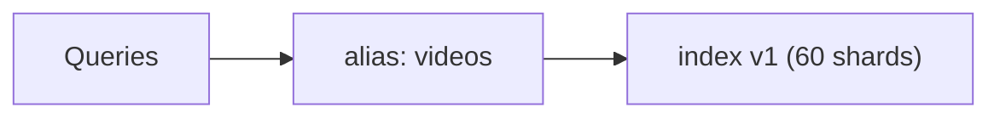
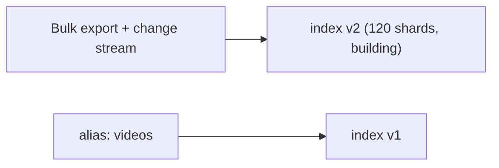
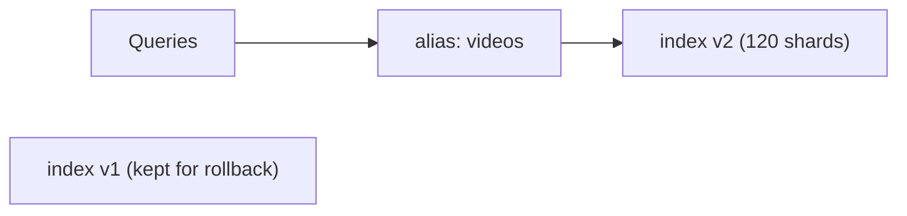

Our index is several terabytes and growing, and queries arrive at thousands per second. We need to decide how to partition the index across machines and how to replicate it for throughput and availability.

## Document partitioning versus term partitioning

There are two fundamental ways to split an inverted index.

**Document partitioning (local index).** Each shard holds a complete inverted index for a subset of documents.

- ✅ Indexing a document touches exactly one shard.
- ✅ Shards are independent and easy to add.
- ❌ Every query must go to every shard (scatter-gather).

**Term partitioning (global index).** Each shard holds the postings lists for a subset of terms across all documents.

- ✅ A query touches only the shards owning its terms.
- ❌ Indexing one document updates many shards.
- ❌ Popular terms create huge postings lists and hot shards; multi-term queries must combine lists across shards over the network.



Most large systems use **document partitioning** because it keeps indexing simple, balances load naturally and handles failures gracefully. Scatter-gather overhead is manageable with enough replicas and careful tail-latency control.

### Routing by tenant or user

When every query is scoped to one tenant or user — a company's documents, a person's email — the index can be partitioned by that key instead of by document ID. A query then goes to one shard only. Very large tenants can be spread over several shards with a secondary hash.

## Replication

Each shard is replicated, typically two to five times:

- **Throughput:** queries are spread across replicas, so adding replicas increases QPS capacity.
- **Availability:** if a replica fails, others serve its queries.
- **Maintenance:** replicas can be updated or rebuilt one at a time without downtime.



The coordinator picks one replica per shard for each query, balancing load.

## Sizing shards and replicas

Shards determine how much data each node holds; replicas determine how many queries the cluster can serve.

```text
Index size:              3 TB
Target shard size:       ~50 GB (fits in node memory, quick to move and rebuild)
Shards:                  3 TB / 50 GB = 60 shards

Peak queries:            6,000 QPS; every query hits all 60 shards
Shard queries/s:         6,000 × 60 = 360,000 shard-queries per second
One replica handles:     ~500 shard-queries per second (with ~20 ms per shard query and ~10 cores)
Replicas needed:         360,000 / 500 = 720 replicas → 12 per shard
```

The arithmetic reveals a scatter-gather cost: doubling the number of shards doubles the per-query fan-out. Keeping shards reasonably large (tens of gigabytes) avoids paying fan-out overhead for no benefit, and caching popular queries reduces the replicas needed.

## Separating indexing from serving

Building index segments is CPU- and I/O-intensive. If it runs on the same machines that serve queries, it can hurt query latency. Many designs separate the roles:

- **Indexer nodes** build segments from the change stream.
- **Searcher nodes** download finished segments and serve queries.

This keeps query latency stable and allows indexing and serving capacity to scale independently.



Storing segments in a blob store also makes adding a replica cheap: a new searcher downloads the shard's segments rather than rebuilding them.

## Controlling tail latency

Because every query waits for the slowest shard, techniques to limit tail latency are essential:

- **Hedged requests:** if a shard replica has not responded within, say, the 95th percentile latency, send the same request to another replica and use whichever responds first.
- **Timeouts with partial results:** return results from the shards that responded in time rather than failing the whole query.
- **Balanced shard sizes** so no shard has much more work than others.
- **Keeping hot index data in memory** and using SSDs for the rest.
- **Adaptive replica selection:** route each shard request to the replica with the best recent latency and shortest queue.

The effect of fan-out on tail latency is dramatic: if each shard is slow 1% of the time, a query hitting 60 shards is slow about `1 − 0.99⁶⁰ ≈ 45%` of the time. Hedging turns each shard's p99 into roughly the p99 of the faster of two replicas.

## Growing the index

As documents grow, shards grow. Systems either create **more shards than nodes** up front and move shards between nodes as the cluster grows, or **reindex** into a larger number of shards in the background and switch over with an alias once it is ready.

<Slides title="Reindexing behind an alias">
<Slide caption="1. Queries use the alias 'videos', which points to index v1 with 60 shards.">



</Slide>
<Slide caption="2. A new index v2 with 120 shards is built from a bulk export plus the change stream, while v1 keeps serving.">



</Slide>
<Slide caption="3. Once v2 has caught up and is verified, the alias switches atomically. v1 is kept briefly for rollback, then deleted.">



</Slide>
</Slides>

The same technique is used to change analyzers or field mappings, which cannot be applied to existing segments in place.

<Callout type="interview">
When asked how search scales, say: "Document-partitioned shards, each replicated. Queries scatter to one replica per shard and gather top results. Replicas scale throughput; more shards scale data size. Hedged requests control tail latency."
</Callout>

<Ponder question="A team splits a 60-shard index into 600 tiny shards 'to make it faster'. Query latency gets worse. Why?">
Every query now fans out to 600 shards instead of 60: ten times the network requests, per-shard overhead and merge work at the coordinator, and a much higher chance that at least one shard is slow. Each shard's work shrank, but fixed per-shard costs and tail-latency amplification dominate. Shard count should be driven by data size and rebalancing needs; query throughput is scaled with replicas.
</Ponder>

<KeyTakeaways>
- Document partitioning keeps indexing local but requires scatter-gather queries; term partitioning is rarely used at scale; tenant-scoped search can route to one shard.
- Replicas scale query throughput and provide availability; shards scale data size — size both from index size and shard-queries per second.
- Separating indexers from searchers, with segments shipped through a blob store, keeps query latency stable.
- Hedged requests, partial results, balanced shards and adaptive replica selection control tail latency amplified by fan-out.
- Over-sharding up front or reindexing behind an alias lets the index grow and change.
</KeyTakeaways>
