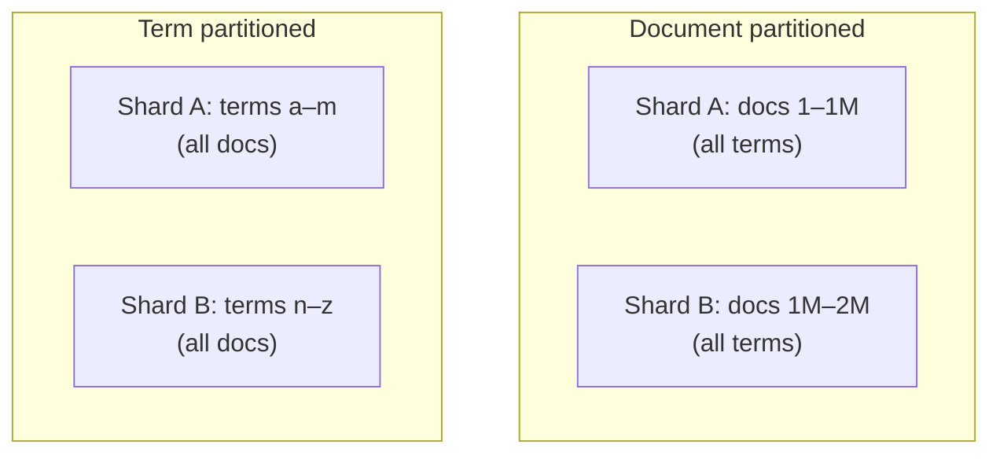
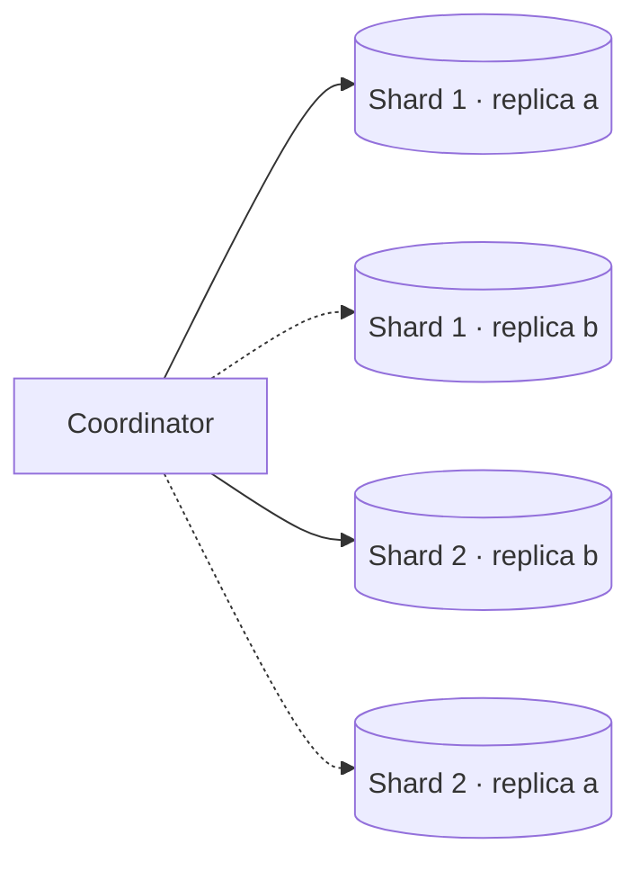

Our index is several terabytes and growing, and queries arrive at thousands per second. We need to decide how to partition the index across machines and how to replicate it for throughput and availability.

## Document partitioning versus term partitioning

There are two fundamental ways to split an inverted index.

**Document partitioning (local index).** Each shard holds a complete inverted index for a subset of documents.

- ✅ Indexing a document touches exactly one shard.
- ✅ Shards are independent and easy to add.
- ❌ Every query must go to every shard (scatter-gather).

**Term partitioning (global index).** Each shard holds the postings lists for a subset of terms across all documents.

- ✅ A query touches only the shards owning its terms.
- ❌ Indexing one document updates many shards.
- ❌ Popular terms create huge postings lists and hot shards; multi-term queries must combine lists across shards over the network.

Most large systems use **document partitioning** because it keeps indexing simple, balances load naturally and handles failures gracefully. Scatter-gather overhead is manageable with enough replicas and careful tail-latency control.

## Replication

Each shard is replicated, typically two to five times:

- **Throughput:** queries are spread across replicas, so adding replicas increases QPS capacity.
- **Availability:** if a replica fails, others serve its queries.
- **Maintenance:** replicas can be updated or rebuilt one at a time without downtime.

The coordinator picks one replica per shard for each query, balancing load.

## Separating indexing from serving

Building index segments is CPU- and I/O-intensive. If it runs on the same machines that serve queries, it can hurt query latency. Many designs separate the roles:

- **Indexer nodes** build segments from the change stream.
- **Searcher nodes** download finished segments and serve queries.

This keeps query latency stable and allows indexing and serving capacity to scale independently.

## Controlling tail latency

Because every query waits for the slowest shard, techniques to limit tail latency are essential:

- **Hedged requests:** if a shard replica has not responded within, say, the 95th percentile latency, send the same request to another replica and use whichever responds first.
- **Timeouts with partial results:** return results from the shards that responded in time rather than failing the whole query.
- **Balanced shard sizes** so no shard has much more work than others.
- **Keeping hot index data in memory** and using SSDs for the rest.

## Growing the index

As documents grow, shards grow. Systems either create **more shards than nodes** up front and move shards between nodes as the cluster grows, or **reindex** into a larger number of shards in the background and switch over with an alias once it is ready.

<Callout type="interview">
When asked how search scales, say: “Document-partitioned shards, each replicated. Queries scatter to one replica per shard and gather top results. Replicas scale throughput; more shards scale data size. Hedged requests control tail latency.”
</Callout>

<KeyTakeaways>
- Document partitioning keeps indexing local but requires scatter-gather queries; term partitioning is rarely used at scale.
- Replicas scale query throughput and provide availability; shards scale data size.
- Separating indexers from searchers keeps query latency stable.
- Hedged requests, partial results and balanced shards control tail latency.
- Over-sharding or background reindexing lets the index grow.
</KeyTakeaways>
