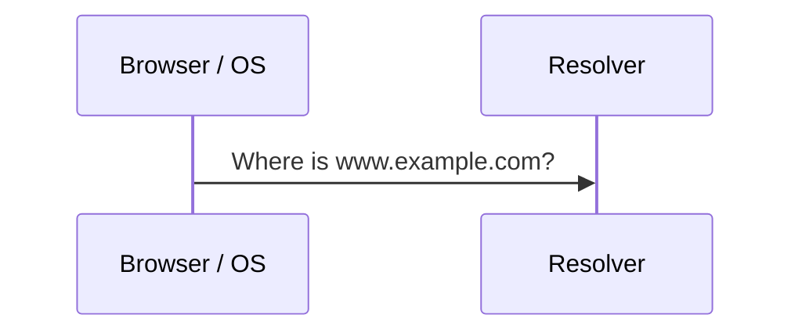
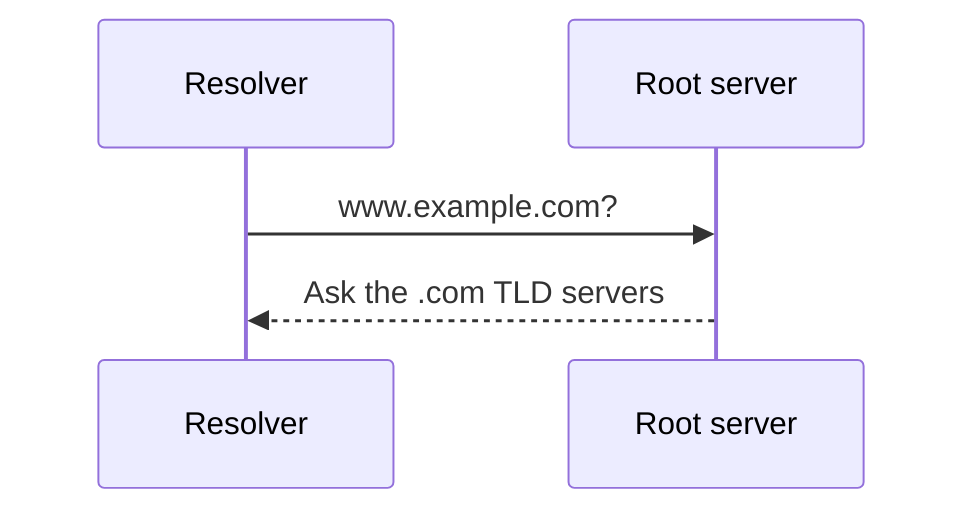
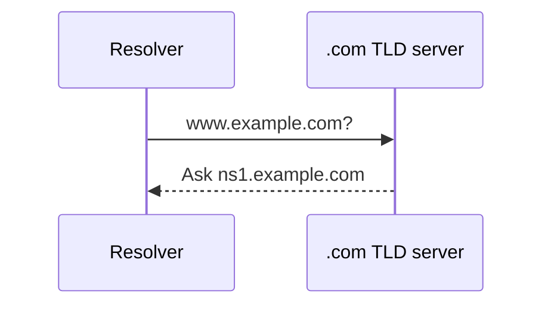
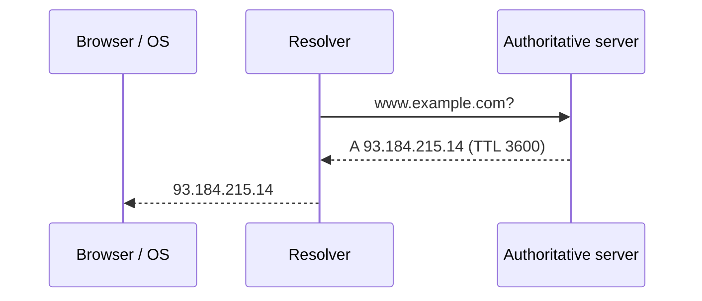

In the previous lesson we saw that DNS is a hierarchical, distributed directory that maps human-friendly names such as `www.example.com` to IP addresses. In this lesson we follow a single lookup step by step, then look at the techniques — caching, replication and anycast — that let DNS answer billions of queries every day with low latency.

## The actors in a lookup

Four kinds of servers cooperate to answer a query:

| Server | Role |
| --- | --- |
| **Resolver** (recursive resolver) | Usually run by your ISP or a public provider. Does the legwork on behalf of the client and caches results. |
| **Root name servers** | Know where the servers for each top-level domain (`.com`, `.org`, `.io`…) live. |
| **TLD name servers** | Know which authoritative servers are responsible for each domain under the TLD. |
| **Authoritative name servers** | Hold the actual records (A, AAAA, CNAME, MX…) for a domain. |

## Following a query

<Slides title="Resolving www.example.com">
<Slide caption="1. The browser and OS check their local caches. On a miss, the OS asks the configured resolver.">

</Slide>
<Slide caption="2. The resolver asks a root server, which refers it to the .com TLD servers.">

</Slide>
<Slide caption="3. The TLD server refers the resolver to example.com's authoritative servers.">

</Slide>
<Slide caption="4. The authoritative server returns the record, which the resolver caches and returns to the client.">

</Slide>
</Slides>

### Iterative versus recursive queries

The client asks the resolver a **recursive** question: “give me the final answer.” The resolver then asks root, TLD and authoritative servers **iterative** questions: each answers with the best referral it has instead of doing the work itself. This split keeps the root and TLD servers simple and stateless — they never chase answers on anyone's behalf — and concentrates the work (and the caching) in resolvers.

## Caching makes DNS fast

A full lookup takes several network round trips, but most queries never leave the resolver's cache. Every DNS record carries a **time to live (TTL)** set by the domain owner. Caches at every layer — the browser, the operating system and the resolver — keep the record until its TTL expires.

TTL is a trade-off:

- **Long TTLs** (hours or days) reduce load and latency, but changes such as moving to a new IP address propagate slowly.
- **Short TTLs** (seconds or minutes) allow fast failover and traffic shifting, at the cost of more queries.

<Callout type="interview">
When a design needs fast regional failover, mention lowering DNS TTLs ahead of a planned migration — and note that some clients ignore TTLs, so DNS alone is rarely enough for instant failover.
</Callout>

## Scaling and resilience

DNS stays available despite enormous load because it is:

- **Hierarchical** — no single server needs to know every name.
- **Replicated** — each zone is served by several authoritative servers, and there are hundreds of root server instances worldwide.
- **Anycast-routed** — many physical servers share one IP address, and the network delivers each query to the nearest one.
- **Eventually consistent** — updates spread as caches expire; clients may briefly see stale records, which is acceptable for most use cases.

DNS can also do basic load distribution. An authoritative server may return several A records in rotating order (round-robin DNS), or return different answers depending on the client's location. This is a coarse form of **global load balancing**, which we explore in the load balancers chapter.

<KeyTakeaways>
- A lookup involves the resolver, root servers, TLD servers and authoritative servers.
- Clients make recursive queries to resolvers; resolvers make iterative queries to the hierarchy.
- Caching at every layer, controlled by TTLs, makes most lookups nearly instant.
- TTL choice trades propagation speed against load and latency.
- Replication, anycast and hierarchy keep DNS highly available; consistency is eventual.
</KeyTakeaways>
