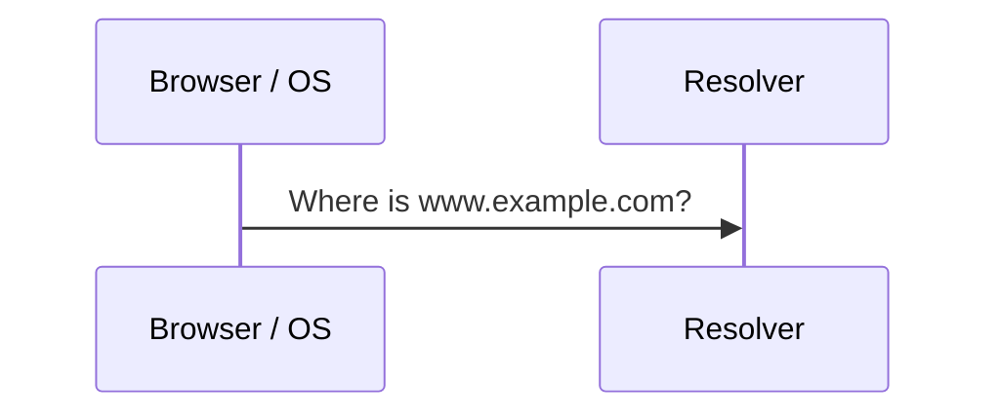
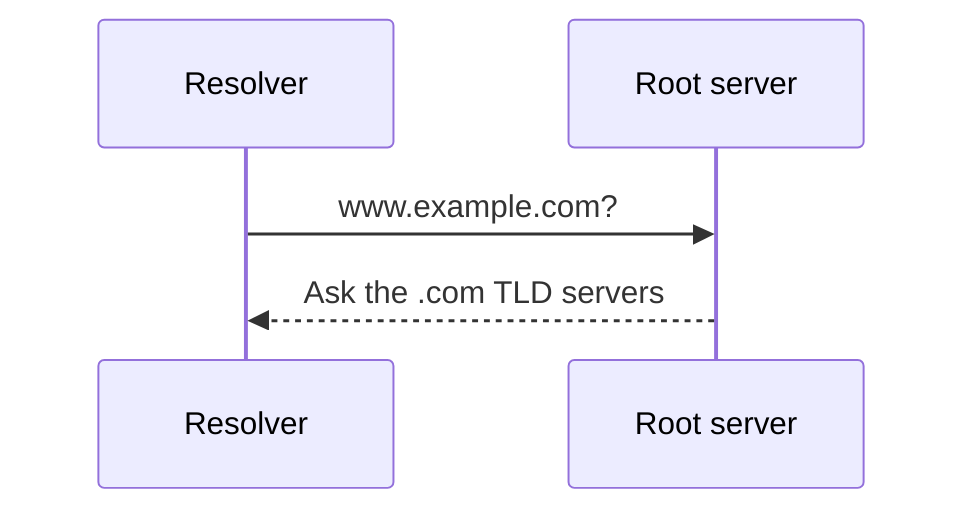
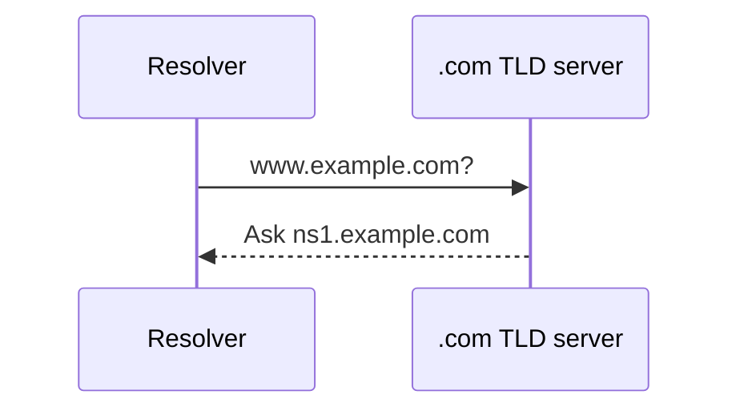
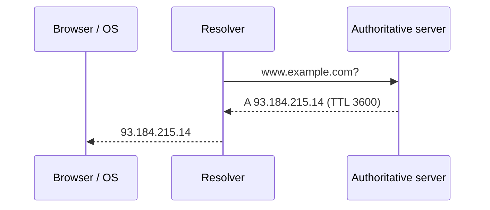
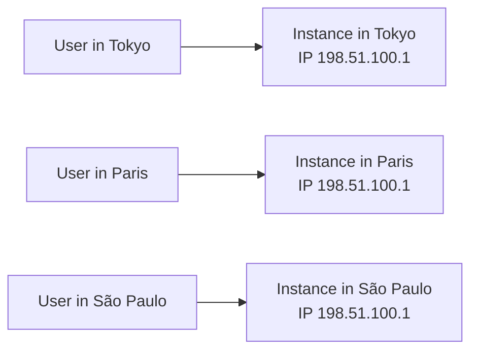

In the previous lesson we saw that DNS is a hierarchical, distributed directory that maps human-friendly names such as `www.example.com` to IP addresses. In this lesson we follow a single lookup step by step, then look at the techniques — caching, replication and anycast — that let DNS answer billions of queries every day with low latency.

## The actors in a lookup

Four kinds of servers cooperate to answer a query:

| Server | Role |
| --- | --- |
| **Resolver** (recursive resolver) | Usually run by your ISP or a public provider. Does the legwork on behalf of the client and caches results. |
| **Root name servers** | Know where the servers for each top-level domain (`.com`, `.org`, `.io`…) live. |
| **TLD name servers** | Know which authoritative servers are responsible for each domain under the TLD. |
| **Authoritative name servers** | Hold the actual records (A, AAAA, CNAME, MX…) for a domain. |

## Following a query

<Slides title="Resolving www.example.com">
<Slide caption="1. The browser and OS check their local caches. On a miss, the OS asks the configured resolver.">

</Slide>
<Slide caption="2. The resolver asks a root server, which refers it to the .com TLD servers.">

</Slide>
<Slide caption="3. The TLD server refers the resolver to example.com's authoritative servers.">

</Slide>
<Slide caption="4. The authoritative server returns the record, which the resolver caches and returns to the client.">

</Slide>
</Slides>

### Iterative versus recursive queries

The client asks the resolver a **recursive** question: "give me the final answer." The resolver then asks root, TLD and authoritative servers **iterative** questions: each answers with the best referral it has instead of doing the work itself. This split keeps the root and TLD servers simple and stateless — they never chase answers on anyone's behalf — and concentrates the work (and the caching) in resolvers.

### How long does a lookup take?

| Situation | Round trips from the resolver | Typical latency |
| --- | --- | --- |
| Answer in browser or OS cache | 0 | under 1 ms |
| Answer in resolver cache | 0 (one client-to-resolver trip) | 1–20 ms |
| Only TLD referral cached | 1 (authoritative) | 20–80 ms |
| Completely cold | 3 (root, TLD, authoritative) | 100–300 ms |

Cold lookups are rare because resolvers serve millions of users: the `.com` referral is almost always cached, and popular names usually are too.

## Caching makes DNS fast

A full lookup takes several network round trips, but most queries never leave the resolver's cache. Every DNS record carries a **time to live (TTL)** set by the domain owner. Caches at every layer — the browser, the operating system and the resolver — keep the record until its TTL expires.

TTL is a trade-off:

- **Long TTLs** (hours or days) reduce load and latency, but changes such as moving to a new IP address propagate slowly.
- **Short TTLs** (seconds or minutes) allow fast failover and traffic shifting, at the cost of more queries.

Resolvers also cache **negative answers**: if a name does not exist, the "no such domain" response is cached for a period set in the zone's SOA record, so repeated lookups of a mistyped name do not hammer the authoritative servers.

<Callout type="interview">
When a design needs fast regional failover, mention lowering DNS TTLs ahead of a planned migration — and note that some clients ignore TTLs, so DNS alone is rarely enough for instant failover.
</Callout>

## Scaling and resilience

DNS stays available despite enormous load because it is:

- **Hierarchical** — no single server needs to know every name.
- **Replicated** — each zone is served by several authoritative servers, and there are 13 root server identities operated by 12 organizations, served by well over a thousand instances worldwide.
- **Anycast-routed** — many physical servers share one IP address, and the network delivers each query to the nearest one.
- **Eventually consistent** — updates spread as caches expire; clients may briefly see stale records, which is acceptable for most use cases.

With **anycast**, the same IP address is announced from many locations, and internet routing delivers each packet to the topologically nearest one. If one site fails, its route is withdrawn and traffic flows to the next nearest site automatically. Anycast also absorbs denial-of-service attacks by spreading attack traffic across all sites.

## DNS for traffic management

DNS can also do load distribution. An authoritative server may:

- Return several A records in rotating order (**round-robin DNS**).
- Return different answers depending on the client's location (**geo-DNS**), often using the resolver's address or the client subnet that some resolvers include in the query.
- Return answers weighted by capacity, for example 90% to the main region and 10% to a new one during a migration.
- Omit endpoints that fail **health checks**, so a failed data center stops receiving new lookups.

This is a coarse form of **global load balancing**, which we explore in the load balancers chapter. It is coarse because the decision is cached for the TTL and made per resolver, not per request.

## Securing DNS

Plain DNS responses are unauthenticated, which enables attacks:

- **Cache poisoning** — an attacker races the real answer with a forged one, and the resolver caches the forgery, sending users to a malicious server. Randomized query IDs and source ports make this much harder.
- **DNSSEC** — authoritative servers sign their records, and resolvers verify the chain of signatures from the root down, so forged answers are rejected.
- **Eavesdropping** — DNS over HTTPS or TLS encrypts queries between clients and resolvers.

<Ponder question="You lower a record's TTL from one day to 60 seconds and immediately switch the record to a new IP address. Why do some users still reach the old address for up to a day?">
Caches that fetched the record before the change still hold the old answer with the **old** one-day TTL; lowering the TTL only affects answers served after the change. The correct procedure is to lower the TTL at least one old-TTL period in advance, wait for old cached copies to expire, then switch the address, and finally raise the TTL again once the migration is stable.
</Ponder>

<KeyTakeaways>
- A lookup involves the resolver, root servers, TLD servers and authoritative servers.
- Clients make recursive queries to resolvers; resolvers make iterative queries to the hierarchy.
- Caching at every layer, controlled by TTLs (including negative caching), makes most lookups nearly instant.
- TTL choice trades propagation speed against load and latency; lower TTLs well before a planned change.
- Replication, anycast and hierarchy keep DNS highly available; consistency is eventual.
- DNS enables coarse global load balancing through round robin, geo-DNS, weighting and health checks; DNSSEC and encrypted DNS protect it.
</KeyTakeaways>
