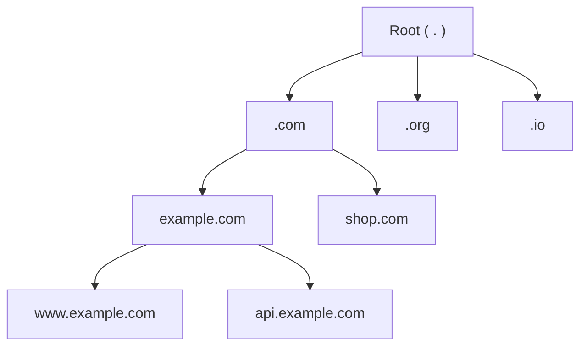

Computers find each other using numeric **IP addresses** such as `93.184.215.14` or `2606:2800:21f:cb07::1`. Humans prefer names such as `www.example.com`. The **Domain Name System (DNS)** is the Internet's directory service that translates names into addresses. Nearly every request a user makes begins with a DNS lookup, which makes DNS one of the most critical — and most heavily used — distributed systems in existence.

## Why not a single directory?

Imagine storing every name-to-address mapping in one central server. It would face impossible demands:

- **Scale:** billions of devices perform lookups constantly.
- **Availability:** if it went down, the whole Internet would effectively stop.
- **Latency:** users far from the server would wait on every lookup.
- **Administration:** millions of organizations need to manage their own names independently, changing records at any time without asking anyone's permission.

In the early Internet, this is roughly how names worked: every host downloaded a single `HOSTS.TXT` file maintained centrally. As the network grew to thousands of hosts, the file changed faster than it could be distributed, and name collisions became common. DNS, introduced in the 1980s, replaced it with a **hierarchical, distributed and cached** design that has scaled to hundreds of millions of domains.

## The DNS hierarchy



Names are read from right to left, from the most general to the most specific:

- The **root** sits at the top.
- **Top-level domains (TLDs)** such as `.com`, `.org` and country codes such as `.uk` sit below it.
- **Second-level domains** such as `example.com` are registered by organizations.
- Organizations create any **subdomains** they like, such as `www` or `api`.

Each level **delegates** authority for the level below. The `.com` operator does not need to know `www.example.com`'s address — only which servers are authoritative for `example.com`. This delegation distributes both the data and the administrative work.

### Zones and who runs them

A **zone** is a portion of the namespace managed by one organization — for example, everything under `example.com` except subdomains delegated elsewhere. Three different parties are often involved:

| Party | Responsibility |
| --- | --- |
| **Registry** | Operates a TLD such as `.com` and its name servers |
| **Registrar** | Sells domain registrations and tells the registry which name servers a domain uses |
| **DNS host** | Runs the authoritative name servers that answer queries for the zone (often a cloud provider or CDN) |

## Resource records

DNS stores information as **resource records**. The most common types are:

| Type | Purpose | Example |
| --- | --- | --- |
| **A** | Name → IPv4 address | `www.example.com → 93.184.215.14` |
| **AAAA** | Name → IPv6 address | `www.example.com → 2606:2800:...` |
| **CNAME** | Alias to another name | `blog.example.com → example.ghost.io` |
| **MX** | Mail servers for the domain | `example.com → mail.example.com` |
| **NS** | Authoritative name servers for a zone | `example.com → ns1.example.com` |
| **TXT** | Arbitrary text, used for verification and email security | `v=spf1 ...` |
| **SRV** | Host and port for a named service | `_sip._tcp.example.com → sip1.example.com:5060` |
| **SOA** | Start of authority: zone serial number and timing parameters | One per zone |

A zone is traditionally written as a **zone file**:

```text
$ORIGIN example.com.
@      3600  IN  SOA   ns1.example.com. admin.example.com. (2026092701 7200 900 1209600 300)
@      3600  IN  NS    ns1.example.com.
@      3600  IN  NS    ns2.example.net.
www     300  IN  A     93.184.215.14
www     300  IN  AAAA  2606:2800:21f:cb07::1
api      60  IN  CNAME api-lb.us-east.example-cloud.com.
@      3600  IN  MX    10 mail.example.com.
```

Each record carries a **time to live (TTL)** in seconds that tells caches how long they may reuse the answer. Notice the different TTLs: the web address can change within five minutes, while the API alias, which may point elsewhere during a failover, has a one-minute TTL.

## DNS as a building block

In system designs, DNS plays several roles beyond simple name resolution:

- **Entry point** for every client request.
- **Coarse load distribution** by returning multiple addresses or rotating them.
- **Geographic routing** by returning addresses of the data center nearest to the user.
- **Failover** by removing unhealthy endpoints from responses, subject to caching delays.
- **Service discovery** inside a company, where internal names resolve to the current instances of a service.

<Callout type="note">
DNS usually runs over UDP on port 53 because queries and answers are small and a lost packet can simply be retried. Larger responses and zone transfers use TCP. Encrypted variants such as DNS over HTTPS and DNS over TLS protect lookups from eavesdropping.
</Callout>

## When DNS fails

Because every request starts with DNS, its failure is catastrophic even when every other system is healthy. In 2016, a large distributed denial-of-service attack against a major managed DNS provider made many well-known websites unreachable for hours, even though their servers were fine — users simply could not resolve their names. Two lessons follow:

- Use **multiple independent DNS providers** (both listed as NS records) for critical domains.
- Keep TTLs long enough that cached answers survive a short outage of the authoritative servers.

<Ponder question="Why do many large services use two different companies to host their authoritative DNS, rather than simply adding more servers at one provider?">
More servers at the same provider still share failure modes: the same software, the same configuration pipeline, the same network and the same organization that can be targeted by an attack or make a mistake. Two independent providers make simultaneous failure much less likely. The cost is keeping both sets of records in sync, usually through automation.
</Ponder>

<KeyTakeaways>
- DNS translates human-friendly names into IP addresses and is involved in almost every request.
- A single central directory would not scale, would be a single point of failure and would be slow for distant users.
- DNS is hierarchical — root, TLD, second-level domains and subdomains — with authority delegated per zone.
- Resource records such as A, AAAA, CNAME, MX, NS and SRV carry TTLs that control caching.
- In designs, DNS also provides coarse load distribution, geographic routing, failover and service discovery.
- DNS outages take down otherwise healthy services, so critical domains use redundant providers.
</KeyTakeaways>
