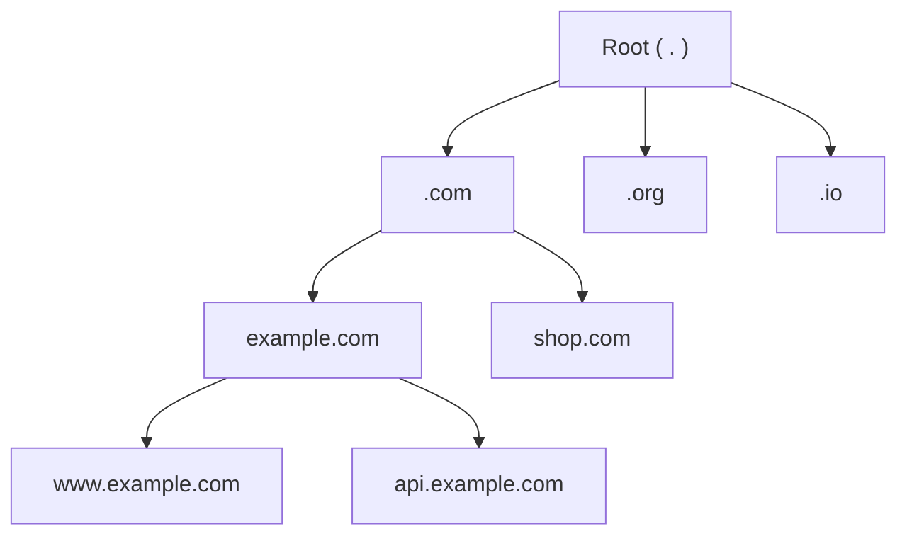

Computers find each other using numeric **IP addresses** such as `93.184.215.14` or `2606:2800:21f:cb07::1`. Humans prefer names such as `www.example.com`. The **Domain Name System (DNS)** is the Internet's directory service that translates names into addresses. Nearly every request a user makes begins with a DNS lookup, which makes DNS one of the most critical — and most heavily used — distributed systems in existence.

## Why not a single directory?

Imagine storing every name-to-address mapping in one central server. It would face impossible demands:

- **Scale:** billions of devices perform lookups constantly.
- **Availability:** if it went down, the whole Internet would effectively stop.
- **Latency:** users far from the server would wait on every lookup.
- **Administration:** millions of organizations need to manage their own names independently.

DNS solves these problems with a **hierarchical, distributed and cached** design.

## The DNS hierarchy

Names are read from right to left, from the most general to the most specific:

- The **root** sits at the top.
- **Top-level domains (TLDs)** such as `.com`, `.org` and country codes such as `.uk` sit below it.
- **Second-level domains** such as `example.com` are registered by organizations.
- Organizations create any **subdomains** they like, such as `www` or `api`.

Each level **delegates** authority for the level below. The `.com` operator does not need to know `www.example.com`'s address — only which servers are authoritative for `example.com`. This delegation distributes both the data and the administrative work.

## Resource records

DNS stores information as **resource records**. The most common types are:

| Type | Purpose | Example |
| --- | --- | --- |
| **A** | Name → IPv4 address | `www.example.com → 93.184.215.14` |
| **AAAA** | Name → IPv6 address | `www.example.com → 2606:2800:...` |
| **CNAME** | Alias to another name | `blog.example.com → example.ghost.io` |
| **MX** | Mail servers for the domain | `example.com → mail.example.com` |
| **NS** | Authoritative name servers for a zone | `example.com → ns1.example.com` |
| **TXT** | Arbitrary text, used for verification and email security | `v=spf1 ...` |

Each record carries a **time to live (TTL)** that tells caches how long they may reuse the answer.

## DNS as a building block

In system designs, DNS plays several roles beyond simple name resolution:

- **Entry point** for every client request.
- **Coarse load distribution** by returning multiple addresses or rotating them.
- **Geographic routing** by returning addresses of the data center nearest to the user.
- **Failover** by removing unhealthy endpoints from responses, subject to caching delays.

<Callout type="note">
DNS usually runs over UDP on port 53 because queries and answers are small and a lost packet can simply be retried. Larger responses and zone transfers use TCP. Encrypted variants such as DNS over HTTPS protect lookups from eavesdropping.
</Callout>

<KeyTakeaways>
- DNS translates human-friendly names into IP addresses and is involved in almost every request.
- A single central directory would not scale, would be a single point of failure and would be slow for distant users.
- DNS is hierarchical — root, TLD, second-level domains and subdomains — with authority delegated at each level.
- Resource records such as A, AAAA, CNAME, MX and NS carry TTLs that control caching.
- In designs, DNS also provides coarse load distribution, geographic routing and failover.
</KeyTakeaways>
