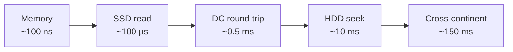

Back-of-the-envelope estimation is the skill of producing rough but useful numbers quickly: how many servers you need, how much storage a year of data will take, whether a design will meet a latency target. It relies on a small set of reference numbers you should know by heart, plus the discipline to round aggressively.

Estimates are not about precision. A good estimate tells you which **order of magnitude** you are in — whether a problem needs one machine, ten or a thousand — and which resource (CPU, memory, disk, network) will run out first. Those two facts drive most architectural decisions.

## Latency reference numbers

Exact values change with hardware generations, but the **orders of magnitude** are stable and they are what matter for design:

| Operation | Approximate latency |
| --- | --- |
| L1 cache reference | 1 ns |
| Branch mispredict | 3 ns |
| L2 cache reference | 4 ns |
| Mutex lock/unlock | 20 ns |
| Main memory reference | 100 ns |
| Compress 1 KB with a fast codec | 2 µs |
| Read 1 MB sequentially from memory | 3 µs |
| Random read from SSD | 16 µs – 100 µs |
| Round trip within a data center | 500 µs |
| Read 1 MB sequentially from SSD | 50 µs – 1 ms |
| Disk (HDD) seek | 2–10 ms |
| Read 1 MB sequentially from HDD | 1–5 ms |
| Round trip between continents | 100–150 ms |

Takeaways that shape designs:

- **Memory is about 100× faster than SSD**, and SSD far faster than spinning disks. This is why caches exist.
- **Network round trips inside a data center** are cheap relative to cross-continent trips. Chatty protocols across regions are slow.
- **Sequential access beats random access**, especially on disks. Log-structured storage exploits this.
- **Compression is cheap** compared with sending bytes over a network, so compress data before sending it across regions.

A helpful way to feel these numbers is to scale them up. If an L1 cache reference took one second, a main memory reference would take about 1.5 minutes, an SSD read about a day, a data-center round trip about six days, and a round trip between continents about **five years**.

## Throughput reference numbers

| Resource | Approximate throughput |
| --- | --- |
| Memory bandwidth (one server) | 10–50 GB/s |
| NVMe SSD sequential read | 2–7 GB/s |
| NVMe SSD random reads | 100,000s of IOPS |
| HDD random reads | 100–200 IOPS |
| Data-center network per server | 10–100 Gbps |
| In-memory key-value store node | 100,000+ ops/s |

Remember that network speeds are quoted in **bits** per second while storage is in **bytes**: a 10 Gbps link moves about 1.25 GB/s.

## Powers of two and data sizes

| Power | Approximate value | Name |
| --- | --- | --- |
| 2^10 | 1 thousand | 1 KB |
| 2^20 | 1 million | 1 MB |
| 2^30 | 1 billion | 1 GB |
| 2^40 | 1 trillion | 1 TB |
| 2^50 | 1 quadrillion | 1 PB |

Typical sizes:

| Item | Approximate size |
| --- | --- |
| ASCII character | 1 byte (UTF-8 up to 4 bytes) |
| Integer / timestamp | 4–8 bytes |
| UUID | 16 bytes |
| Short post with metadata | ~300 bytes – 1 KB |
| Small JSON record | ~1 KB |
| Compressed photo | 200 KB – 2 MB |
| Minute of HD video | 50–100 MB |

## Time conversions

A day has 86,400 seconds; round to **100,000** for quick math. A month is about 2.5 million seconds, and a year about 30 million.

This gives a handy rule: **1 million requests per day ≈ 12 requests per second** on average. Peak traffic is often 2–10× the average, so design for the peak.

| Per day | Per second (average) |
| --- | --- |
| 1 million | ~12 |
| 10 million | ~115 |
| 100 million | ~1,150 |
| 1 billion | ~11,500 |

## Rough server capacity

Single-server capacity varies widely with workload, but useful starting points are:

- A web or API server handling simple requests: **a few thousand to tens of thousands of requests per second**.
- A single relational database instance: **thousands to tens of thousands of simple queries per second**, far fewer for complex queries or heavy writes.
- An in-memory cache node: **around 100,000+ simple operations per second**.
- A message broker partition: **tens of thousands of messages per second**, with clusters reaching millions.

State your assumption explicitly — "assume one server handles about 5,000 requests per second" — so the interviewer can follow and correct you.

<Callout type="tip">
Round early and often. 86,400 becomes 100,000; 3.7 million becomes 4 million. The goal is to know whether you need 10 servers or 1,000, not whether you need 37 or 41.
</Callout>

<Ponder question="A service in Europe makes 8 sequential calls to a database in the US to render one page. Roughly how long does the page take, and what would you change?">
Each transatlantic round trip is roughly 80–150 ms, so 8 sequential calls cost about **0.6–1.2 seconds** in network time alone, before any processing. Fixes: put the data (or a read replica or cache) in the same region as the service; batch the 8 queries into one; or run independent queries in parallel so the page pays for one round trip instead of eight.
</Ponder>

## Availability and durability numbers

Recall from the previous chapter: 99.9% availability allows about 8.8 hours of downtime per year, and 99.99% about 53 minutes. Cloud object stores typically advertise very high durability (for example, eleven nines) by storing multiple copies or erasure-coded fragments across failure domains.

<KeyTakeaways>
- Memorize orders of magnitude: memory ~100 ns, SSD ~100 µs, data-center round trip ~0.5 ms, disk seek ~10 ms, cross-continent ~150 ms.
- Sequential access and in-memory data are dramatically faster than random disk access; compression is cheap compared with network transfer.
- Network speeds are in bits, storage in bytes: 10 Gbps ≈ 1.25 GB/s.
- Use powers of two for data sizes and round a day to 100,000 seconds; 1 million requests per day is about 12 per second.
- Design for peak, not average, and state capacity assumptions explicitly.
</KeyTakeaways>
