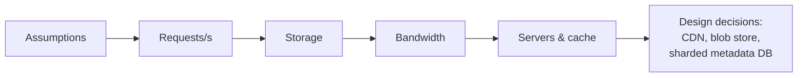

With reference numbers in hand, let's estimate resources for a realistic system. We will size a photo-sharing service and practice the four estimates that come up most often: **request rate**, **storage**, **bandwidth** and **number of servers**.

## Assumptions

Always start by writing assumptions down:

- 500 million total users, **100 million daily active users (DAU)**.
- Each active user views **50 photos** and uploads **0.2 photos** per day on average.
- Average photo size after compression: **500 KB**. We also store a thumbnail of **20 KB**.
- Peak traffic is **3×** the average.
- Keep data for **5 years**.

## Request rate

```text
Reads:  100M users × 50 views  = 5 billion views/day
        5 × 10^9 / 10^5 s      ≈ 50,000 reads/s average
        × 3 peak               ≈ 150,000 reads/s peak

Writes: 100M users × 0.2       = 20 million uploads/day
        2 × 10^7 / 10^5 s      ≈ 200 uploads/s average
        × 3 peak               ≈ 600 uploads/s peak
```

The read-to-write ratio is 250 : 1, a strongly **read-heavy** workload. That immediately suggests caching and a CDN.

## Storage

```text
Per day:   20M photos × (500 KB + 20 KB) ≈ 20M × 0.5 MB = 10 TB/day
Per year:  10 TB × 365                   ≈ 3.6 PB/year
5 years:                                  ≈ 18 PB
With 3× replication:                      ≈ 55 PB
```

Photo metadata (owner, caption, timestamps, location) might be ~1 KB per photo: 20M × 1 KB = 20 GB/day, or about 36 TB over 5 years — small compared with the images, but large enough that it needs a partitioned database.

<Callout type="note">
Storage estimates often reveal that different kinds of data need different stores: petabytes of immutable images belong in a blob store, while terabytes of frequently queried metadata belong in a database.
</Callout>

## Bandwidth

```text
Ingress: 200 uploads/s × 0.5 MB ≈ 100 MB/s ≈ 0.8 Gbps average
Egress:  50,000 views/s × 0.5 MB ≈ 25 GB/s ≈ 200 Gbps average
         (≈ 600 Gbps at peak)
```

Serving 600 Gbps from origin servers would be enormously expensive. This number is the strongest argument for a **CDN**, which serves popular photos from edge locations close to users. Serving thumbnails in feeds instead of full images also cuts egress drastically.

## Number of servers

Assume an application server can handle about **5,000 requests per second** for simple metadata requests (the photo bytes themselves come from the CDN and blob store):

```text
Peak reads + writes ≈ 150,000 req/s
150,000 / 5,000     = 30 servers
With headroom (×2)  ≈ 60 servers
```

## Cache sizing

Popularity typically follows a power law: a small fraction of photos gets most views. If we cache metadata for the **20% of photos viewed each day**:

```text
5B views/day → suppose 1B distinct photos viewed
20% × 1B × 1 KB ≈ 200 GB of metadata cache
```

That fits comfortably across a small cluster of cache nodes.



## Presenting estimates

In an interview, spend three to five minutes on estimates and **connect every number to a decision**: the read ratio justifies caching, egress justifies a CDN, storage justifies a blob store, and metadata volume justifies partitioning.

<KeyTakeaways>
- Write down assumptions first: users, actions per user, object sizes, peak factor and retention.
- Estimate requests per second, storage, bandwidth, servers and cache size.
- Round aggressively and use 100,000 seconds per day.
- Tie each estimate to a design decision, such as a CDN for heavy egress or sharding for large metadata.
</KeyTakeaways>
