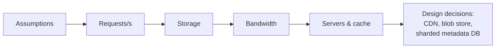

With reference numbers in hand, let's estimate resources for realistic systems. We will size a photo-sharing service and practice the estimates that come up most often: **request rate**, **storage**, **bandwidth**, **number of servers** and **cache size**. Then we will size a second, write-heavy system to see how different the numbers and conclusions can be.

## Types of requests

Before counting servers, consider what each request actually spends its time on:

| Request type | Bottleneck | Example |
| --- | --- | --- |
| CPU-bound | Computation | Image resizing, encryption, ranking a feed |
| Memory-bound | RAM capacity or bandwidth | Serving hot data from an in-memory index |
| I/O-bound | Disk or network waits | Reading records from a database, calling other services |

A server handling I/O-bound requests spends most of its time waiting, so it can hold thousands of concurrent requests with asynchronous I/O. A server handling CPU-bound requests is limited by its cores. Knowing which type dominates tells you which estimate matters.

## Example 1: a photo-sharing service

### Assumptions

Always start by writing assumptions down:

- 500 million total users, **100 million daily active users (DAU)**.
- Each active user views **50 photos** and uploads **0.2 photos** per day on average.
- Average photo size after compression: **500 KB**. We also store a thumbnail of **20 KB**.
- Peak traffic is **3×** the average.
- Keep data for **5 years**.

### Request rate

```text
Reads:  100M users × 50 views  = 5 billion views/day
        5 × 10^9 / 10^5 s      ≈ 50,000 reads/s average
        × 3 peak               ≈ 150,000 reads/s peak

Writes: 100M users × 0.2       = 20 million uploads/day
        2 × 10^7 / 10^5 s      ≈ 200 uploads/s average
        × 3 peak               ≈ 600 uploads/s peak
```

The read-to-write ratio is 250 : 1, a strongly **read-heavy** workload. That immediately suggests caching and a CDN.

### Storage

```text
Per day:   20M photos × (500 KB + 20 KB) ≈ 20M × 0.5 MB = 10 TB/day
Per year:  10 TB × 365                   ≈ 3.6 PB/year
5 years:                                  ≈ 18 PB
With 3× replication:                      ≈ 55 PB
```

Photo metadata (owner, caption, timestamps, location) might be ~1 KB per photo: 20M × 1 KB = 20 GB/day, or about 36 TB over 5 years — small compared with the images, but large enough that it needs a partitioned database.

<Callout type="note">
Storage estimates often reveal that different kinds of data need different stores: petabytes of immutable images belong in a blob store, while terabytes of frequently queried metadata belong in a database.
</Callout>

### Bandwidth

```text
Ingress: 200 uploads/s × 0.5 MB ≈ 100 MB/s ≈ 0.8 Gbps average
Egress:  50,000 views/s × 0.5 MB ≈ 25 GB/s ≈ 200 Gbps average
         (≈ 600 Gbps at peak)
```

Serving 600 Gbps from origin servers would be enormously expensive. This number is the strongest argument for a **CDN**, which serves popular photos from edge locations close to users. Serving thumbnails in feeds instead of full images also cuts egress drastically.

### Number of servers

There are two common ways to estimate server count.

**By requests per server.** Assume an application server can handle about **5,000 requests per second** for simple metadata requests (the photo bytes themselves come from the CDN and blob store):

```text
Peak reads + writes ≈ 150,000 req/s
150,000 / 5,000     = 30 servers
With headroom (×2)  ≈ 60 servers
```

**By CPU time per request.** If each request needs about 10 ms of CPU and a server has 32 cores:

```text
One server:   32 cores × (1,000 ms / 10 ms) = 3,200 req/s
Servers:      150,000 / 3,200               ≈ 47
Target 60% utilization to leave headroom:   ≈ 80 servers
```

Both methods land in the same order of magnitude — tens of servers, not thousands — which is all the design needs.

### Cache sizing

Popularity typically follows a power law: a small fraction of photos gets most views. If we cache metadata for the **20% of photos viewed each day**:

```text
5B views/day → suppose 1B distinct photos viewed
20% × 1B × 1 KB ≈ 200 GB of metadata cache
```

That fits comfortably across a small cluster of cache nodes.



## Example 2: a metrics ingestion service

Now consider a write-heavy system: a monitoring service collecting metrics from servers.

**Assumptions:** 1 million monitored hosts, each emitting **500 metrics every 10 seconds**; each data point is about **16 bytes** (timestamp plus value, after compression of the series identifier); keep raw data for **15 days** and downsampled data for a year.

```text
Writes:   1M hosts × 500 metrics / 10 s  = 50 million points/s
Ingest:   50M × 16 bytes                 = 800 MB/s ≈ 6.4 Gbps
Per day:  800 MB/s × 86,400              ≈ 69 TB/day
15 days:  ≈ 1 PB of raw data (before replication)
```

The conclusions are completely different from the photo service:

- Writes dominate, at 50 million per second — far beyond any single database. The design needs **partitioning by series**, write batching and an append-optimized time-series store.
- Reads are comparatively rare (dashboards and alerts), so caching matters less than write throughput.
- Storage grows so fast that **retention and downsampling** are core requirements, not afterthoughts: keeping one-minute averages instead of ten-second points cuts storage six-fold.

<Ponder question="In example 2, the team proposes storing each data point as a JSON document of about 200 bytes instead of 16 bytes. What happens to the estimates?">
Everything scales by 12.5×: ingest rises to about 10 GB/s (80 Gbps), and 15 days of raw data grows to roughly 12.5 PB before replication. Network, disk and cost all explode. This is why time-series systems use compact binary encodings, delta-of-delta timestamps and value compression — the per-item size is multiplied by billions, so every byte matters.
</Ponder>

## Common estimation mistakes

| Mistake | Consequence | Fix |
| --- | --- | --- |
| Confusing bits and bytes | Bandwidth off by 8× | Write units on every number |
| Forgetting replication | Storage off by 3× | Multiply by the replication factor |
| Designing for average load | Outages at peak | Apply a peak factor (2–10×) |
| Ignoring metadata and indexes | Underestimated database size | Add 20–50% for indexes |
| Spending ten minutes on arithmetic | No time left for design | Round to one significant digit |

## Presenting estimates

In an interview, spend three to five minutes on estimates and **connect every number to a decision**: the read ratio justifies caching, egress justifies a CDN, storage justifies a blob store, and metadata volume justifies partitioning.

<KeyTakeaways>
- Classify requests as CPU-, memory- or I/O-bound to know which resource limits a server.
- Write down assumptions first: users, actions per user, object sizes, peak factor and retention.
- Estimate requests per second, storage, bandwidth, servers and cache size; server counts can come from requests per server or CPU time per request.
- Read-heavy and write-heavy systems lead to very different conclusions: caching and CDNs versus partitioning, batching and retention.
- Round aggressively, label units, remember replication, and tie each estimate to a design decision.
</KeyTakeaways>
