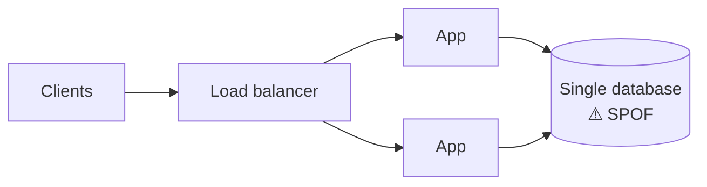

Many capable engineers underperform in system design interviews not because they lack knowledge, but because they fall into predictable traps. Recognizing these traps in advance is one of the highest-leverage things you can do. Strong engineers in particular are prone to some of them: years of working on one system can make you design *that* system no matter what is asked.

## Trap 1: Solving the wrong problem

The prompt "design a chat app" could mean one-to-one messaging, large group chats, a customer-support widget or a live-stream comment feed. Each has a different architecture. Candidates who skip scoping end up designing something the interviewer did not ask for.

**Avoid it:** Spend the first few minutes agreeing on the core features and scale, and confirm your understanding before drawing anything.

## Trap 2: The buzzword architecture

Some candidates draw a diagram packed with every technology they know — Kubernetes, Kafka, Redis, Elasticsearch, GraphQL — without explaining why each is needed. This invites probing questions that expose shallow understanding.

**Avoid it:** Add a component only when a requirement demands it, and justify it in one sentence: "We need a queue here because video transcoding takes minutes and we cannot block the upload request."

## Trap 3: Ignoring the numbers

Without estimates, you cannot decide whether a single database suffices or whether you need sharding. Some candidates skip estimation entirely; others spend ten minutes on precise arithmetic.

**Avoid it:** Do quick, rounded estimates for the quantities that drive design decisions — requests per second, storage growth, bandwidth — and use them to justify choices.

## Trap 4: Single points of failure

A design with one database, one cache node or one load balancer will fail when that component fails.

**Avoid it:** After drawing your high-level design, walk through each component and ask, "What happens if this dies?" Add replication, failover or redundancy where needed.

## Trap 5: Hand-waving the hard part

Every problem has one or two genuinely difficult components: generating unique short URLs without collisions, matching riders to nearby drivers, ordering messages in a group chat. Candidates who say "and then we store it in a database" for the hard part miss the main opportunity to show depth.

**Avoid it:** Identify the hardest part early and plan to spend your deep-dive time there.

| Problem | The hard part worth your deep dive |
| --- | --- |
| URL shortener | Generating unique, unguessable keys without coordination |
| News feed | Fan-out for users with millions of followers |
| Ride-hailing | Indexing moving drivers and matching them quickly |
| Chat | Delivery guarantees, ordering and offline users |
| Ticket booking | Preventing double-booking under heavy contention |
| Web crawler | Politeness, deduplication and prioritizing billions of URLs |

## Trap 6: Defending instead of discussing

When an interviewer challenges a decision, some candidates dig in. The interviewer may be testing whether you can adapt to new constraints.

**Avoid it:** Treat challenges as new requirements. "Good point — if we need stronger consistency here, I'd switch to synchronous replication for this table and accept the higher write latency."

## Trap 7: Running out of time

Candidates sometimes spend so long on one area that they never present a complete design.

**Avoid it:** Aim to have a complete, if simple, end-to-end design by roughly the halfway mark. A finished simple design beats an unfinished sophisticated one.

## Trap 8: Over-engineering for imaginary scale

The opposite of ignoring numbers is designing for numbers nobody asked for: multi-region active-active replication for an internal tool with 500 users, or a custom consensus protocol when a managed database would do. Over-engineering signals poor judgment just as clearly as under-engineering.

**Avoid it:** Match complexity to requirements, and say so: "At 200 writes per second a single primary with replicas is enough; I'd revisit sharding if we grow tenfold."

## Trap 9: Designing only the happy path

Many designs describe what happens when everything works. Real systems spend much of their complexity on what happens when things go wrong: a payment succeeds but the confirmation is lost, a worker crashes mid-task, a client retries a request that already succeeded.

**Avoid it:** For each write path, ask what happens on timeout, crash and retry. Mention idempotency keys, at-least-once processing with deduplication, and timeouts with backoff.

## Trap 10: Forgetting the data model

Some candidates draw beautiful boxes but never say what is stored where or how it is keyed. The data model determines which queries are cheap, how data is partitioned and where hotspots appear.

**Avoid it:** Name the main entities, their primary keys and the queries that access them. Choose partition keys that spread load evenly and keep related data together.

<Ponder question="Traps 3 and 8 seem to pull in opposite directions. How do you avoid both at once?">
Let the estimates decide. Estimation prevents under-engineering by revealing when a single component cannot cope, and it prevents over-engineering by showing when it can. Stating the threshold at which you would change the design ("sharding becomes necessary above roughly 10,000 writes per second") shows you understand both the current need and the growth path.
</Ponder>

<Callout type="tip">
After every practice session, write down which trap you fell into. Most people have one or two recurring habits; fixing those produces rapid improvement.
</Callout>

## Self-review table

Use this table after a mock interview. Each "no" points to the trap to work on.

| Question | Trap it detects |
| --- | --- |
| Did I confirm scope before drawing? | 1 |
| Can I justify every box with a requirement? | 2, 8 |
| Did an estimate change a decision? | 3 |
| Did I ask "what if this dies?" for every component? | 4 |
| Did I go deep on the hardest part? | 5 |
| Did I adapt when challenged? | 6 |
| Was the design complete by the halfway mark? | 7 |
| Did I cover retries, crashes and timeouts? | 9 |
| Did I state keys and access patterns? | 10 |

<KeyTakeaways>
- Scope the problem before designing so you solve the problem that was asked.
- Add components only when requirements justify them, and match complexity to real scale.
- Use rounded estimates to drive decisions such as sharding and caching.
- Check every component for single points of failure and design for failures, not just the happy path.
- Spend your depth on the hard part, define the data model, adapt to challenges, and finish an end-to-end design by mid-interview.
</KeyTakeaways>
